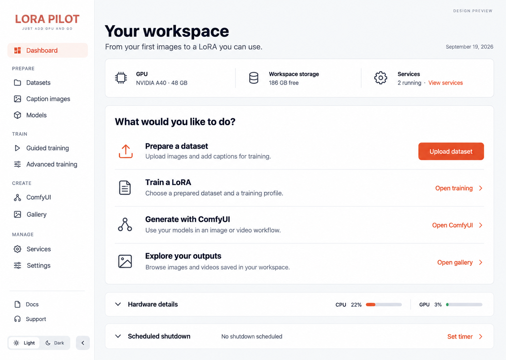
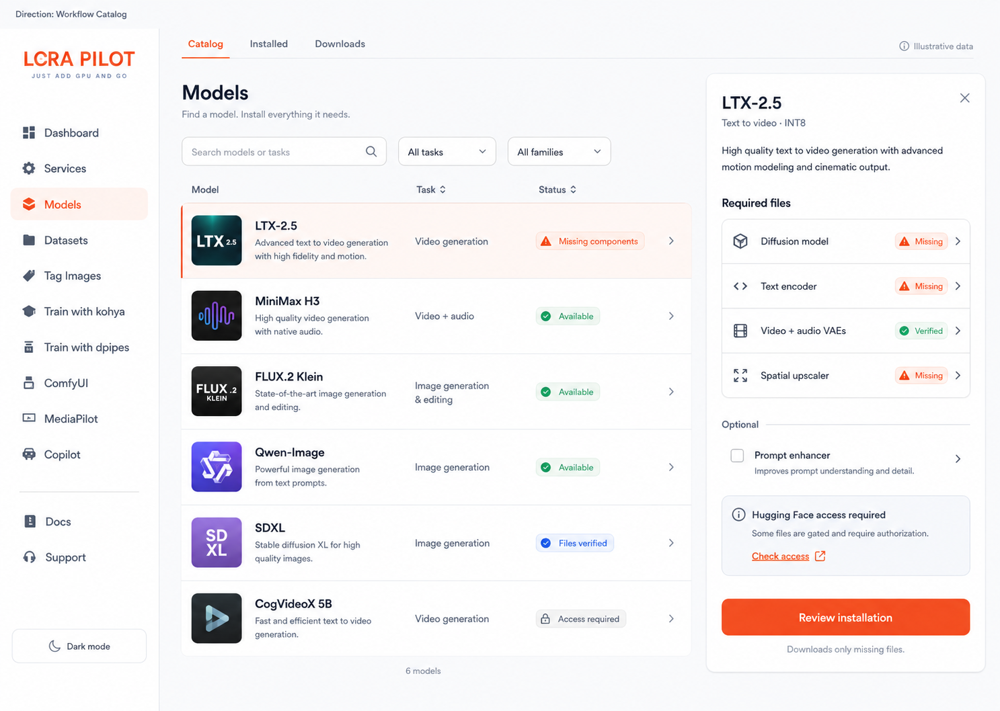
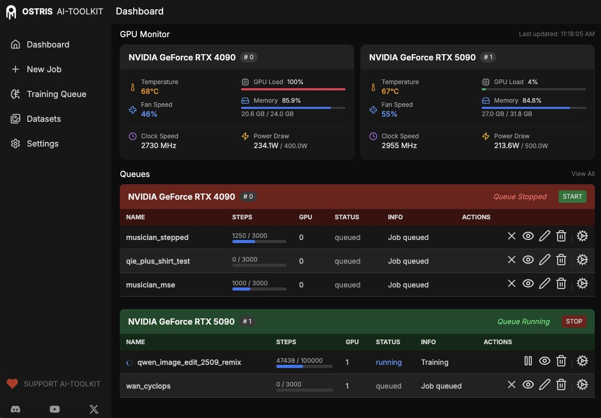

# LoRA Pilot (The Last Docker Image You'll Ever Need)
[](https://www.buymeacoffee.com/vavo) [](https://github.com/sponsors/vavo) [](https://www.patreon.com/vavo)


> End-to-end Stable Diffusion workspace in one container, with one persistent `/workspace`.
LoRA Pilot bundles dataset prep, model management, training, inference, and media workflow into one integrated stack, so you can spend time creating instead of fixing broken envs.

Release-by-release details: [`CHANGELOG`](CHANGELOG)



*Dashboard design preview from [lorapilot.com](https://lorapilot.com/). Interfaces vary with the installed image.*

## Why LoRA Pilot
- **Three proven LoRA trainer stacks** in one place: Kohya SS, AI Toolkit, and Diffusion Pipe (plus TrainPilot for quick Kohya setup).
- **51 training model groups** without juggling five half-compatible environments.
- **ComfyUI + InvokeAI for rendering** with shared models, persistent outputs, and built-in model pulling.
- **Full SD lifecycle covered**: dataset tagging/prep, model/dataset management, training, inference tuning, and media review.
- **One control panel for ops**: ControlPilot handles services, downloads, logs, docs, and runtime controls.
- **Persistent by design**: models, datasets, outputs, configs, and logs all live under `/workspace`.

## What's in the box?
- **Kohya SS** - battle-tested LoRA trainer UI with broad model support.
- **AI Toolkit** - modern trainer stack wired into the same workspace and model store.
- **Diffusion Pipe + TensorBoard** - scalable training pipeline plus live experiment telemetry.
- **ComfyUI** (+ ComfyUI-Manager, ComfyUI-Downloader) - node-based inference playground and workflow automation.
- **InvokeAI** - dedicated inference stack in its own venv, ready when you need it.
- **ControlPilot** - central command center for services, models, datasets, docs, and training orchestration.
- **TagPilot** - fast dataset tagging/prep flow.
- **TrainPilot** - guided Kohya run flow with sane profile defaults.
- **MediaPilot** - generated image browser/organizer for curation and review.
- **JupyterLab** and **code-server** for notebook/dev workflows.
- **Copilot sidecar (optional)** - workspace-aware assistant integration.

## From your images to a usable LoRA

In the current source, ControlPilot follows the work itself: upload a dataset, review caption coverage, queue guided SDXL or FLUX.1 dev training, and compare the completed LoRA with its base model in ComfyUI. Persistent history keeps configurations, logs, and output locations available after a restart, and library copies preserve original checkpoints. You can inspect hardware, logs, and advanced configuration when you need them. The sidebar groups tools by preparation, training, creation, and workspace management, with light and dark themes available throughout.

These interface changes are **unreleased**. The [ControlPilot guide](docs/user-guide/control-pilot.md) describes the current source; check the [changelog](CHANGELOG) and the image you deploy before expecting the same screens on an existing pod.

## Current release

[LoRA Pilot v2.5.8](https://github.com/vavo/lora-pilot/releases/tag/v2.5.8) includes the Models workflow catalog, reviewed LTX-2.5/MiniMax H3 installation, optional ComfyUI access protection, and startup security fixes. See the [release notes and upgrade guidance](docs/releases/v2.5.8.md).

The v2.5.8 Docker publishing run failed at startup. To use this release, [build from its source tag](docs/development/building.md#build-a-release-tag). The `stable` and `latest` image tags do not establish which GitHub release an image contains.

**Quick Start with a published image:**
```bash
docker pull notrius/lora-pilot:stable 
docker run --gpus all -p 7878:7878 -p 5555:5555 -p 6666:6666 -v /path/to/your/data:/workspace notrius/lora-pilot:stable
```
*(This would pull the image and run Comfy UI, Kohya SS and ControlPilot services, exposing the ControlPilot dashboard on port 7878)*  

## Supported training models

**All 51 model groups**, including their listed variants, from the [September 26 training inventory](https://lorapilot.com/lora-training/#supported-models):

- **Images and editing (31):** FLUX.2 dev; FLUX.2 Klein base 4B/9B; FLUX.1 dev/schnell; FLUX.1 Kontext dev; Flex.1 alpha; Flex.2 preview; Qwen-Image/2512; Qwen-Image-Edit/2509/2511; Z-Image/Turbo/De-Turbo; Z-Image L2P; SD 1.4/1.5; SD 2.0/2.1; SDXL 1.0; SD3/3.5 Medium/3.5 Large; Anima Base v1.0; Lumina-Image 2.0; HunyuanImage 2.1; Chroma1 Base; Zeta-Chroma; HiDream I1 Full; HiDream E1-1; HiDream O1 Image; OmniGen2; ERNIE-Image; Nucleus-Image; Ideogram 4; PRX Pixel T2I; Krea 2 Raw/Turbo; Boogu-Image 0.1 Base/Edit; Mage-Flow Base/Edit-Base; Cosmos-Predict2 2B/14B.
- **Video (12):** Wan 2.1 T2V 1.3B/14B; Wan 2.1 I2V 14B 480p/720p; Wan 2.2 T2V/I2V A14B; Wan 2.2 TI2V 5B; LTX-2/2.3/2.5; LTX-Video 0.9.x (through 0.9.8); HunyuanVideo; HunyuanVideo 1.5; Cosmos 1.0 Diffusion Text2World 7B/14B; MiniMax H3; MiniMax H3 Ref2VA; FastH3 Preview v0.2.
- **Audio (2):** ACE-Step 1.5 Base; ACE-Step 1.5 XL Base.
- **Advanced image configuration (6):** AuraFlow 0.3; PixArt-α XL-2/Σ XL-2; CogView4-6B; F-Lite Standard/Texture; Chroma1-Radiance (x0); Segmind SSD-1B/Vega.

See the [full trainer compatibility tables](docs/reference/supported-models.md) for UI versus configuration paths, version restrictions, and setup notes. Cosmos 1.0 needs extra setup; the advanced entries need configuration outside the web UI. Guided TrainPilot recipes cover SDXL and FLUX.1 dev. Model weights download separately. Qwen-Image 2.1 and Ming-Image 0.1 Design require a trainer upgrade and are outside this count.

## Explore the workspace

### Find models and review their components



*Models catalog preview with illustrative data from [lorapilot.com](https://lorapilot.com/). See [model management](docs/user-guide/model-management.md) for the installation workflow.*

### Follow training in AI Toolkit



*AI Toolkit training view from [lorapilot.com](https://lorapilot.com/). See the [AI Toolkit guide](docs/components/ai-toolkit.md) for job setup and monitoring.*

Everything is orchestrated by **supervisord** and writes to **/workspace**, so reboots do not nuke your progress.

Nice quality-of-life bits:
- Use a verified image tag or digest for reproducible deployments; check Docker publishing status before assuming `:latest` includes a new release.
- Jupyter and code-server settings/plugins persist between restarts.
- Venv switching gymnastics are gone; the stack is prewired.
- Handy CLI tools (`mc`, `nano`, `unzip`, model scripts) are already there.
- Need SDXL base? `models pull sdxl-base` and continue with your life.
- Need a quick Kohya run? `trainpilot` builds a sane config from dataset size + selected quality.
- Prefer UI? ControlPilot handles service state, logs, and workflows.
- Prefer CLI? `pilot status`, `pilot start`, `pilot stop` are right there.

## Installation

### Option 1: RunPod template (fastest)
- One-click deploy: https://console.runpod.io/deploy?template=gg1utaykxa&ref=o3idfm0n

### Option 2: Local Docker (Compose)
```bash
cp .env.example .env
docker compose -f docker-compose.yml up -d
```

More setup docs:
- Linux/macOS/local compose: `DOCKER_COMPOSE.md`
- Full compose guide: `docker-compose/README.md`
- Windows guide: `docs/WINDOWS_INSTALLATION.md`

---

## Storage layout

`/workspace` is home base. Keep that persisted and you keep your project.

Expected directories (created on boot if possible):

- `/workspace/models` (shared by everything; Invoke now points here too)
- `/workspace/datasets` (with `/workspace/datasets/images` and `/workspace/datasets/ZIPs`)
- `/workspace/outputs` (with `/workspace/outputs/comfy` and `/workspace/outputs/invoke`)
- `/workspace/apps`
  - Comfy: user + custom nodes under `/workspace/apps/comfy`
  - Diffusion Pipe under `/workspace/apps/diffusion-pipe`
  - Invoke under `/workspace/apps/invoke`
  - Kohya under `/workspace/apps/kohya`
  - MediaPilot under `/workspace/apps/MediaPilot` (https://github.com/vavo/MediaPilot)
  - TagPilot under `/workspace/apps/TagPilot` (https://github.com/vavo/TagPilot)
  - TrainPilot under `/workspace/apps/TrainPilot`(not yet on GitHub)
- `/opt/pilot/repos/ai-toolkit` (source) with persistent links to `/workspace/datasets`, `/workspace/models`, and `/workspace/outputs/ai-toolkit`
- `/workspace/config`
- `/workspace/cache`
- `/workspace/logs`

### RunPod volume guidance

The `/workspace` directory is the only volume that truly matters. Models, datasets, outputs, and config all live there, so that is the one you back up.

**Disk sizing (practical, not theoretical):**
- Root/container disk: **30 GB** recommended 
- `/workspace` volume: **100 GB minimum**, more if you plan to store multiple base models/checkpoints.

---

## Credentials

Bootstrapping writes secrets to:

- `/workspace/config/secrets.env`

Typical entries:
- `JUPYTER_TOKEN=...`
- `CODE_SERVER_PASSWORD=...`

---

## Default ports

| Service | Port |
|---|---:|
| Diffusion Pipe (TensorBoard) | `4444` |
| ComfyUI | `5555` |
| Kohya SS | `6666` |
| ControlPilot | `7878` |
| MediaPilot | `7878` (`/mediapilot`) |
| code-server | `8443` |
| AI Toolkit | `8675` |
| JupyterLab | `8888` |
| InvokeAI (optional) | `9090` |
| Copilot sidecar (internal) | `7879` |


## Ports (optional overrides)
COMFY_PORT=5555
KOHYA_PORT=6666
DIFFPIPE_PORT=4444
CODE_SERVER_PORT=8443
JUPYTER_PORT=8888
INVOKE_PORT=9090
AI_TOOLKIT_PORT=8675
COPILOT_SIDECAR_PORT=7879

## AI Toolkit (optional)
AI_TOOLKIT_DB_PATH=/workspace/config/ai-toolkit/aitk_db.db

DB is persisted under /workspace by default

## Jupyter (optional)
JUPYTER_ALLOW_ORIGIN_PAT=...   # extra origin regex appended to defaults (RunPod proxy + localhost + 127.0.0.1)

## Shutdown scheduler (ControlPilot)
RUNPOD_POD_SHUTDOWN=stop       # default; safe for local storage
RUNPOD_POD_SHUTDOWN=remove     # terminate pod (network volume only)
RUNPOD_VOLUME_TYPE=network    # auto-select remove
RUNPOD_VOLUME_TYPE=local      # auto-select stop

## Hugging Face (optional but often necessary)
HF_TOKEN=...                 # for gated models
HF_HUB_ENABLE_HF_TRANSFER=1  # faster downloads (requires hf_transfer, included)
HF_XET_HIGH_PERFORMANCE=1    # faster Xet storage downloads (included)

## Diffusion Pipe (optional)
DIFFPIPE_CONFIG=/workspace/config/diffusion-pipe.toml
DIFFPIPE_LOGDIR=/workspace/diffusion-pipe/logs
DIFFPIPE_NUM_GPUS=1
If DIFFPIPE_CONFIG is unset, the service just runs TensorBoard on DIFFPIPE_PORT.


## Model downloader (built-in)

The image includes a system-wide command:
• models (alias: pilot-models)

Usage:
• models list
• models pull <name> [--dir SUBDIR]
• models pull-all

You can also download models using Lora Pilot's web interface running at port 7878.

## Manifest

Models are defined in the manifest shipped in the image:
	•	/opt/pilot/models.manifest

A default copy is also shipped here (useful as a reference/template):
	•	/opt/pilot/config/models.manifest.default

If your get-models.sh supports workspace overrides, the intended override location is:
	•	/workspace/config/models.manifest

(If you don’t have override logic yet, copy the default into /workspace/config/ and point the script there. Humans love paper cuts.)

Both `models` and `modelsgui` will use `/workspace/config/models.manifest` when present.

## Example usage

### download SDXL base checkpoint into /workspace/models/checkpoints
models pull sdxl-base

### list all available model nicknames
models list

## Security note (because reality exists)

- supervisord can run with an unauthenticated unix socket by default.
- This image is meant for trusted environments like your own RunPod pod.
- Don’t expose internal control surfaces to the public internet unless you enjoy chaos monkeys.

### For security issues, please see SECURITY.md and do not report vulnerabilities publicly.

[](https://www.bestpractices.dev/projects/12386)

## Support

LoRA Pilot is not just a side project, it is actively used in real production workflows.
Builds are frequent, breakages are taken seriously, and reasonable feature requests are welcome.
If you need help or have questions, feel free to reach out or open an issue on GitHub.

Reddit: u/no3us

## Sponsor
[](https://github.com/sponsors/vavo) [](https://www.buymeacoffee.com/vavo)

---

## 🆕 Recent Updates

See full details in [`CHANGELOG`](CHANGELOG).

### ControlPilot 2.x redesign
- Unified command center for services, model/dataset management, trainers, logs, and docs.
- Cleaner operations UX with better service actions, autostart control, model pulls, and dashboard telemetry.

### MediaPilot and TagPilot workflow integration
- **MediaPilot** is now the built-in output browser for fast curation, comparison, and cleanup.
- **TagPilot** handles dataset tagging/prep in the same stack, including reliable large dataset saves to `/workspace`.

### Service maintenance and updateability
- Added service version checks and in-app update actions in Services.
- Added rollback metadata + boot-time reconcile flow driven by `/workspace/config/service-updates.toml`.

### Training + inference stack updates
- Added AI Toolkit as a first-class trainer with persistent DB/config under `/workspace`.
- Added dual Blackwell build profiles: CUDA 13.0/PyTorch 2.12 by default, with CUDA 12.8/PyTorch 2.11 retained as the legacy profile.
- Consolidated Python runtime environments around one shared GPU stack and refreshed Comfy/Invoke/Jupyter/code-server/AI Toolkit/Diffusion Pipe pins.
- Fixed TagPilot provider image uploads, provider-secret persistence, JSON error reporting, dark-mode startup, and preview-modal crop access.

---

## 🙏 Standing on the shoulders of giants
- ComfyUI - Node-based magic
- ComfyUI-Manager - The organizer
- Kohya SS - LoRA whisperer
- AI Toolkit - modern trainer stack
- code-server - Code anywhere
- JupyterLab - Data scientist's best friend
- InvokeAI - The fancy pants option
- Diffusion Pipe - Training powerhouse
- TensorBoard - Visualization tool
- GitHub Copilot SDK/CLI - assistant foundation

## 📜 License
MIT License - go wild, make cool stuff, just don't blame us if your AI starts writing poetry about toast.

Made with ❤️ and way too much coffee by vavo

"If it works, don't touch it. If it doesn't, reboot. If that fails, we have Docker." 
    - Ancient sysadmin wisdom

## Project links
- GitHub repo: https://github.com/vavo/lora-pilot
- Docker Hub image: https://hub.docker.com/r/notrius/lora-pilot
- RunPod template: https://console.runpod.io/deploy?template=gg1utaykxa&ref=o3idfm0n

---
