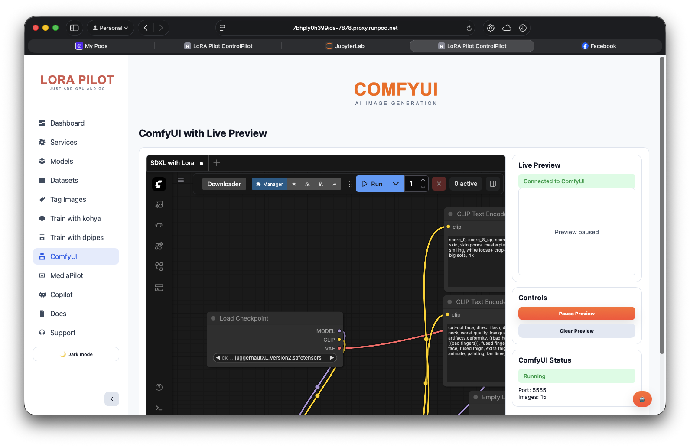

# ComfyUI

ComfyUI is a powerful node-based interface for Stable Diffusion that allows you to create complex image generation workflows through a visual programming interface. It's integrated into LoRA Pilot with custom nodes and workspace integration.

##  Overview

ComfyUI offers:
- **Node-Based Interface**: Visual workflow creation
- **Custom Nodes**: Extended functionality with custom nodes
- **Workflow Sharing**: Import/export workflows
- **High Performance**: Optimized for batch processing
- **Extensible**: Large ecosystem of custom nodes

##  Quick Start

### Access ComfyUI

1. **Via ControlPilot**: Services tab → Click "Open" next to ComfyUI
2. **Direct URL**: http://localhost:5555
3. **CLI**: `docker exec lora-pilot supervisorctl status comfyui`



### First Workflow

1. **Load Model**: Add "CheckpointLoader" node and select a model
2. **Add Prompt**: Add "CLIPTextEncode" nodes for prompt and negative prompt
3. **Configure Sampling**: Add "KSampler" node with desired settings
4. **Generate**: Add "VAEDecode" and "SaveImage" nodes
5. **Queue Prompt**: Click "Queue Prompt" to generate

## 🖥️ Interface Guide

### Main Components

#### Node Categories
- **Loaders**: Model, VAE, CLIP loaders
- **Conditioning**: Text encoding, prompt management
- **Sampling**: KSampler, custom samplers
- **Image**: Image processing, saving, loading
- **Utility**: Math, logic, control flow

#### Workflow Management
- **Save Workflow**: Save your workflow as JSON/API format
- **Load Workflow**: Import workflows from community or your own
- **Queue Management**: Queue multiple prompts for batch processing
- **Lightning Mode**: Fast execution without UI updates

### Essential Nodes

#### Model Loading
```yaml
CheckpointLoader:
  - Loads base model (checkpoint)
  - Outputs: MODEL, CLIP, VAE

VAELoader:
  - Loads VAE separately
  - Output: VAE

CLIPTextEncode:
  - Encodes text prompts
  - Input: CLIP from CheckpointLoader
  - Output: CONDITIONING
```

#### Sampling
```yaml
KSampler:
  - Main sampling node
  - Inputs: MODEL, CONDITIONING, NEGATIVE_CONDITIONING, LATENT_IMAGE
  - Parameters: seed, steps, cfg, sampler_name, scheduler
  - Output: LATENT_IMAGE
```

#### Image Processing
```yaml
VAEDecode:
  - Decodes latent to image
  - Input: LATENT_IMAGE, VAE
  - Output: IMAGE

SaveImage:
  - Saves generated image
  - Input: IMAGE
  - Parameters: filename_prefix, output_path
```

##  Basic Workflow Templates

### Simple Text-to-Image
```
CheckpointLoader → CLIPTextEncode (positive) → KSampler → VAEDecode → SaveImage
                 ↘ CLIPTextEncode (negative) ↗
```

### LoRA Workflow
```
CheckpointLoader → LoRALoader → CLIPTextEncode → KSampler → VAEDecode → SaveImage
                 ↘ CLIPTextEncode (negative) ↗
```

### ControlNet Workflow
```
CheckpointLoader → ControlNetLoader → CLIPTextEncode → KSampler → VAEDecode → SaveImage
                 ↘ CLIPTextEncode (negative) ↗
                 ↘ ControlNetApply ↗
```

### Image-to-Image
```
CheckpointLoader → CLIPTextEncode → KSampler → VAEDecode → SaveImage
                 ↘ CLIPTextEncode (negative) ↗
LoadImage → VAEEncode ↗
```

##  Custom Nodes

### Pre-installed Custom Nodes

#### ComfyUI-Manager
- **Purpose**: Node management and installation
- **Features**: Browse, install, update custom nodes
- **Access**: Available in ComfyUI interface

#### ComfyUI-Downloader
- **Purpose**: Model downloading and management
- **Features**: Download models from Hugging Face
- **Integration**: Works with LoRA Pilot model management

#### ControlNet Preprocessors
- **Purpose**: Image preprocessing for ControlNet
- **Features**: Canny, depth, pose detection
- **Nodes**: Various preprocessing nodes

#### Advanced Samplers
- **Purpose**: Enhanced sampling methods
- **Features**: DPM++, UniPC, custom samplers
- **Performance**: Better quality and speed

### Installing Additional Nodes

#### Via ComfyUI Manager
1. Open ComfyUI Manager
2. Click "Install Custom Nodes"
3. Browse or search for nodes
4. Click "Install" and restart ComfyUI

#### Manual Installation
```bash
# Access container shell
docker exec -it lora-pilot bash

# Install custom node
cd /workspace/apps/comfy/custom_nodes
git clone https://github.com/author/custom-node.git
docker-compose restart comfyui
```

##  Performance Optimization

### Memory Optimization

#### Model Loading
```yaml
# Use FP16 VAE for memory savings
VAELoader:
  vae_name: "sdxl_vae.safetensors"
  # Automatically uses FP16 when available
```

#### Batch Processing
```yaml
# Increase batch size for efficiency
KSampler:
  batch_size: 4  # If VRAM allows
```

#### Memory Management
```yaml
# Automatic memory management
# ComfyUI automatically manages VRAM
# Use LightGBM for large models
```

### Speed Optimization

#### Lightning Mode
- **Purpose**: Fast execution without UI updates
- **Use**: For batch processing
- **Access**: Menu → "Lightning Mode"

#### Efficient Workflows
- **Minimize Nodes**: Reduce unnecessary nodes
- **Reuse Components**: Share nodes across workflows
- **Batch Processing**: Queue multiple prompts

#### Model Selection
```yaml
# Use optimized models
# FLUX.1 Schnell for speed
# SDXL Turbo for fast generation
# FP16 versions when available
```

##  Advanced Features

### Workflow Automation

#### API Format
ComfyUI workflows can be saved as API format for automation:

```json
{
  "3": {
    "inputs": {
      "ckpt_name": "sdxl_base.safetensors"
    },
    "class_type": "CheckpointLoaderSimple"
  },
  "4": {
    "inputs": {
      "text": "a beautiful landscape",
      "clip": ["3", 1]
    },
    "class_type": "CLIPTextEncode"
  }
}
```

#### Batch Processing
```python
# Python script for batch processing
import json
import requests

# Load workflow
with open('workflow.json', 'r') as f:
    workflow = json.load(f)

# Batch prompts
prompts = [
    "a beautiful landscape",
    "a city at night",
    "a portrait of a person"
]

# Process each prompt
for prompt in prompts:
    workflow["4"]["inputs"]["text"] = prompt
    response = requests.post('http://localhost:5555/prompt', json={"prompt": workflow})
    print(f"Queued: {prompt}")
```

### Custom Node Development

#### Node Structure
```python
# Custom node example
class MyCustomNode:
    @classmethod
    def INPUT_TYPES(cls):
        return {
            "required": {
                "input_image": ("IMAGE",),
                "strength": ("FLOAT", {"default": 1.0, "min": 0.0, "max": 2.0})
            }
        }
    
    RETURN_TYPES = ("IMAGE",)
    FUNCTION = "process_image"
    
    def process_image(self, input_image, strength):
        # Process image
        return (output_image,)
```

#### Node Registration
```python
# Register custom node
NODE_CLASS_MAPPINGS = {
    "MyCustomNode": MyCustomNode
}

NODE_DISPLAY_NAME_MAPPINGS = {
    "MyCustomNode": "My Custom Node"
}
```

##  Workflow Examples

### Portrait Photography
```
CheckpointLoader (SDXL) → CLIPTextEncode → KSampler → VAEDecode → SaveImage
                 ↘ CLIPTextEncode (negative) ↗
                 ↘ LoRALoader (portrait LoRA) ↗
```

### Art Style Transfer
```
CheckpointLoader → ControlNetLoader → CLIPTextEncode → KSampler → VAEDecode → SaveImage
                 ↘ CLIPTextEncode (negative) ↗
                 ↘ ControlNetApply (style) ↗
LoadImage → ControlNetPreprocessor ↗
```

### Batch Character Design
```
CheckpointLoader → CLIPTextEncode → KSampler → VAEDecode → SaveImage
                 ↘ CLIPTextEncode (negative) ↗
                 ↘ LoRALoader (character LoRA) ↗
RandomPrompt → CLIPTextEncode ↗
```

### Iterative Refinement
```
CheckpointLoader → CLIPTextEncode → KSampler → VAEDecode → SaveImage
                 ↘ CLIPTextEncode (negative) ↗
                 ↘ ImageUpscale ↗
LoadImage → VAEEncode → KSampler ↗
```

##  Troubleshooting

### Common Issues

#### Model Loading Errors
```bash
# Problem: Model not found
# Solution: Check model path
ls /workspace/models/stable-diffusion/

# Download missing model
docker exec lora-pilot models pull sdxl-base
```

#### Out of Memory
```bash
# Problem: CUDA out of memory
# Solutions:
1. Use smaller batch size
2. Use FP16 models
3. Enable memory management
4. Close other applications
```

#### Node Errors
```bash
# Problem: Custom node not working
# Solutions:
1. Restart ComfyUI
2. Check node installation
3. Update custom node
4. Check for conflicts
```

### Debug Commands

#### Check Service Status
```bash
# Check ComfyUI status
docker exec lora-pilot supervisorctl status comfyui

# View logs
docker exec lora-pilot supervisorctl tail -100 comfyui
```

#### Test Model Loading
```bash
# Test model access
python -c "
import torch
from diffusers import StableDiffusionPipeline
pipe = StableDiffusionPipeline.from_pretrained('/workspace/models/stable-diffusion-xl-base-1.0')
print('✅ Model loads successfully')
"
```

##  Integration with LoRA Pilot

### Model Integration
- **Shared Models**: Access all LoRA Pilot models
- **Automatic Discovery**: Models appear in dropdown
- **Version Control**: Track model versions

### Workspace Integration
- **Output Directory**: `/workspace/outputs/comfyui/`
- **Input Directory**: `/workspace/datasets/`
- **Custom Nodes**: Stored in `/workspace/apps/comfy/custom_nodes/`

### Service Management
- **ControlPilot**: Start/stop/restart ComfyUI
- **Log Access**: View logs through ControlPilot
- **Resource Monitoring**: Track GPU and memory usage

##  Best Practices

### Workflow Design
1. **Modular Design**: Create reusable workflow components
2. **Clear Naming**: Use descriptive node names
3. **Documentation**: Add notes to complex workflows
4. **Version Control**: Save workflow versions

### Performance Optimization
1. **Batch Processing**: Queue multiple prompts
2. **Lightning Mode**: Use for batch jobs
3. **Model Selection**: Choose appropriate models
4. **Memory Management**: Monitor VRAM usage

### Quality Improvement
1. **Prompt Engineering**: Craft detailed prompts
2. **Negative Prompts**: Use effective negative prompts
3. **Parameter Tuning**: Experiment with sampling parameters
4. **Iterative Refinement**: Refine based on results

---

## 📝 Feedback

Was this helpful? [Suggest improvements on GitHub Discussions](https://github.com/notri1/lora-pilot/discussions/categories/documentation-feedback)


