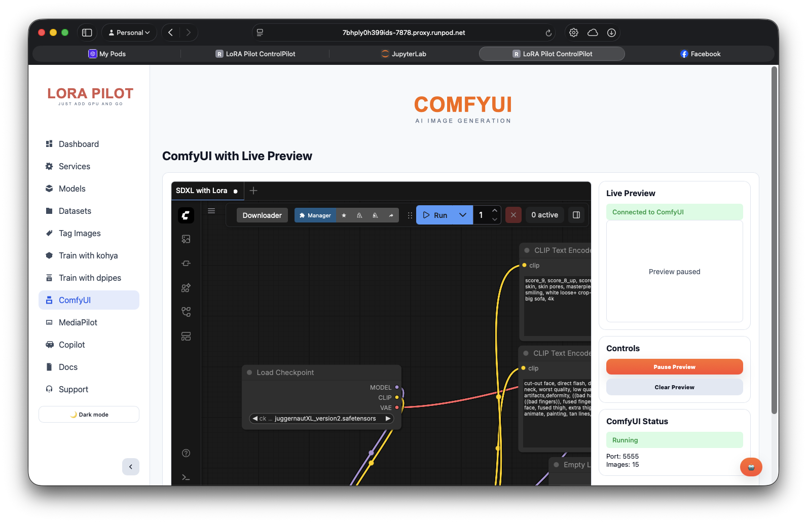
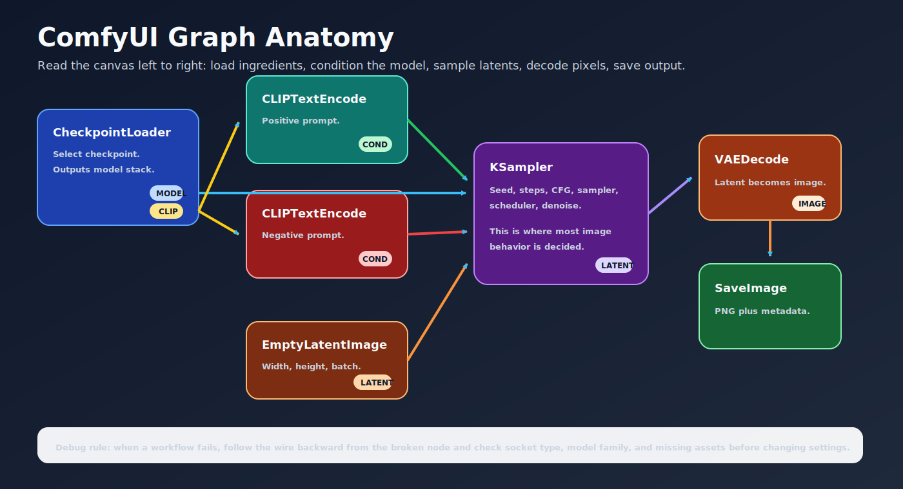

# ComfyUI

_Last updated: 2026-07-05_

ComfyUI is the node-based inference workbench in LoRA Pilot. It shows the generation pipeline directly: models load on the left, prompts and conditioning feed the middle, samplers turn latent noise into structure, and output nodes decode and save the result.

Use ComfyUI when the workflow matters as much as the prompt. It is the right surface for custom graph building, imported community workflows, ControlNet branches, LoRA experiments, image-to-image, inpainting, upscales, and many video model pipelines. If you are still choosing between text-to-image, image-to-image, text-to-video, and image-to-video, start with [Workflow Types](../getting-started/inference-101/workflow-types.md).

##  Overview

ComfyUI is powerful because it makes the invisible parts visible. You can see which checkpoint is loaded, which `CLIP` output feeds the prompt encoders, which latent source enters `KSampler`, which VAE decodes the result, and where the final image is saved. That visibility makes complex workflows possible. It also means weak wiring, missing models, and wrong-family files are easier to create if you skip the basics.

The practical path is to learn one small graph first, save it, then add complexity one branch at a time.

##  Quick Start

### Access ComfyUI

1. **Via ControlPilot**: Services tab → Click "Open" next to ComfyUI
2. **Direct URL**: http://localhost:5555
3. **CLI**: `docker exec lora-pilot supervisorctl status comfyui`



### First Workflow

Your first graph should be plain text-to-image. Load a checkpoint, feed its `CLIP` output into positive and negative `CLIPTextEncode` nodes, create an `EmptyLatentImage`, connect everything into `KSampler`, decode the latent with `VAEDecode`, then save with `SaveImage`.



Before queueing, scan the graph from left to right. Required inputs should be connected, loader dropdowns should point to real files, the model family should match the workflow, and the seed behavior should match your goal. Fixed seed for testing. Random seed for exploration.

## 🖥️ Interface Guide

### Main Components

#### Canvas Basics
Arrange workflows left to right: loaders on the left, processing in the middle, outputs on the right. Nodes have inputs on the left, editable settings in the center, and outputs on the right.

Connection colors and socket labels matter. A `MODEL` output cannot plug into an `IMAGE` input, and ComfyUI will reject incompatible links. One output can feed multiple inputs, so you can reuse the same `MODEL`, `CLIP`, `VAE`, seed, or image output when comparing branches.

Double-click empty canvas space to search nodes. It is faster than digging through menus once you know the node name.

#### Node Categories
- **Loaders**: Model, VAE, CLIP loaders
- **Conditioning**: Text encoding, prompt management
- **Sampling**: KSampler, custom samplers
- **Image**: Image processing, saving, loading
- **Utility**: Math, logic, control flow

#### Workflow Management
- **Save Workflow**: Save important workflows as JSON. Browser storage is not a backup.
- **Load Workflow**: Import JSON workflows, or drag a ComfyUI-generated PNG back onto the canvas to reload embedded workflow metadata.
- **Queue Management**: Queue prompts with `Ctrl+Enter` / `Cmd+Enter`.
- **Versioning**: Save working milestones as `workflow-v1.json`, `workflow-v2-upscale.json`, etc. Overwriting the only good copy is how people invent unpaid archaeology.
- **Lightning Mode**: Fast execution without UI updates.

### Essential Nodes

#### Model Loading
```yaml
CheckpointLoader:
  - Loads base model (checkpoint)
  - Outputs: MODEL, CLIP, VAE

VAELoader:
  - Loads VAE separately
  - Output: VAE

CLIPTextEncode:
  - Encodes text prompts
  - Input: CLIP from CheckpointLoader
  - Output: CONDITIONING
```

#### Sampling
```yaml
KSampler:
  - Main sampling node
  - Inputs: MODEL, CONDITIONING, NEGATIVE_CONDITIONING, LATENT_IMAGE
  - Parameters: seed, steps, cfg, sampler_name, scheduler, denoise
  - Output: LATENT_IMAGE
```

Key KSampler fields:
- **Seed**: Controls the starting noise. Fix it while tuning prompts or settings; randomize it when exploring new compositions.
- **Steps**: Controls denoising passes. Start around 20-30 for classic SD workflows, then only increase when details still look unfinished.
- **CFG**: Controls prompt pressure. Classic SD/SDXL often starts around 6-8, while Flux workflows commonly use much lower CFG and separate guidance controls.
- **Scheduler / sampler**: Keep these fixed while learning. Changing sampler, scheduler, seed, prompt, and CFG together gives you a mystery, not a test.
- **Denoise**: Controls how much the sampler can change the starting latent. Use lower values for image-to-image and inpainting when you need to preserve the source.

#### Image Processing
```yaml
VAEDecode:
  - Decodes latent to image
  - Input: LATENT_IMAGE, VAE
  - Output: IMAGE

SaveImage:
  - Saves generated image
  - Input: IMAGE
  - Parameters: filename_prefix, output_path
```

##  Basic Workflow Templates

These are starting shapes, not sacred recipes. For the decision process behind them, see [Workflow Types](../getting-started/inference-101/workflow-types.md).

### Simple Text-to-Image
```
CheckpointLoader → CLIPTextEncode (positive) → KSampler → VAEDecode → SaveImage
                 ↘ CLIPTextEncode (negative) ↗
EmptyLatentImage ─────────────────────────────↗
```

Build this graph until you can explain every wire. The checkpoint provides `MODEL`, `CLIP`, and `VAE`. The two prompt encoders produce positive and negative conditioning. `EmptyLatentImage` supplies the starting latent at a model-appropriate size. `KSampler` does the denoising work, `VAEDecode` turns latent output into pixels, and `SaveImage` writes the result with metadata.

Save this as your known-good starter workflow before adding LoRAs, ControlNet, upscalers, detailers, or video nodes.

### LoRA Workflow
```
CheckpointLoader → LoRALoader → CLIPTextEncode → KSampler → VAEDecode → SaveImage
                 ↘ CLIPTextEncode (negative) ↗
```

### ControlNet Workflow
```
CheckpointLoader → ControlNetLoader → CLIPTextEncode → KSampler → VAEDecode → SaveImage
                 ↘ CLIPTextEncode (negative) ↗
                 ↘ ControlNetApply ↗
```

### Image-to-Image
```
CheckpointLoader → CLIPTextEncode → KSampler → VAEDecode → SaveImage
                 ↘ CLIPTextEncode (negative) ↗
LoadImage → VAEEncode ↗
```

##  Custom Nodes

### Pre-installed Custom Nodes

#### ComfyUI-Manager
- **Purpose**: Node management and installation
- **Features**: Browse, install, update custom nodes, and install missing nodes from loaded workflows
- **Access**: Available in ComfyUI interface

#### ComfyUI-Downloader
- **Purpose**: Model downloading and management
- **Features**: Download models from Hugging Face
- **Integration**: Works with LoRA Pilot model management

#### ControlNet Preprocessors
- **Purpose**: Image preprocessing for ControlNet
- **Features**: Canny, depth, pose detection
- **Nodes**: Various preprocessing nodes

#### Advanced Samplers
- **Purpose**: Enhanced sampling methods
- **Features**: DPM++, UniPC, custom samplers
- **Performance**: Better quality and speed

### Installing Additional Nodes

#### Via ComfyUI Manager
1. Open ComfyUI Manager
2. Click "Install Custom Nodes"
3. Browse or search for nodes
4. Click "Install" and restart ComfyUI

For red missing-node blocks in an imported workflow, use Manager's missing-node install flow, restart ComfyUI, then reload the workflow. If the workflow also references missing checkpoints, LoRAs, VAEs, or upscalers, install those models separately.

#### Manual Installation
```bash
# Access container shell
docker exec -it lora-pilot bash

# Install custom node
cd /workspace/apps/comfy/custom_nodes
git clone <custom-node-repo-url>
docker-compose restart comfyui
```

##  Performance Optimization

### Memory Optimization

#### Model Loading
```yaml
# Use FP16 VAE for memory savings
VAELoader:
  vae_name: "sdxl_vae.safetensors"
  # Automatically uses FP16 when available
```

#### Batch Processing
```yaml
# Increase batch size for efficiency
KSampler:
  batch_size: 1  # Raise only after the workflow is stable and VRAM allows
```

#### Memory Management
```yaml
# Automatic memory management
# ComfyUI automatically manages VRAM
# Prefer quantized/FP8 models when large models exhaust VRAM
```

Practical VRAM triage:
- Reduce batch size to 1.
- Test at a smaller latent size, then upscale later.
- Restart ComfyUI after swapping large checkpoints or adding several custom nodes.
- Prefer FP8 or other quantized model variants when the model family supports them.
- Avoid queueing several heavy prompts while debugging memory pressure.

### Speed Optimization

#### Lightning Mode
- **Purpose**: Fast execution without UI updates
- **Use**: For batch processing
- **Access**: Menu → "Lightning Mode"

#### Efficient Workflows
- **Minimize Nodes**: Reduce unnecessary nodes
- **Reuse Components**: Share nodes across workflows
- **Batch Processing**: Queue multiple prompts

#### Model Selection
```yaml
# Use optimized models
# FLUX.1 Schnell for speed
# SDXL Turbo for fast generation
# FP16 versions when available
```

##  Advanced Features

### Workflow Automation

#### API Format
ComfyUI workflows can be saved as API format for automation:

```json
{
  "3": {
    "inputs": {
      "ckpt_name": "sdxl_base.safetensors"
    },
    "class_type": "CheckpointLoaderSimple"
  },
  "4": {
    "inputs": {
      "text": "a beautiful landscape",
      "clip": ["3", 1]
    },
    "class_type": "CLIPTextEncode"
  }
}
```

#### Batch Processing
```python
# Python script for batch processing
import json
import requests

# Load workflow
with open('workflow.json', 'r') as f:
    workflow = json.load(f)

# Batch prompts
prompts = [
    "a beautiful landscape",
    "a city at night",
    "a portrait of a person"
]

# Process each prompt
for prompt in prompts:
    workflow["4"]["inputs"]["text"] = prompt
    response = requests.post('http://localhost:5555/prompt', json={"prompt": workflow})
    print(f"Queued: {prompt}")
```

### Custom Node Development

#### Node Structure
```python
# Custom node example
class MyCustomNode:
    @classmethod
    def INPUT_TYPES(cls):
        return {
            "required": {
                "input_image": ("IMAGE",),
                "strength": ("FLOAT", {"default": 1.0, "min": 0.0, "max": 2.0})
            }
        }
    
    RETURN_TYPES = ("IMAGE",)
    FUNCTION = "process_image"
    
    def process_image(self, input_image, strength):
        # Process image
        return (output_image,)
```

#### Node Registration
```python
# Register custom node
NODE_CLASS_MAPPINGS = {
    "MyCustomNode": MyCustomNode
}

NODE_DISPLAY_NAME_MAPPINGS = {
    "MyCustomNode": "My Custom Node"
}
```

##  Workflow Examples

### Portrait Photography
```
CheckpointLoader (SDXL) → CLIPTextEncode → KSampler → VAEDecode → SaveImage
                 ↘ CLIPTextEncode (negative) ↗
                 ↘ LoRALoader (portrait LoRA) ↗
```

### Art Style Transfer
```
CheckpointLoader → ControlNetLoader → CLIPTextEncode → KSampler → VAEDecode → SaveImage
                 ↘ CLIPTextEncode (negative) ↗
                 ↘ ControlNetApply (style) ↗
LoadImage → ControlNetPreprocessor ↗
```

### Batch Character Design
```
CheckpointLoader → CLIPTextEncode → KSampler → VAEDecode → SaveImage
                 ↘ CLIPTextEncode (negative) ↗
                 ↘ LoRALoader (character LoRA) ↗
RandomPrompt → CLIPTextEncode ↗
```

### Iterative Refinement
```
CheckpointLoader → CLIPTextEncode → KSampler → VAEDecode → SaveImage
                 ↘ CLIPTextEncode (negative) ↗
                 ↘ ImageUpscale ↗
LoadImage → VAEEncode → KSampler ↗
```

##  Troubleshooting

### Common Issues

#### Model Loading Errors
```bash
# Problem: Model not found
# Solution: Check model path
ls /workspace/models/stable-diffusion/

# Download missing model
docker exec lora-pilot models pull sdxl-base
```

#### Out of Memory
```bash
# Problem: CUDA out of memory
# Solutions:
1. Use smaller batch size
2. Use FP16 models
3. Enable memory management
4. Close other applications
```

For large modern models, also try FP8/quantized variants before assuming the workflow is broken.

#### Node Errors
```bash
# Problem: Custom node not working
# Solutions:
1. Restart ComfyUI
2. Check node installation
3. Update custom node
4. Check for conflicts
```

#### Black, Flat, or Washed-Out Output
```bash
# Fast checks:
1. Confirm VAE Decode is connected to the checkpoint VAE or the intended external VAE
2. Check the model card for baked-in VAE guidance
3. Use the correct VAE family, e.g. SDXL VAE for SDXL and ae.safetensors for Flux
4. Restart ComfyUI after changing VAE/model files
```

#### Imported Workflow Fails Validation
```bash
# Common causes:
1. Missing checkpoint, LoRA, VAE, or upscale model
2. Missing custom node package
3. Node changed after a ComfyUI/custom-node update
4. Workflow uses settings from a different model family
```

Match the model family first. An SDXL workflow wants SDXL-size latents and SDXL checkpoints; a Flux workflow wants Flux models and Flux-appropriate guidance.

### Debug Commands

#### Check Service Status
```bash
# Check ComfyUI status
docker exec lora-pilot supervisorctl status comfyui

# View logs
docker exec lora-pilot supervisorctl tail -100 comfyui
```

#### Test Model Loading
```bash
# Test model access
python -c "
import torch
from diffusers import StableDiffusionPipeline
pipe = StableDiffusionPipeline.from_pretrained('/workspace/models/stable-diffusion-xl-base-1.0')
print('✅ Model loads successfully')
"
```

##  Integration with LoRA Pilot

### Model Integration
- **Shared Models**: Access all LoRA Pilot models
- **Automatic Discovery**: Models appear in dropdown
- **Version Control**: Track model versions

### Workspace Integration
- **Output Directory**: `/workspace/outputs/comfyui/`
- **Input Directory**: `/workspace/datasets/`
- **Custom Nodes**: Stored in `/workspace/apps/comfy/custom_nodes/`

### Service Management
- **ControlPilot**: Start/stop/restart ComfyUI
- **Log Access**: View logs through ControlPilot
- **Resource Monitoring**: Track GPU and memory usage

##  Best Practices

### Workflow Design
1. **Modular Design**: Create reusable workflow components.
2. **Clear Layout**: Keep loaders left, samplers center, outputs right.
3. **Clear Naming**: Use descriptive node and group names.
4. **Documentation**: Add notes to complex workflows.
5. **Version Control**: Save workflow versions.
6. **Small Tests**: Build from a known-good text-to-image chain before adding ControlNet, LoRAs, upscalers, or face/detailer nodes.

### Performance Optimization
1. **Batch Processing**: Queue multiple prompts
2. **Lightning Mode**: Use for batch jobs
3. **Model Selection**: Choose appropriate models
4. **Memory Management**: Monitor VRAM usage

### Quality Improvement
1. **Prompt Engineering**: Craft clear prompts and keep negative prompts focused.
2. **Parameter Tuning**: Change one parameter at a time with a fixed seed.
3. **Model-Specific Defaults**: Check the model card before trusting generic CFG, step, and resolution advice.
4. **Workflow Metadata**: Drag a saved PNG back into ComfyUI to recover the exact workflow and settings.
5. **Iterative Refinement**: Compare outputs side by side and keep the seed, model, LoRA weights, sampler, scheduler, CFG, steps, and resolution with the final image.

---

## 📝 Feedback

Was this helpful? [Suggest improvements on GitHub Discussions](https://github.com/vavo/lora-pilot/discussions/categories/documentation-feedback)
