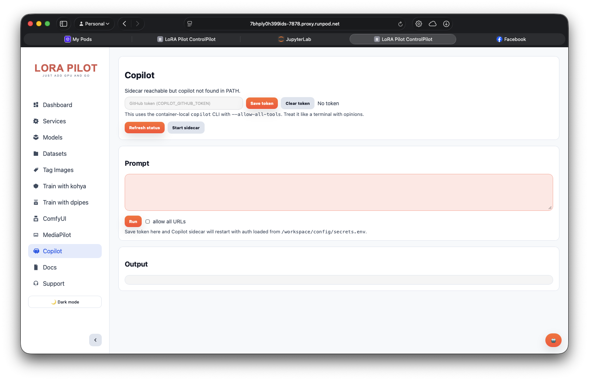

# Copilot Sidecar

_Last updated: 2026-07-05_

Copilot Sidecar is an optional FastAPI service that lets ControlPilot call the `copilot` CLI through HTTP.
It is designed for workspace-local execution and persists Copilot config/auth under `/workspace`.

## What It Does

- Exposes a small API on localhost (`127.0.0.1`, default port `7879`).
- Runs `copilot -p <prompt>` for each chat request.
- Bridges ControlPilot UI requests (`/api/copilot/*`) to sidecar endpoints.
- Stores Copilot config in workspace-backed paths so auth survives restarts.



## Runtime Wiring

- Supervisor program: `copilot` (`autostart=false`) in `supervisor/supervisord.conf`.
- Startup script: `scripts/copilot-sidecar.sh`.
- Script sets:
  - `HOME=${COPILOT_HOME:-/workspace/home/root}`
  - `XDG_CONFIG_HOME=${COPILOT_XDG_CONFIG_HOME:-/workspace/home/root/.config}`
- Uvicorn bind:
  - `127.0.0.1:${COPILOT_SIDECAR_PORT:-7879}`

ControlPilot backend target:
- `COPILOT_SIDECAR_URL` (default `http://127.0.0.1:7879`)

## Sidecar API

- `GET /health`
- `GET /status`
- `POST /chat`

`POST /chat` request fields:

- `prompt` (required)
- `cwd` (optional; must resolve under `/workspace`)
- `allow_all_tools` (default `true`)
- `allow_all_paths` (default `true`)
- `allow_all_urls` (default `false`)
- `timeout_seconds` (optional; default from `COPILOT_TIMEOUT_SECONDS`)

## ControlPilot API Bridge

In `apps/Portal/app.py`, ControlPilot exposes:

- `GET /api/copilot/status`
- `POST /api/copilot/chat`
- `GET /api/copilot/token`
- `POST /api/copilot/token`

Notes:
- If the sidecar is unreachable, status returns a graceful payload with `sidecar_reachable=false`.
- Chat calls are pass-through to sidecar `/chat`.

## Environment Variables

| Variable | Default |
|---|---|
| `COPILOT_SIDECAR_PORT` | `7879` |
| `COPILOT_SIDECAR_URL` | `http://127.0.0.1:7879` |
| `COPILOT_TIMEOUT_SECONDS` | `1800` |
| `COPILOT_HOME` | `/workspace/home/root` |
| `COPILOT_XDG_CONFIG_HOME` | `/workspace/home/root/.config` |
| `COPILOT_CWD` | `/workspace` |
| `COPILOT_GITHUB_TOKEN` | empty |

## Quick Checks

```bash
# Sidecar process
supervisorctl status copilot

# Sidecar status endpoint
curl -s http://127.0.0.1:7879/status

# Sidecar health check
curl -s http://127.0.0.1:7879/health

# Send a quick chat probe
curl -s -X POST http://127.0.0.1:7879/chat \
  -H 'Content-Type: application/json' \
  -d '{"prompt":"What tools are available?","allow_all_urls":false,"timeout_seconds":30}'

# ControlPilot bridge status
curl -s http://127.0.0.1:7878/api/copilot/status
```

## API Surface Details

`POST /chat` accepts this payload:

```json
{
  "prompt": "string",
  "cwd": "/workspace/path/for/file-access",
  "allow_all_tools": true,
  "allow_all_paths": true,
  "allow_all_urls": false,
  "timeout_seconds": 1800
}
```

Behavior notes:

- `cwd` is validated to stay under `/workspace` before command execution.
- If `copilot` is missing, requests return HTTP `503`.
- If a command exceeds `timeout_seconds`, the sidecar returns timeout response with `returncode: 124`.
- `GET /status` includes auth-availability indicators:
  - `env_has_token`
  - `config_has_token_like_field`
- `GET /health` is a simple availability probe.

## Related

- [ControlPilot](../user-guide/control-pilot.md)
- [API Reference](../development/api-reference.md)
- [Supervisor](../configuration/supervisor.md)
- [Section Index](README.md)
- [Documentation Home](../README.md)

---

---

## 📝 Feedback

Was this helpful? [Suggest improvements on GitHub Discussions](https://github.com/vavo/lora-pilot/discussions/categories/documentation-feedback)

