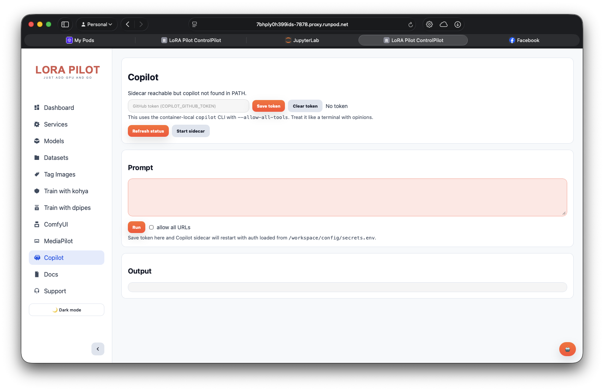

# Copilot Sidecar

_Last updated: 2026-09-10_

You can ask about a training configuration while keeping the project files in the same environment. LoRA Pilot's optional Copilot integration connects the ControlPilot drawer to the installed GitHub Copilot CLI. It lets you work with an assistant in the context of the workspace rather than moving each file into a separate conversation by hand.

The sidecar is the local service between the browser and the CLI. A chat request can invoke tools and change files, depending on the permissions passed to the CLI. Treat it as an execution interface and give it a task with a clear scope.

## Open the assistant when you need it

The Supervisor service is named `copilot` and has autostart disabled in the bundled configuration. Start it through **Services** when you want to use the assistant. ControlPilot enables the chat prompt and Run control after it can reach the sidecar and confirm that the CLI is installed. The drawer refreshes status when opened and during background checks.

CLI availability and account access are separate checks. A token-presence indicator shows that a credential may be available; it does not prove that the credential is valid or that a request will succeed. Complete the GitHub Copilot authentication required by your installed CLI before relying on the integration.



A useful initial task is to explain a particular configuration file and identify the settings relevant to a planned run. Name the file and describe the question. Review the response against that file before asking for an edit, then inspect any changes before starting training. The drawer is hidden while you use MediaPilot.

## Understand the execution boundary

The sidecar accepts a working directory that resolves under `/workspace`. Its default is `/workspace`, controlled by `COPILOT_CWD`. It starts the CLI in that directory and sends the prompt through standard input. The working-directory check determines where the process starts; it is not a filesystem sandbox for the tools the CLI can execute.

The request defaults `allow_all_tools` and `allow_all_paths` to `true`, while `allow_all_urls` defaults to `false`. These map to the corresponding CLI permission flags. With the broad defaults, a request can use powerful tools and access paths beyond its starting folder according to the CLI's behavior and the container's permissions. Use the integration within a workspace and access arrangement you trust.

The launcher binds the sidecar to `127.0.0.1` on port `7879` by default. ControlPilot connects through `COPILOT_SIDECAR_URL`, whose default is `http://127.0.0.1:7879`. Keep that service internal and use the ControlPilot bridge for browser access. The sidecar does not provide a separate public login layer.

## Keep authentication with the workspace

The launcher sets `HOME` from `COPILOT_HOME`, defaulting to `/workspace/home/root`. It sets `XDG_CONFIG_HOME` from `COPILOT_XDG_CONFIG_HOME`, defaulting to `/workspace/home/root/.config`. These workspace-backed locations let the CLI retain configuration across sessions when the workspace persists.

The integration recognizes token availability through variables including `COPILOT_GITHUB_TOKEN`, and ControlPilot provides token configuration through its settings flow. Keep credentials private and ensure that an interactive CLI session uses the same home and configuration locations as the sidecar. Authenticating under a different home directory may leave the service unable to find that configuration.

The sidecar records the selected working directory in the CLI's trusted-folder configuration. Existing configuration and authentication files therefore form part of the state you should understand before sharing or backing up the workspace.

## Check availability without executing a task

Run the following inside the pod or container to inspect the service and its status. On a Docker Compose host, enter the container with `docker compose exec lora-pilot bash` first.

```bash
supervisorctl status copilot
curl -s http://127.0.0.1:7879/health
curl -s http://127.0.0.1:7879/status
```

The health endpoint reports whether the service answers. The status endpoint reports CLI availability, version information when available, and configuration indicators without returning the token values. Through ControlPilot, `GET /api/copilot/status` adds information about whether the sidecar is reachable.

Use these read-only checks before submitting a chat as a diagnostic probe. A prompt such as “what tools are available?” still invokes the CLI and can perform work; it is not equivalent to a health request.

## Read a completed or failed request

The internal `POST /chat` endpoint requires `prompt` and accepts `cwd`, the permission fields, and an optional positive `timeout_seconds`. ControlPilot forwards chat requests through `POST /api/copilot/chat`. The default timeout comes from `COPILOT_TIMEOUT_SECONDS`, with a bundled default of `1800` seconds.

A response includes `ok`, `returncode`, elapsed duration, and captured output. If the CLI is missing, the sidecar returns HTTP `503`. A timeout returns `ok: false` and `returncode: 124`, with available output and a timeout message. Read those fields before treating a response as completed work.

For a service error, inspect `/workspace/logs/copilot.err.log` and the ControlPilot log. Use the [debugging guide](../development/debugging.md) to trace connection failures, or the [Supervisor guide](../configuration/supervisor.md) to understand service startup. Return to the [component overview](README.md) for the training and generation tools around the assistant.
