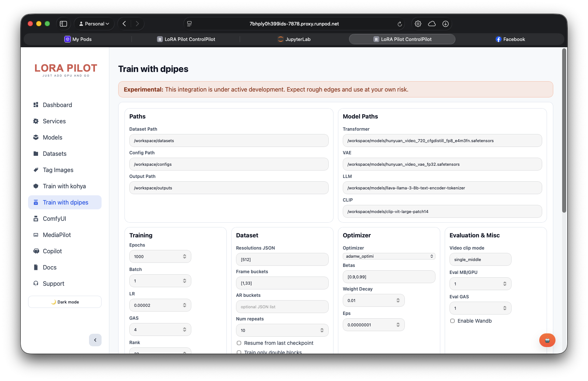

# Diffusion Pipe

Diffusion Pipe in LoRA Pilot is an experimental DeepSpeed-based training path with TensorBoard baked in. It is exposed as the `diffpipe` supervisor service and as the `Dpipe` training tab in ControlPilot.

##  Overview

Current implementation provides:
- TensorBoard service on port `4444` (default)
- Optional `deepspeed train.py` launch when a config is provided
- ControlPilot API/UI for start/stop/logs and config generation
- Single-run process guard in the API (one active training process at a time)

##  Access

- **ControlPilot Dpipe tab**: `http://localhost:7878` -> `Dpipe`
- **TensorBoard URL**: `http://localhost:4444`
- **Supervisor service name**: `diffpipe`
- **Startup script**: `/opt/pilot/diffusion-pipe.sh`



## ⚙️ Runtime Modes

The supervisor service behaves differently based on `DIFFPIPE_CONFIG`:

| Mode | Condition | Behavior |
|---|---|---|
| TensorBoard-only | `DIFFPIPE_CONFIG` is empty | Starts TensorBoard on `DIFFPIPE_PORT` |
| Train + TensorBoard | `DIFFPIPE_CONFIG` is set | Runs `deepspeed --num_gpus=<N> train.py --deepspeed --config <file>` and optionally starts TensorBoard |

Notes:
- `DIFFPIPE_TENSORBOARD=1` starts TensorBoard sidecar during training mode.
- `NCCL_P2P_DISABLE=1` and `NCCL_IB_DISABLE=1` are exported by default.

## 📁 Paths and Artifacts

| Path | Purpose |
|---|---|
| `/opt/pilot/repos/diffusion-pipe` | Default training repo used by runtime script |
| `/workspace/apps/diffusion-pipe` | Workspace override location (used by API if `train.py` exists there) |
| `/workspace/logs/diffusion-pipe` | Default TensorBoard logdir (`DIFFPIPE_LOGDIR`) |
| `/workspace/configs/dataset_config.toml` | Generated dataset config (ControlPilot API flow) |
| `/workspace/configs/training_config.toml` | Generated training config (ControlPilot API flow) |

##  Environment Variables

| Variable | Purpose | Default |
|---|---|---|
| `DIFFPIPE_PORT` | TensorBoard port | `4444` |
| `DIFFPIPE_CONFIG` | Training config path for service script | empty |
| `DIFFPIPE_LOGDIR` | TensorBoard log directory | `/workspace/logs/diffusion-pipe` |
| `DIFFPIPE_NUM_GPUS` | Passed to `deepspeed --num_gpus` | `1` |
| `DIFFPIPE_EXTRA_ARGS` | Extra CLI args appended to train command | empty |
| `DIFFPIPE_TENSORBOARD` | Start TensorBoard sidecar in train mode | `1` |
| `NCCL_P2P_DISABLE` | NCCL setting | `1` |
| `NCCL_IB_DISABLE` | NCCL setting | `1` |

## 🖥️ ControlPilot Dpipe API

`apps/Portal/dpipe_api.py` exposes:

| Endpoint | Method | Purpose |
|---|---|---|
| `/dpipe/train/validate` | `POST` | Validate required model paths exist |
| `/dpipe/train/start` | `POST` | Generate configs and launch training |
| `/dpipe/train/stop` | `POST` | Stop active training process |
| `/dpipe/train/logs` | `GET` | Return in-memory log tail for active/recent run |

`/dpipe/train/start` currently builds a `hunyuan-video` style config and requires:
- `transformer_path`
- `vae_path`
- `llm_path`
- `clip_path`

## 🧰 Operational Commands

```bash
# Service status
docker exec lora-pilot supervisorctl status diffpipe

# Follow service logs (TensorBoard/service bootstrap)
docker exec lora-pilot tail -n 200 /workspace/logs/diffpipe.out.log
docker exec lora-pilot tail -n 200 /workspace/logs/diffpipe.err.log

# Hit training logs from API
curl -s "http://localhost:7878/dpipe/train/logs?limit=200"
```

##  Troubleshooting

### Port `4444` opens but no training runs
- Expected when `DIFFPIPE_CONFIG` is unset: service is TensorBoard-only.
- Start training from ControlPilot `Dpipe` tab or set `DIFFPIPE_CONFIG`.

### Start fails with missing model files
- Use `POST /dpipe/train/validate` (ControlPilot does this automatically).
- Verify each configured model path exists under `/workspace/models`.

### Start fails with "A training process is already running."
- Stop current run first:
```bash
curl -s -X POST http://localhost:7878/dpipe/train/stop
```

### TensorBoard starts but shows empty runs
- Confirm `DIFFPIPE_LOGDIR` points to the directory where your training writes events.
- If training is launched via API, verify output/config/log paths in the Dpipe form.

## Related

- [ControlPilot](../user-guide/control-pilot.md)
- [Training Workflows](../user-guide/training-workflows.md)
- [Environment Variables](../configuration/environment-variables.md)
- [Section Index](README.md)
- [Documentation Home](../README.md)

---

_Last updated: 2026-02-11_

---

## 📝 Feedback

Was this helpful? [Suggest improvements on GitHub Discussions](https://github.com/notri1/lora-pilot/discussions/categories/documentation-feedback)


