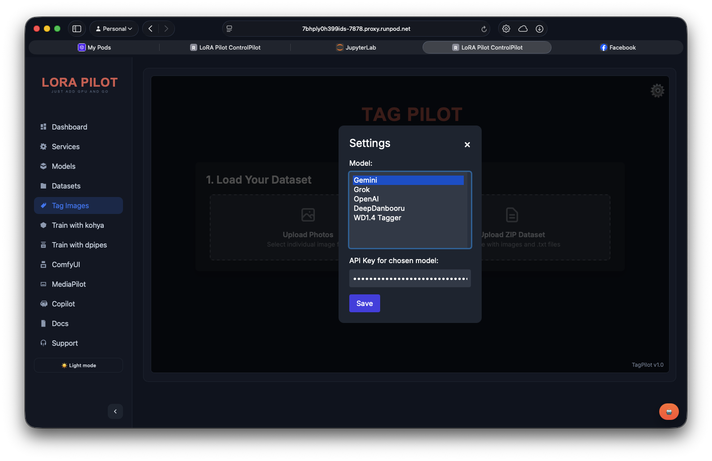
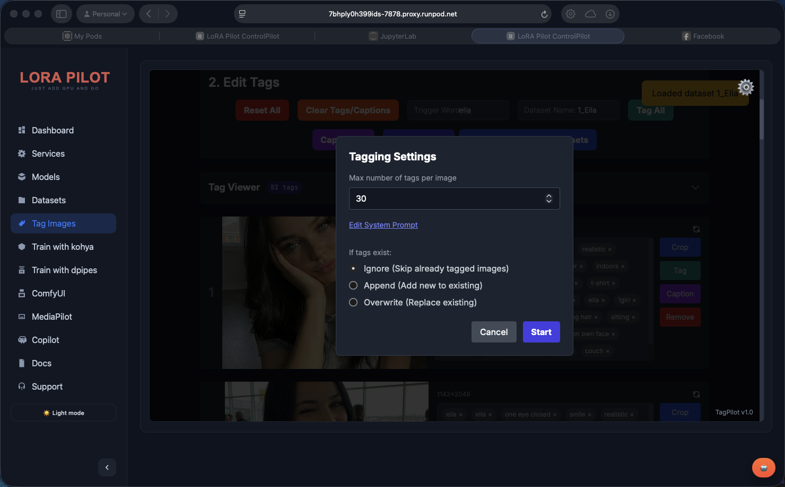

# TagPilot

TagPilot is the dataset preparation UI for LoRA Pilot. It is a browser-first tool for loading images, generating tags/captions, editing labels, and saving datasets into `/workspace/datasets`.

## 🎯 Overview

TagPilot supports:
- Upload individual images or full ZIP datasets
- Duplicate detection (hash-based)
- Manual tag editing and caption mode
- Trigger-word prepending across the dataset
- Crop and single-image tools (tag/caption/remove)
- Batch tagging/captioning with multiple AI providers
- Export ZIP or save directly to workspace dataset folders





## 🚀 Access

- **ControlPilot tab**: `TagPilot`
- **Direct route**: `http://localhost:7878/tagpilot/`
- **Open a dataset directly**:
  - `http://localhost:7878/tagpilot/?dataset=1_my_dataset`

In LoRA Pilot, TagPilot is mounted under ControlPilot; you generally do not need a separate service/port.

## 📁 Dataset Flow

### Load existing dataset
TagPilot requests:
- `GET /api/tagpilot/load?name=<dataset>`

This loads files from:
- `/workspace/datasets/1_<dataset_name>`

### Save to workspace
The `Save to /workspace/datasets` action streams files to:
- `POST /api/tagpilot/save-item?name=<dataset>`

Result:
- Dataset folder: `/workspace/datasets/1_<dataset_name>`
- ZIP copy: `/workspace/datasets/ZIPs/<dataset_name>.zip`

### Export without saving
- `Export as ZIP` creates a client-side download only.

## 🤖 Auto Tag/Caption Providers

Configurable in TagPilot settings:
- `Gemini`
- `Grok`
- `OpenAI`
- `DeepDanbooru`
- `WD1.4` (via Replicate)

Notes:
- API keys and provider settings are stored in browser `localStorage`.
- WD1.4 requires a Replicate API key.
- Batch operations support modes: `ignore`, `append`, `overwrite`.

## 🧰 Typical Workflow

1. Open TagPilot from ControlPilot.
2. Upload images or a ZIP.
3. Set `Trigger Word` and `Dataset Name`.
4. Run `Tag All` or `Caption All` (optional).
5. Manually fix tags in card editor or global tag viewer.
6. Click `Save to /workspace/datasets`.
7. Train with Kohya/AI Toolkit/TrainPilot using that dataset.

## ⌨️ Keyboard Shortcuts

Shortcuts currently implemented in `apps/TagPilot/index.html`:

| Context | Shortcut | Action |
|---|---|---|
| Preview modal open | `ArrowLeft` / `ArrowRight` | Previous / next preview image |
| Global | `Escape` | Close preview, cancel crop, and close tag/caption settings modals (when batch processing is not running) |
| Tag input field (`Add tag...`) | `Enter` or `,` | Commit typed tag as a tag pill |

Additional global navigation/edit shortcuts beyond the above are **Not found in repo**.

## 🔌 Integration Endpoints

| Endpoint | Method | Purpose |
|---|---|---|
| `/api/tagpilot/load` | `GET` | Load dataset files into TagPilot |
| `/api/tagpilot/save` | `POST` | Save ZIP and extract to dataset dir |
| `/api/tagpilot/save-item` | `POST` | Incremental save (used by UI) |
| `/api/datasets` | `GET` | Dataset list used by ControlPilot/TrainPilot |

## 🔐 Security Notes

- Provider API keys are browser-side values (`localStorage`), not server secrets.
- Do not run TagPilot in shared browsers with persistent sessions if that is a problem for your workflow.

## 🛠️ Troubleshooting

### TagPilot opens but cannot load/save datasets
- Confirm ControlPilot API is reachable at `http://localhost:7878`.
- Check `controlpilot` logs:
```bash
docker exec lora-pilot supervisorctl status controlpilot
docker exec lora-pilot tail -n 200 /workspace/logs/controlpilot.err.log
```

### Save to workspace fails mid-run
- Ensure dataset name is valid (letters/numbers/`_`/`-` safest).
- Check free disk space under `/workspace`.
- Retry with smaller batch uploads if browser memory is tight.

### Auto-tagging fails
- Verify selected provider key and quota.
- For WD1.4, confirm Replicate key and thresholds.
- For Gemini/Grok/OpenAI, verify account model access.

## Related

- [Datasets 101](../getting-started/datasets-101/README.md)
- [Training Workflows](../user-guide/training-workflows.md)
- [TrainPilot](trainpilot.md)
- [Section Index](README.md)
- [Documentation Home](../README.md)

---

_Last updated: 2026-02-11_
