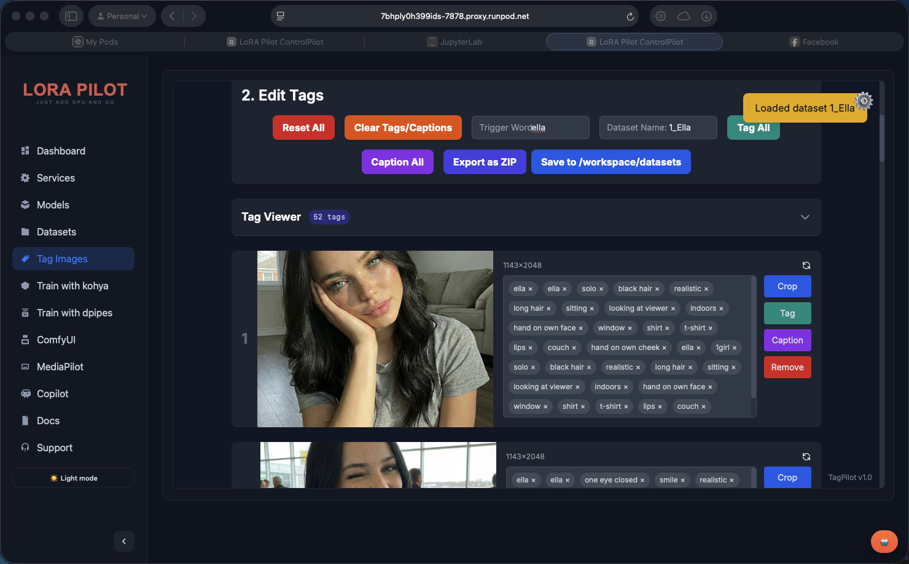
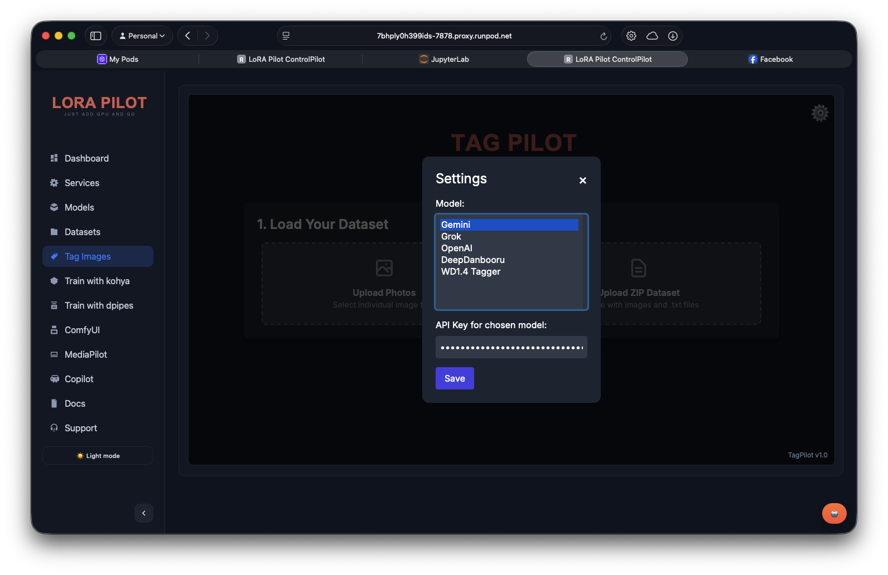
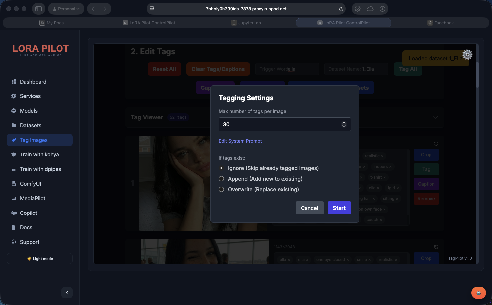

# TagPilot

TagPilot is the dataset preparation UI for LoRA Pilot. It is a browser-first tool for loading images, generating tags/captions, editing labels, and saving datasets into `/workspace/datasets`.

##  Overview

TagPilot supports:
- Upload individual images or full ZIP datasets
- Duplicate detection (hash-based)
- Manual tag editing and caption mode
- Trigger-word prepending across the dataset
- Crop and single-image tools (tag/caption/remove), including preview-modal crop access
- Batch tagging/captioning with multiple AI providers
- Export ZIP or save directly to workspace dataset folders





##  Access

- **ControlPilot tab**: `TagPilot`
- **Direct route**: `http://localhost:7878/tagpilot/`
- **Open a dataset directly**:
  - `http://localhost:7878/tagpilot/?dataset=1_my_dataset`
  - The ControlPilot Datasets menu now opens TagPilot with `?dataset=<dataset_name>` so edits resume from previously saved images/tags.

In LoRA Pilot, TagPilot is mounted under ControlPilot; you generally do not need a separate service/port.

## 📁 Dataset Flow

### Load existing dataset
TagPilot requests:
- `GET /api/tagpilot/load?name=<dataset>`

This loads files from:
- `/workspace/datasets/1_<dataset_name>`
- Dataset links coming from ControlPilot (for example from the Datasets list) keep the existing `dataset` query param and call the same endpoint, so tags/captions load automatically.

### Save to workspace
The `Save to /workspace/datasets` action streams files to:
- `POST /api/tagpilot/save-item?name=<dataset>`

Result:
- Dataset folder: `/workspace/datasets/1_<dataset_name>`
- ZIP copy: `/workspace/datasets/ZIPs/<dataset_name>.zip`

### Export without saving
- `Export as ZIP` creates a client-side download only.

## 🤖 Auto Tag/Caption Providers

Configurable in TagPilot settings:
- `Gemini`
- `Grok`
- `OpenAI`
- `Claude`
- `vLLM (OpenAI compatible)`
- `DeepDanbooru`
- `WD1.4` (via Replicate)

Notes:
- `Claude` and `vLLM` are configured directly in the TagPilot Settings modal and kept in the browser session storage for convenience.
- `Gemini`, `Grok`, and `OpenAI` can still be managed from ControlPilot secrets settings.
- Browser uploads for Gemini/Grok/OpenAI are normalized to JPEG/PNG where needed, and the backend infers image MIME type from the request, filename, and image bytes before provider calls.
- Provider errors return JSON from ControlPilot instead of gateway-style HTML error pages.
- WD1.4 requires a Replicate API key.
- Batch operations support modes: `ignore`, `append`, `overwrite`.

## OpenAI-Compatible vLLM Support

For OpenAI-compatible backends (`vLLM`, LM Studio, etc.), pick `vLLM OpenAI compatible` from the TagPilot model selectors and set:

- `vLLM endpoint URL`: set the full URL or base URL for `/v1` (TagPilot supports either `https://host/v1` or `https://host/v1/chat/completions`).
- `vLLM model type`: enter the exact model identifier your endpoint serves (for example `Qwen/Qwen3-8B`).
- `API key`: provided in the `Authorization: Bearer <token>` header when your server requires it.

The selected endpoint/model are saved in browser localStorage so they persist between TagPilot sessions.

## 🧰 Typical Workflow

1. Open TagPilot from ControlPilot.
2. Upload images or a ZIP.
3. Set `Trigger Word` and `Dataset Name`.
4. Run `Tag All` or `Caption All` (optional).
5. Manually fix tags in card editor or global tag viewer.
6. Click `Save to /workspace/datasets`.
7. Train with Kohya/AI Toolkit/TrainPilot using that dataset.

## ⌨️ Keyboard Shortcuts

Shortcuts currently implemented in `apps/TagPilot/index.html`:

| Context | Shortcut | Action |
|---|---|---|
| Preview modal open | `ArrowLeft` / `ArrowRight` | Previous / next preview image |
| Global | `Escape` | Close preview, cancel crop, and close tag/caption settings modals (when batch processing is not running) |
| Tag input field (`Add tag...`) | `Enter` or `,` | Commit typed tag as a tag pill |

Additional global navigation/edit shortcuts beyond the above are **Not found in repo**.

## 🔌 Integration Endpoints

| Endpoint | Method | Purpose |
|---|---|---|
| `/api/tagpilot/load` | `GET` | Load dataset files into TagPilot |
| `/api/tagpilot/providers` | `GET` | Return Gemini/Grok/OpenAI configuration status without exposing keys |
| `/api/tagpilot/providers/{provider}/key` | `POST` | Save a Gemini/Grok/OpenAI key to server-side secrets |
| `/api/tagpilot/generate` | `POST` | Generate tags/captions from an uploaded image through Gemini/Grok/OpenAI through ControlPilot |
| `/api/tagpilot/save` | `POST` | Save ZIP and extract to dataset dir |
| `/api/tagpilot/save-item` | `POST` | Incremental save (used by UI) |
| `/api/datasets` | `GET` | Dataset list used by ControlPilot/TrainPilot |

## 🔐 Security Notes

- Gemini, Grok, and OpenAI keys are server-side values in `/workspace/config/secrets.env` when using ControlPilot-managed providers.
- Claude and vLLM keys entered in TagPilot are stored in browser session storage on the running machine.
- Bootstrap preserves existing provider key lines when rewriting runtime secrets.
- WD1.4 still uses a browser-session Replicate key.
- Do not run TagPilot in shared browsers with persistent sessions if that is a problem for your workflow.

## 🧪 Provider Smoke Test

Inside the image, run:

```bash
/opt/pilot/tagpilot-provider-smoke.py --require-all
```

The script loads provider keys from `/workspace/config/secrets.env`, sends a tiny PNG to OpenAI, Gemini, and Grok, and reports whether the currently pinned provider APIs/models are reachable. Locally from the repo checkout, use `scripts/tagpilot-provider-smoke.py`.

##  Troubleshooting

### TagPilot opens but cannot load/save datasets
- Confirm ControlPilot API is reachable at `http://localhost:7878`.
- Check `controlpilot` logs:
```bash
docker exec lora-pilot supervisorctl status controlpilot
docker exec lora-pilot tail -n 200 /workspace/logs/controlpilot.err.log
```

### Save to workspace fails mid-run
- Ensure dataset name is valid (letters/numbers/`_`/`-` safest).
- Check free disk space under `/workspace`.
- Retry with smaller batch uploads if browser memory is tight.

### Auto-tagging fails
- Verify selected provider key and quota.
- For WD1.4, confirm Replicate key and thresholds.
- For Gemini/Grok/OpenAI, verify account model access.
- For vLLM, verify endpoint URL and that model ID exists on the vLLM server.

## Related

- [Datasets 101](../getting-started/datasets-101/README.md)
- [Training Workflows](../user-guide/training-workflows.md)
- [TrainPilot](trainpilot.md)
- [Section Index](README.md)
- [Documentation Home](../README.md)

---

_Last updated: 2026-07-03_

---

## 📝 Feedback

Was this helpful? [Suggest improvements on GitHub Discussions](https://github.com/notri1/lora-pilot/discussions/categories/documentation-feedback)
