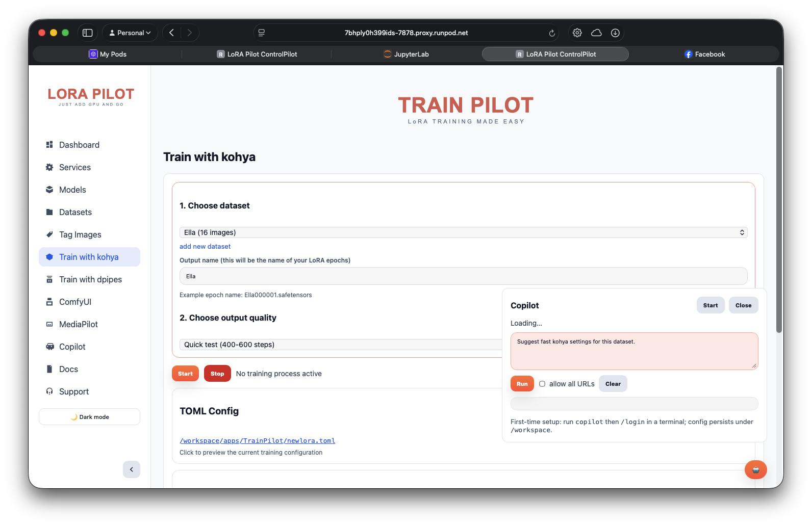

# TrainPilot

_Last updated: 2026-09-10_

Your first training run can answer a focused question: can this collection teach an SDXL model the subject you have in mind? TrainPilot gives you a guided way to set up that experiment through Kohya. You choose a saved dataset and a profile, then follow the run through its logs and saved outputs.

TrainPilot is an SDXL LoRA launcher. It prepares a configuration for Kohya's `sdxl_train_network.py`; use the other [training paths](../user-guide/training-workflows.md) when your model family or training method requires them.

## Begin with a reviewed dataset

Open **Train with kohya** in ControlPilot and select a dataset. If the collection is missing, return to **Datasets** and confirm that you saved it under `/workspace/datasets` with the expected `1_` naming convention. Review its images and captions before committing GPU time to training.

Give the output a name that distinguishes this experiment from earlier runs. A name such as `teapot_sideviews_test` tells you more about the intent than `final_v2`. Keep the dataset revision and the question you are testing in your project notes so you can interpret the result later.



ControlPilot checks the Kohya and TensorBoard service state before launch and offers to start missing services. It also checks the checkpoint and VAE paths from the selected TOML configuration. If it can match missing files to catalog entries, it offers a download path. A successful preflight establishes those checks, rather than promising that the full run will fit the GPU.

## Choose a profile as an experiment size

The `quick_test` profile starts from a target of 600 steps with a 12-epoch ceiling. It uses rank 32, alpha 16, batch size 1, gradient accumulation of 2, and `fp16` precision. Use it to inspect whether the setup and dataset produce a useful direction before committing to a larger run.

The `regular` profile starts from 1,200 steps and a 25-epoch ceiling, with rank 48, alpha 24, batch size 2, gradient accumulation of 2, and `bf16`. The `high_quality` profile starts from 2,400 steps and a 45-epoch ceiling, with rank 64, alpha 32, batch size 4, accumulation of 1, and `bf16`. The profile name is not a guarantee that the resulting LoRA will suit your project better.

TrainPilot adjusts the step target for datasets above 80 images and clamps it to a calculated epoch ceiling. The number of steps in the final configuration may therefore differ from the starting target. Compare completed runs using their saved configuration and output, rather than relying on the profile label alone.

## Know which configuration the run uses

The persistent base configuration defaults to `/workspace/config/trainpilot/newlora.toml`. ControlPilot's launcher uses `/opt/pilot/apps/TrainPilot/trainpilot.sh`, and the training process defaults to `/opt/venvs/kohya/bin/python`. The workspace application copy is not the launcher path used by the current ControlPilot integration.

At launch, TrainPilot copies the selected TOML to `/workspace/outputs/<output_name>/<output_name>.toml` and applies profile values. These include rank, batch, learning-rate, precision, and step settings. Editing one of those values in the base TOML does not guarantee it survives the profile patching. Inspect the generated run configuration when you need to know the settings that reached Kohya.

The launcher stages a copy of the dataset under the training directory selected by the configuration. Use a dedicated staging directory: the staging flow can clear existing child directories before copying the chosen collection. Keep your source dataset and other projects outside that scratch location. Read [dataset preparation](../user-guide/dataset-preparation.md) for the saved collection's layout.

## Follow the run and judge its output

The run writes its training log to `/workspace/outputs/<output_name>/_logs/train.log`. ControlPilot combines launcher messages and training logs in its interface. If a run fails, inspect the first meaningful error and the generated TOML before changing several settings at once.

TrainPilot writes TensorBoard events under `/workspace/logs/TrainPilot`. Use **Open TensorBoard** on the training page to inspect them through the shared TensorBoard service on port `4444`. A fresh run may need time to produce event files before there is anything to display.

After training, use a compatible SDXL generation workflow to compare the adaptation with the base model. Test more than one prompt relevant to your intended use. You may discover that the subject is recognizable in familiar views but weak in a new setting; that gives you a specific reason to revise the dataset or training setup. [Is my LoRA good?](../getting-started/loRA-training-101/is-my-lora-good.md) develops that evaluation process.

## Use the terminal when you want a scripted run

Run `trainpilot` inside the pod or container for the interactive flow. It prepares the environment and may download required tokenizer files before presenting dataset choices. It does not implement a `--help` option. Read the configuration first rather than using that flag as a harmless inspection command.

For a headless run, provide a real saved dataset and an existing TOML. The following example launches training; replace the names with your intended experiment and run it only when the GPU and output location are ready.

```bash
NO_CONFIRM=1 DATASET_NAME=1_ceramic_teapot OUTPUT_NAME=teapot_test   PROFILE=quick_test TOML=/workspace/config/trainpilot/newlora.toml   /opt/pilot/apps/TrainPilot/trainpilot.sh
```

Queue mode accepts `--queue` followed by entries in the form `TOML:DATASET[:OUTPUT[:PROFILE]]`. It runs them in sequence and reports a nonzero result if any queued run fails. Each entry still needs its own valid inputs and an output name that makes the result identifiable.

For API integration, `POST /api/trainpilot/start` and `/stop` control a run, `/model-check` checks paths, and `GET /api/trainpilot/logs` returns combined logs. The `/api/trainpilot/toml` endpoint supports reading and saving the base configuration. Consult the [API reference](../development/api-reference.md) for request details and [debugging](../development/debugging.md) for runtime failures.
