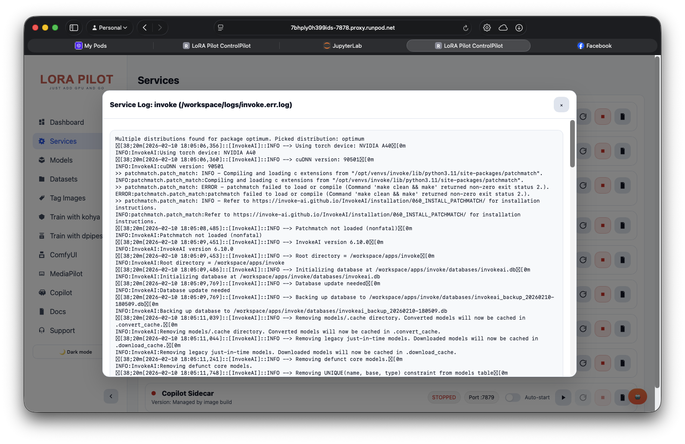

# Supervisor

_Last updated: 2026-07-05_

LoRA Pilot uses `supervisord` as the in-container process manager.

## Startup Path

Container command (Dockerfile `CMD`):

1. `/opt/pilot/start.sh` sources `bootstrap.sh`, including persisted settings.
2. It launches `/usr/bin/supervisord -n -c "$SUPERVISOR_CONFIG_PATH"`. The default remains `/etc/supervisor/supervisord.conf`.

Main config in repo: `supervisor/supervisord.conf` (copied to `/etc/supervisor/supervisord.conf` in image).

## Supervisor Interfaces

Defined in config:

- Unix socket: `/tmp/supervisor.sock` (`chmod=0700`)
- HTTP interface: `127.0.0.1:9001`
  - Username: `admin`
  - Password: `${SUPERVISOR_ADMIN_PASSWORD:-supervisor_secure_password_2024}`

`supervisorctl` is configured to use the unix socket:

- `serverurl=unix:///tmp/supervisor.sock`

## Managed Programs

| Program | Autostart | Autorestart | Startsecs | Command |
|---|---:|---:|---:|---|
| `jupyter` | `true` | `true` | `2` | `/opt/pilot/start-jupyter.sh` |
| `code-server` | `true` | `true` | `2` | `/opt/pilot/start-code-server.sh` |
| `comfy` | `true` | `true` | `2` | `/bin/bash -lc '/opt/pilot/comfy.sh'` |
| `kohya` | `true` | `true` | `2` | `/bin/bash -lc '/opt/pilot/start-kohya.sh'` |
| `diffpipe` | `true` | `true` | `2` | `/bin/bash -lc 'exec /opt/pilot/diffusion-pipe.sh'` |
| `invoke` | `true` | `true` | `5` | `/bin/bash -lc 'exec /opt/pilot/invoke.sh'` |
| `controlpilot` | `true` | `true` | `2` | `/bin/bash -lc 'exec /opt/pilot/portal.sh'` |
| `copilot` | `false` | `true` | `2` | `/bin/bash -lc '... exec /opt/pilot/copilot-sidecar.sh'` |
| `ai-toolkit` | `true` | `unexpected` | `5` | `/bin/bash -lc '... npm run update_db; exec npm run start'` |

Notes:

- `copilot` loads `/workspace/config/secrets.env` when present and maps `COPILOT_GITHUB_TOKEN` into `GH_TOKEN`/`GITHUB_TOKEN`.
- `ai-toolkit` exits cleanly if UI assets/node are unavailable (build without UI).
- `ai-toolkit` is configured with `stopasgroup=true` and `killasgroup=true`.

## Logs

Supervisor + service logs are persisted under `/workspace/logs`:

- Supervisor main log: `/workspace/logs/supervisord.log`
- Per-service logs:
  - `<service>.out.log`
  - `<service>.err.log`

Examples:

- `/workspace/logs/controlpilot.out.log`
- `/workspace/logs/comfy.err.log`



## Control Surface in ControlPilot API

Service control is implemented in `apps/Portal/app.py`.

### Status and actions

- `GET /api/services`
- `POST /api/services/{name}/{action}` where `action` is `start|stop|restart`
- `GET /api/services/{name}/log?lines=<n>`

Service names accepted by API:

- `jupyter`, `code-server`, `comfy`, `kohya`, `diffpipe`, `invoke`, `ai-toolkit`, `controlpilot`, `copilot`

Example:

```bash
curl -s http://localhost:7878/api/services
curl -s -X POST http://localhost:7878/api/services/comfy/restart
```

### Autostart settings

- `POST /api/services/{name}/settings/autostart`

Behavior:

- Edits `autostart=` in supervisor config section `[program:<name>]`
- Writes config file back to disk
- Runs `supervisorctl reread` (best effort)

Config file lookup order:

1. `SUPERVISOR_CONFIG_PATH` env var (if set)
2. `/etc/supervisor/supervisord.conf`
3. `/opt/pilot/supervisor/supervisord.conf`
4. repo path fallback when running from source

Example:

```bash
curl -s -X POST http://localhost:7878/api/services/invoke/settings/autostart \
  -H "Content-Type: application/json" \
  -d '{"enabled":false}'
```

## In-App Service Updates

ControlPilot includes update orchestration for selected services:

- Supported: `invoke` (pip)
- Image-managed: `comfy`, `kohya`, `diffpipe`, and `ai-toolkit` are updated by rebuilding the image with new build refs
- Endpoints:
  - `GET /api/services/versions`
  - `POST /api/services/{name}/update/start`
  - `GET /api/services/{name}/update/status`

Config + audit files (under `/workspace/config` by default):

- `service-updates.toml`
- `service-updates-rollback.jsonl`

Boot-time reconcile is controlled by `SERVICE_UPDATES_BOOT_RECONCILE` and runs `service-updates-reconcile.py` when enabled.

## Operational Runbook

### Check system state quickly

```bash
docker exec lora-pilot supervisorctl status
curl -s http://localhost:7878/api/services
```

### Restart one service cleanly

```bash
docker exec lora-pilot supervisorctl restart controlpilot
```

### Diagnose a flapping service

```bash
docker exec lora-pilot supervisorctl status <service>
docker exec lora-pilot tail -n 200 /workspace/logs/<service>.err.log
docker exec lora-pilot tail -n 200 /workspace/logs/<service>.out.log
```

### After editing supervisor config manually

```bash
docker exec lora-pilot supervisorctl reread
docker exec lora-pilot supervisorctl update
```

## Compose vs Supervisor

- `docker compose restart lora-pilot` restarts the whole container.
- `supervisorctl restart <service>` restarts only one in-container program.
- Prefer supervisor-level restarts for surgical fixes.

## Security Notes

- Supervisor HTTP listener is localhost-only (`127.0.0.1`).
- Password should be set via `SUPERVISOR_ADMIN_PASSWORD` (bootstrap writes a random value if missing).
- Primary operational control path in LoRA Pilot is unix-socket-backed `supervisorctl`, not exposed publicly by default.

## Related

- [Environment Variables](environment-variables.md)
- [Docker Compose](docker-compose.md)
- [Custom Setup](custom-setup.md)
- [Section Index](README.md)
- [Documentation Home](../README.md)

---

---

## 📝 Feedback

Was this helpful? [Suggest improvements on GitHub Discussions](https://github.com/vavo/lora-pilot/discussions/categories/documentation-feedback)


## Persistent startup overrides (RunPod)

To keep a custom Supervisor command across pod replacement/restart, store the configuration on the persistent workspace:

```bash
cp -n /etc/supervisor/supervisord.conf /workspace/config/supervisord.conf
```

Add this line once to `/workspace/config/secrets.env`:

```bash
export SUPERVISOR_CONFIG_PATH=/workspace/config/supervisord.conf
```

Edit the `[program:comfy]` command in the workspace config, for example:

```ini
command=/bin/bash -lc 'exec /workspace/comfy.sh'
```

Your `/workspace/comfy.sh` can set runtime options and then delegate to the bundled launcher:

```bash
#!/usr/bin/env bash
set -euo pipefail
# Optional: use an already provisioned, compatible workspace Python venv.
# export COMFY_VENV_PATH=/workspace/venvs/comfy
exec /opt/pilot/comfy.sh
```

Restart the pod to select the new config. Bootstrap autostart updates, Supervisor and ControlPilot now use the same configured path. A missing override stops startup with an error instead of silently using the image default. Existing custom commands are preserved; ControlPilot can still change their autostart flags. Custom configurations remain user-maintained when new image services are added.

Keep the bundled Comfy launcher in the execution chain to retain model/workflow setup and ControlPilot access protection. If your RunPod template overrides the image startup command, use `/opt/pilot/start.sh` rather than launching Supervisor with a hard-coded config path.

### Persistent Python dependencies

`/opt/venvs/core` belongs to the image. Manual pip changes there do not survive container replacement. Startup does not reinstall torchaudio; a replacement container supplies the image's pinned packages again.

For an intentionally customized Comfy runtime, provision a complete compatible venv under `/workspace/venvs/comfy` and set `export COMFY_VENV_PATH=/workspace/venvs/comfy` in `secrets.env` or your wrapper. LoRA Pilot activates it without installing or repairing packages. The default remains core; invalid custom venv paths fail explicitly. You own compatibility between that venv, the bundled Comfy version, and custom nodes.

Do not remove torchaudio as a general cuDNN fix: audio workflows require it. Issue #27's A40/cuDNN failure needs target-host validation with matching CUDA/Torch libraries; persistence support alone does not prove that GPU error resolved.
