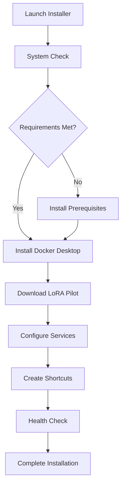

# Windows Installer

This guide covers creating a Windows installer for LoRA Pilot, providing a native Windows experience for users who prefer not to use Docker Desktop directly.

## 🎯 Overview

The Windows installer provides:
- **Native Windows Installation**: Traditional installer experience
- **Docker Desktop Integration**: Automatic Docker setup
- **Service Management**: Windows service integration
- **Desktop Integration**: Start menu shortcuts and desktop icons
- **Auto-Updates**: Automatic update notifications

## 🏗️ Installer Architecture

### Installer Components

```
LoRA Pilot Installer
├── Prerequisites Check
│   ├── Windows Version Check
│   ├── Docker Desktop Detection
│   ├── GPU Driver Check
│   └── System Requirements Validation
├── Docker Desktop Setup
│   ├── Docker Desktop Installation
│   ├── WSL2 Configuration
│   ├── Hyper-V Setup
│   └── Docker Service Start
├── LoRA Pilot Installation
│   ├── File Extraction
│   ├── Docker Image Download
│   ├── Container Configuration
│   └── Service Setup
├── Integration Setup
│   ├── Start Menu Shortcuts
│   ├── Desktop Icons
│   ├── File Associations
│   └── Windows Services
└── Post-Installation
    ├── Health Check
    ├── First Launch
    ├── User Guide
    └── Registration
```

### Installation Flow



## 🛠️ Installer Technologies

### NSIS (Nullsoft Scriptable Install System)

#### Advantages
- **Lightweight**: Small installer footprint
- **Scriptable**: Powerful scripting capabilities
- **Plugins**: Extensive plugin ecosystem
- **Cross-Version**: Works on Windows 7-11

#### Basic Structure
```nsis
; LoRA Pilot Installer Script
!define APP_NAME "LoRA Pilot"
!define APP_VERSION "2.0.0"
!define APP_PUBLISHER "vavo"
!define APP_URL "https://github.com/vavo/lora-pilot"

; Include modern UI
!include "MUI2.nsh"

; General settings
Name "${APP_NAME}"
OutFile "${APP_NAME}-${APP_VERSION}-Setup.exe"
InstallDir "$PROGRAMFILES\${APP_NAME}"
RequestExecutionLevel admin

; Pages
!insertmacro MUI_PAGE_WELCOME
!insertmacro MUI_PAGE_LICENSE "LICENSE.txt"
!insertmacro MUI_PAGE_COMPONENTS
!insertmacro MUI_PAGE_DIRECTORY
!insertmacro MUI_PAGE_INSTFILES
!insertmacro MUI_PAGE_FINISH
```

### Inno Setup

#### Advantages
- **Modern UI**: Modern, polished interface
- **Powerful Scripting**: Pascal-based scripting
- **Unicode Support**: Full Unicode support
- **Code Signing**: Built-in code signing

#### Basic Structure
```pascal
; LoRA Pilot Installer Script
#define MyAppName "LoRA Pilot"
#define MyAppVersion "2.0.0"
#define MyAppPublisher "vavo"
#define MyAppURL "https://github.com/vavo/lora-pilot"

[Setup]
AppName={#MyAppName}
AppVersion={#MyAppVersion}
AppPublisher={#MyAppPublisher}
AppPublisherURL={#MyAppURL}
DefaultDirName={pf}\{#MyAppName}
DefaultGroupName={#MyAppName}
OutputDir=Output
OutputBaseFilename=LoRAPilotSetup
Compression=lzma2
SolidCompression=yes
PrivilegesRequired=admin
```

## 📋 Prerequisites Management

### System Requirements Check

#### Windows Version Detection
```nsis
; Check Windows version
Function CheckWindowsVersion
  ${If} ${IsWin10}
    DetailPrint "Windows 10 detected - OK"
  ${ElseIf} ${IsWin11}
    DetailPrint "Windows 11 detected - OK"
  ${Else}
    MessageBox MB_OK|MB_ICONSTOP "Windows 10 or 11 required"
    Abort
  ${EndIf}
FunctionEnd
```

#### Docker Desktop Detection
```nsis
; Check if Docker Desktop is installed
Function CheckDockerDesktop
  ClearErrors
  ReadRegStr $0 HKLM "SOFTWARE\Docker\DockerDesktop" "Version"
  ${If} ${Errors}
    DetailPrint "Docker Desktop not found - will install"
    StrCpy $DockerInstalled "false"
  ${Else}
    DetailPrint "Docker Desktop found: $0"
    StrCpy $DockerInstalled "true"
  ${EndIf}
FunctionEnd
```

#### GPU Driver Check
```nsis
; Check for NVIDIA GPU and drivers
Function CheckGPUDrivers
  ClearErrors
  ReadRegStr $0 HKLM "SYSTEM\CurrentControlSet\Services\nvlddmkm" "ImagePath"
  ${If} ${Errors}
    DetailPrint "NVIDIA GPU not found - CPU mode"
    StrCpy $GPUAvailable "false"
  ${Else}
    DetailPrint "NVIDIA GPU detected"
    StrCpy $GPUAvailable "true"
    
    ; Check driver version
    nsExec::ExecToStack 'nvidia-smi --query-gpu=driver_version --format=csv,noheader'
    Pop $1
    ${If} $1 == "0"
      DetailPrint "NVIDIA drivers installed"
    ${Else}
      DetailPrint "NVIDIA drivers may need updating"
    ${EndIf}
  ${EndIf}
FunctionEnd
```

### Prerequisites Installation

#### Docker Desktop Installer
```nsis
; Download and install Docker Desktop
Section "Docker Desktop" SecDocker
  ${If} $DockerInstalled == "false"
    DetailPrint "Downloading Docker Desktop..."
    NSISdl::download "https://desktop.docker.com/win/stable/Docker%20Desktop%20Installer.exe" "$TEMP\DockerSetup.exe"
    
    DetailPrint "Installing Docker Desktop..."
    ExecWait '"$TEMP\DockerSetup.exe" --quiet install'
    
    DetailPrint "Starting Docker Desktop..."
    Exec '"$PROGRAMFILES\Docker\Docker\Docker Desktop.exe"'
    
    ; Wait for Docker to start
    DetailPrint "Waiting for Docker to start..."
    Sleep 30000  # Wait 30 seconds
    
    Delete "$TEMP\DockerSetup.exe"
  ${Else}
    DetailPrint "Docker Desktop already installed"
  ${EndIf}
SectionEnd
```

#### WSL2 Configuration
```nsis
; Configure WSL2 for Docker
Function ConfigureWSL2
  DetailPrint "Configuring WSL2..."
  
  ; Enable WSL2
  ExecWait 'powershell.exe -Command "wsl --install"'
  
  ; Set WSL2 as default
  ExecWait 'powershell.exe -Command "wsl --set-default-version 2"'
  
  ; Restart WSL
  ExecWait 'powershell.exe -Command "wsl --shutdown"'
  Sleep 10000
  ExecWait 'powershell.exe -Command "wsl"'
  
  DetailPrint "WSL2 configuration complete"
FunctionEnd
```

## 📦 Installation Process

### File Installation

#### Core Files
```nsis
; Install LoRA Pilot files
Section "LoRA Pilot" SecLoRAPilot
  SetOutPath "$INSTDIR"
  
  ; Create directories
  CreateDirectory "$INSTDIR\data"
  CreateDirectory "$INSTDIR\logs"
  CreateDirectory "$INSTDIR\config"
  
  ; Install main files
  File /r "dist\*"
  
  ; Install configuration files
  File "config\docker-compose.yml"
  File "config\.env.example"
  
  ; Install scripts
  File "scripts\start.bat"
  File "scripts\stop.bat"
  File "scripts\status.bat"
  
  ; Create default workspace
  CreateDirectory "$INSTDIR\workspace"
  CreateDirectory "$INSTDIR\workspace\models"
  CreateDirectory "$INSTDIR\workspace\datasets"
  CreateDirectory "$INSTDIR\workspace\outputs"
SectionEnd
```

#### Docker Images
```nsis
; Download Docker images
Section "Docker Images" SecDockerImages
  DetailPrint "Downloading LoRA Pilot Docker image..."
  
  ; Pull main image
  nsExec::ExecToStack 'docker pull vavo/lora-pilot:latest'
  Pop $1
  ${If} $1 != "0"
    DetailPrint "Error downloading Docker image"
    MessageBox MB_OK|MB_ICONEXCLAMATION "Error downloading Docker image. Please check your internet connection."
  ${Else}
    DetailPrint "Docker image downloaded successfully"
  ${EndIf}
SectionEnd
```

### Service Configuration

#### Docker Compose Setup
```nsis
; Configure Docker Compose
Function ConfigureDockerCompose
  DetailPrint "Configuring Docker Compose..."
  
  ; Copy docker-compose.yml
  CopyFiles "$INSTDIR\config\docker-compose.yml" "$INSTDIR\docker-compose.yml"
  
  ; Create .env file from template
  FileOpen $0 "$INSTDIR\.env" w
  FileWrite $0 "TZ=America/New_York$\r$\n"
  FileWrite $0 "INSTALL_GPU_STACK=1$\r$\n"
  FileWrite $0 "INSTALL_INVOKE=1$\r$\n"
  FileWrite $0 "INSTALL_KOHYA=1$\r$\n"
  FileWrite $0 "INSTALL_COMFYUI=1$\r$\n"
  FileWrite $0 "INSTALL_AI_TOOLKIT=1$\r$\n"
  FileClose $0
  
  DetailPrint "Docker Compose configured"
FunctionEnd
```

#### Windows Service Integration
```nsis
; Install Windows service
Function InstallWindowsService
  DetailPrint "Installing Windows service..."
  
  ; Create service script
  FileOpen $0 "$INSTDIR\service.bat" w
  FileWrite $0 "@echo off$\r$\n"
  FileWrite $0 "cd /d $INSTDIR$\r$\n"
  FileWrite $0 "docker-compose up -d$\r$\n"
  FileClose $0
  
  ; Install service using NSSM (Non-Sucking Service Manager)
  File "nssm.exe" "$INSTDIR\nssm.exe"
  
  ExecWait '"$INSTDIR\nssm.exe" install LoRA-Pilot "$INSTDIR\service.bat"'
  ExecWait '"$INSTDIR\nssm.exe" set LoRA-Pilot DisplayName "LoRA Pilot Service"'
  ExecWait '"$INSTDIR\nssm.exe" set LoRA-Pilot Description "LoRA Pilot AI Workspace Service"'
  ExecWait '"$INSTDIR\nssm.exe" set LoRA-Pilot Start SERVICE_AUTO_START'
  
  DetailPrint "Windows service installed"
FunctionEnd
```

## 🎨 User Interface Integration

### Start Menu Integration

#### Start Menu Shortcuts
```nsis
; Create Start Menu shortcuts
Section "Start Menu Shortcuts" SecStartMenu
  CreateDirectory "$SMPROGRAMS\${APP_NAME}"
  
  ; Main application shortcut
  CreateShortCut "$SMPROGRAMS\${APP_NAME}\${APP_NAME}.lnk" \
    "$INSTDIR\start.bat" \
    "$INSTDIR" \
    0 \
    "" \
    "" \
    "" \
    "$INSTDIR\icon.ico"
  
  ; Stop shortcut
  CreateShortCut "$SMPROGRAMS\${APP_NAME}\Stop ${APP_NAME}.lnk" \
    "$INSTDIR\stop.bat" \
    "$INSTDIR" \
    0 \
    "" \
    "" \
    "" \
    "$INSTDIR\icon.ico"
  
  ; Status shortcut
  CreateShortCut "$SMPROGRAMS\${APP_NAME}\Service Status.lnk" \
    "$INSTDIR\status.bat" \
    "$INSTDIR" \
    0 \
    "" \
    "" \
    "" \
    "$INSTDIR\icon.ico"
  
  ; Documentation shortcut
  CreateShortCut "$SMPROGRAMS\${APP_NAME}\Documentation.lnk" \
    "https://github.com/vavo/lora-pilot/wiki" \
    "" \
    0 \
    "" \
    "" \
    "" \
    "$INSTDIR\icon.ico"
  
  ; Uninstall shortcut
  CreateShortCut "$SMPROGRAMS\${APP_NAME}\Uninstall.lnk" \
    "$INSTDIR\uninstall.exe" \
    "$INSTDIR" \
    0 \
    "" \
    "" \
    "" \
    "$INSTDIR\icon.ico"
SectionEnd
```

#### Desktop Integration
```nsis
; Create desktop shortcut
Section "Desktop Shortcut" SecDesktop
  CreateShortCut "$DESKTOP\${APP_NAME}.lnk" \
    "$INSTDIR\start.bat" \
    "$INSTDIR" \
    0 \
    "" \
    "" \
    "" \
    "$INSTDIR\icon.ico"
SectionEnd
```

### File Associations

#### File Type Associations
```nsis
; Register file associations
Section "File Associations" SecFileAssoc
  ; Associate .lora files
  WriteRegStr HKCR ".lora" "" "LoRAPilot.LoRA"
  WriteRegStr HKCR "LoRAPilot.LoRA" "" "LoRA Model"
  WriteRegStr HKCR "LoRAPilot.LoRA\DefaultIcon" "" "$INSTDIR\icon.ico,0"
  WriteRegStr HKCR "LoRAPilot.LoRA\shell\open\command" "" '"$INSTDIR\start.bat" "%1"'
  
  ; Associate .dataset files
  WriteRegStr HKCR ".dataset" "" "LoRAPilot.Dataset"
  WriteRegStr HKCR "LoRAPilot.Dataset" "" "LoRA Dataset"
  WriteRegStr HKCR "LoRAPilot.Dataset\DefaultIcon" "" "$INSTDIR\icon.ico,0"
  WriteRegStr HKCR "LoRAPilot.Dataset\shell\open\command" "" '"$INSTDIR\start.bat" "%1"'
SectionEnd
```

## 📝 Scripts and Utilities

### Batch Scripts

#### Start Script
```batch
@echo off
REM start.bat - Start LoRA Pilot

echo Starting LoRA Pilot...

REM Check if Docker is running
docker version >nul 2>&1
if errorlevel 1 (
    echo Docker is not running. Starting Docker Desktop...
    start "" "C:\Program Files\Docker\Docker\Docker Desktop.exe"
    timeout /t 30 /nobreak
)

REM Change to installation directory
cd /d "%~dp0"

REM Start services
docker-compose up -d

REM Wait for services to start
echo Waiting for services to start...
timeout /t 60 /nobreak

REM Open web interface
start http://localhost:7878

echo LoRA Pilot started successfully!
pause
```

#### Stop Script
```batch
@echo off
REM stop.bat - Stop LoRA Pilot

echo Stopping LoRA Pilot...

cd /d "%~dp0"

docker-compose down

echo LoRA Pilot stopped.
pause
```

#### Status Script
```batch
@echo off
REM status.bat - Check LoRA Pilot status

echo Checking LoRA Pilot status...

cd /d "%~dp0"

echo.
echo Docker Status:
docker version
echo.

echo Container Status:
docker-compose ps
echo.

echo Service URLs:
echo ControlPilot: http://localhost:7878
echo ComfyUI: http://localhost:5555
echo Kohya SS: http://localhost:6666
echo InvokeAI: http://localhost:9090
echo.

pause
```

### PowerShell Scripts

#### Health Check Script
```powershell
# health-check.ps1 - LoRA Pilot health check

Write-Host "LoRA Pilot Health Check" -ForegroundColor Green
Write-Host "========================" -ForegroundColor Green

# Check Docker
try {
    $dockerVersion = docker version --format "{{.Server.Version}}"
    Write-Host "Docker: $dockerVersion" -ForegroundColor Green
} catch {
    Write-Host "Docker: Not running" -ForegroundColor Red
}

# Check containers
try {
    $containers = docker-compose ps -q
    if ($containers) {
        Write-Host "Containers: Running" -ForegroundColor Green
        docker-compose ps
    } else {
        Write-Host "Containers: Not running" -ForegroundColor Red
    }
} catch {
    Write-Host "Containers: Error checking status" -ForegroundColor Red
}

# Check services
$services = @("controlpilot", "kohya", "comfyui", "invokeai")
foreach ($service in $services) {
    try {
        $response = Invoke-WebRequest -Uri "http://localhost:7878/api/services" -TimeoutSec 5
        Write-Host "$service: Healthy" -ForegroundColor Green
    } catch {
        Write-Host "$service: Unhealthy" -ForegroundColor Red
    }
}

Write-Host "Health check completed." -ForegroundColor Green
```

## 🔧 Advanced Features

### Auto-Update System

#### Update Checker
```nsis
; Check for updates
Function CheckForUpdates
  DetailPrint "Checking for updates..."
  
  ; Get current version
  ReadRegStr $0 HKLM "SOFTWARE\${APP_NAME}" "Version"
  ${If} ${Errors}
    StrCpy $CurrentVersion "${APP_VERSION}"
  ${Else}
    StrCpy $CurrentVersion $0
  ${EndIf}
  
  ; Check latest version online
  nsExec::ExecToStack 'powershell.exe -Command "Invoke-RestMethod -Uri \"https://api.github.com/repos/vavo/lora-pilot/releases/latest\" | Select-Object -ExpandProperty tag_name"'
  Pop $1
  ${If} $1 == "0"
    Pop $LatestVersion
    ${If} $LatestVersion != $CurrentVersion
      MessageBox MB_YESNO|MB_ICONQUESTION "Update available: $LatestVersion$\nCurrent version: $CurrentVersion$\n$\nDownload update?" IDYES UpdateAvailable
    ${Else}
      DetailPrint "No updates available"
    ${EndIf}
  ${Else}
    DetailPrint "Error checking for updates"
  ${EndIf}
FunctionEnd
```

### Configuration Wizard

#### First-Time Setup
```nsis
; First-time configuration wizard
Function SetupWizard
  ; Create configuration wizard pages
  !insertmacro MUI_PAGE_WELCOME
  !insertmacro MUI_PAGE_LICENSE "LICENSE.txt"
  !insertmacro MUI_PAGE_COMPONENTS
  !insertmacro MUI_PAGE_DIRECTORY
  !insertmacro MUI_PAGE_INSTFILES
  !insertmacro MUI_PAGE_FINISH
  
  ; Custom configuration page
  Page custom ConfigurationPage ConfigurationPageLeave
  
  ; Configuration page function
  Function ConfigurationPage
    !insertmacro MUI_HEADER_TEXT "Configuration" "Configure your LoRA Pilot installation"
    
    nsDialogs::Create 1018
    Pop $0
    
    ${If} $0 == error
        Abort
    ${EndIf}
    
    ; Add controls
    ${NSD_CreateLabel} 1040u 10u 100% 10u "Select installation options:"
    
    ${NSD_CreateCheckbox} 1040u 30u 100% 10u "Install GPU support (requires NVIDIA GPU)" $GPUCheckbox
    ${NSD_CreateCheckbox} 1040u 50u 100% 10u "Create desktop shortcut" $DesktopCheckbox
    ${NSD_CreateCheckbox} 1040u 70u 100% 10u "Start with Windows" $AutoStartCheckbox
    
    ${NSD_CreateLabel} 1040u 100u 100% 10u "Workspace location:"
    ${NSD_CreateDirRequest} 1040u 120u 100% 12u $WorkspaceDir
    
    ${NSD_CreateButton} 1040u 150u 50u 25u "Browse" $BrowseButton
    ${NSD_CreateButton} 1100u 150u 50u 25u "Next" $NextButton
    
    nsDialogs::Show
    Pop $0
  FunctionEnd
```

## 📊 Build Process

### Build Script

#### NSIS Build Script
```batch
@echo off
REM build-installer.bat - Build LoRA Pilot installer

echo Building LoRA Pilot installer...

REM Set variables
set VERSION=2.0.0
set OUTPUT_DIR=dist
set INSTALLER_NAME=LoRA-Pilot-%VERSION%-Setup.exe

REM Create output directory
if not exist %OUTPUT_DIR% mkdir %OUTPUT_DIR%

REM Build installer
"C:\Program Files (x86)\NSIS\makensis.exe" \
  /DVERSION=%VERSION% \
  /DOUTPUT_DIR=%OUTPUT_DIR% \
  /DINSTALLER_NAME=%INSTALLER_NAME% \
  installer.nsi

REM Sign installer (if certificate available)
if exist "code-signing.pfx" (
    echo Signing installer...
    "C:\Program Files (x86)\Windows Kits\10\bin\10.0.19041.0\x64\signtool.exe" sign /f code-signing.pfx /p %SIGNING_PASSWORD% /t http://timestamp.digicert.com %OUTPUT_DIR%\%INSTALLER_NAME%
)

echo Installer built: %OUTPUT_DIR%\%INSTALLER_NAME%
pause
```

### Automated Build Pipeline

#### GitHub Actions Workflow
```yaml
# .github/workflows/build-installer.yml
name: Build Windows Installer

on:
  push:
    tags:
      - 'v*'
  pull_request:
    branches:
      - main

jobs:
  build:
    runs-on: windows-latest
    
    steps:
    - uses: actions/checkout@v3
    
    - name: Set up Python
      uses: actions/setup-python@v4
      with:
        python-version: '3.11'
    
    - name: Install dependencies
      run: |
        pip install -r requirements.txt
        pip install pyinstaller
    
    - name: Build application
      run: |
        pyinstaller --onefile --windowed apps/Portal/app.py
    
    - name: Download NSIS
      run: |
        curl -L -o nsis.exe "https://github.com/NSIS/nsis/releases/download/v3.08/nsis-3.08-setup.exe"
        start /wait nsis.exe /S
    
    - name: Build installer
      run: |
        "C:\Program Files (x86)\NSIS\makensis.exe" installer.nsi
    
    - name: Upload installer
      uses: actions/upload-artifact@v3
      with:
        name: windows-installer
        path: dist/LoRA-Pilot-*.exe
```

## 🔍 Testing and Validation

### Installation Testing

#### Automated Tests
```python
# tests/test_installer.py
import pytest
import subprocess
import os
from pathlib import Path

class TestInstaller:
    def test_installer_creation(self):
        """Test that installer is created correctly"""
        installer_path = Path("dist/LoRA-Pilot-2.0.0-Setup.exe")
        assert installer_path.exists()
        assert installer_path.stat().st_size > 1000000  # At least 1MB
    
    def test_installer_execution(self):
        """Test installer execution in test environment"""
        installer_path = Path("dist/LoRA-Pilot-2.0.0-Setup.exe")
        
        # Run installer with /S flag for silent installation
        result = subprocess.run([
            str(installer_path),
            "/S",
            "/D=C:\\test\\lora-pilot"
        ], capture_output=True, text=True)
        
        assert result.returncode == 0
        
        # Check installation
        install_path = Path("C:/test/lora-pilot")
        assert install_path.exists()
        assert (install_path / "start.bat").exists()
        assert (install_path / "docker-compose.yml").exists
    
    def test_service_startup(self):
        """Test that services start correctly"""
        install_path = Path("C:/test/lora-pilot")
        
        # Start services
        result = subprocess.run([
            str(install_path / "start.bat")
        ], capture_output=True, text=True)
        
        assert result.returncode == 0
        
        # Check if containers are running
        result = subprocess.run([
            "docker-compose", "ps"
        ], cwd=install_path, capture_output=True, text=True)
        
        assert "Up" in result.stdout
```

### Validation Tests

#### Health Check Tests
```python
# tests/test_health_check.py
import pytest
import requests
import time

class TestHealthCheck:
    def test_controlpilot_health(self):
        """Test ControlPilot health endpoint"""
        # Wait for services to start
        time.sleep(60)
        
        response = requests.get("http://localhost:7878/api/health", timeout=10)
        assert response.status_code == 200
        
        health_data = response.json()
        assert health_data["status"] == "healthy"
    
    def test_service_availability(self):
        """Test all services are available"""
        services = {
            "controlpilot": 7878,
            "comfyui": 5555,
            "kohya": 6666,
            "invokeai": 9090
        }
        
        for service, port in services.items():
            response = requests.get(f"http://localhost:{port}/", timeout=5)
            assert response.status_code == 200
```

## 📋 Distribution

### Release Process

#### Release Checklist
- [ ] Installer builds successfully
- [ ] All tests pass
- [ ] Code signing completed
- [ ] Virus scan clean
- [ ] Documentation updated
- [ ] Release notes written
- [ ] Upload to distribution platform

#### Distribution Channels
- **GitHub Releases**: Primary distribution channel
- **Website Download**: Direct download from website
- **Package Managers**: Chocolatey, Winget (future)
- **CDN Distribution**: Fast global distribution

### Version Management

#### Semantic Versioning
```
MAJOR.MINOR.PATCH
2.0.0 - Major release with breaking changes
2.1.0 - Minor release with new features
2.1.1 - Patch release with bug fixes
```

#### Update Channels
- **Stable**: Production-ready releases
- **Beta**: Pre-release testing
- **Alpha**: Development builds

## 🔍 Troubleshooting

### Common Installation Issues

#### Docker Desktop Issues
```nsis
; Docker Desktop troubleshooting
Function TroubleshootDocker
  DetailPrint "Troubleshooting Docker Desktop..."
  
  ; Check Docker service
  nsExec::ExecToStack 'sc query docker'
  Pop $1
  ${If} $1 != "0"
    DetailPrint "Docker service not running"
    MessageBox MB_OK|MB_ICONEXCLAMATION "Docker service is not running. Please start Docker Desktop manually."
  ${EndIf}
  
  ; Check WSL2
  nsExec::ExecToStack 'wsl --list'
  Pop $1
  ${If} $1 != "0"
    DetailPrint "WSL2 not properly configured"
    MessageBox MB_OK|MB_ICONEXCLAMATION "WSL2 is not properly configured. Please run 'wsl --install' in PowerShell as Administrator."
  ${EndIf}
FunctionEnd
```

#### GPU Issues
```nsis
; GPU troubleshooting
Function TroubleshootGPU
  DetailPrint "Troubleshooting GPU support..."
  
  ; Check NVIDIA driver
  nsExec::ExecToStack 'nvidia-smi'
  Pop $1
  ${If} $1 != "0"
    DetailPrint "NVIDIA drivers not detected"
    MessageBox MB_OK|MB_ICONEXCLAMATION "NVIDIA drivers not detected. Please install NVIDIA drivers from nvidia.com."
  ${EndIf}
  
  ; Check GPU memory
  nsExec::ExecToStack 'nvidia-smi --query-gpu=memory.total --format=csv,noheader'
  Pop $1
  ${If} $1 == "0"
    DetailPrint "Could not determine GPU memory"
  ${Else}
    DetailPrint "GPU memory detected: $1"
  ${EndIf}
FunctionEnd
```

### Support Resources

#### Help Documentation
- **User Guide**: Comprehensive user documentation
- **FAQ**: Common questions and answers
- **Video Tutorials**: Step-by-step video guides
- **Community Forum**: Community support and discussions

#### Contact Information
- **Email Support**: support@lora-pilot.com
- **GitHub Issues**: Bug reports and feature requests
- **Discord Server**: Real-time community support

---

*Last updated: 2025-02-11*
