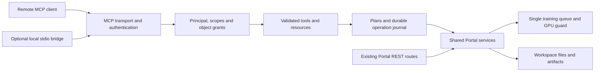

# LoRA Pilot MCP implementation plan

Date: 2026-10-03  
Status: proposed implementation; no MCP server or security controls described here have shipped.  
Companion: [test plan and release gates](mcp-test-plan.md).

## 1. Outcome and assumptions

Give an authorized assistant enough access to inspect a workspace, prepare training, submit an approved run, inspect its results and prepare a portable export. The user must be able to grant that access without granting a shell, unrestricted filesystem access, or permission to delete existing work.

Assumptions for this plan:

- One trusted workspace owner, one Portal process and one training queue per workspace. Several clients may connect; this is not multi-tenant hosting or isolation between mutually hostile OS users.
- Remote assistants and their arguments are untrusted. The container image, configured authorization server and workspace administrator are trusted. A compromised root process can bypass application controls; MCP cannot make this container a sandbox.
- The first supported workflow uses existing datasets and installed models. Dataset ingestion/editing, model installation and recovery have separate gates below; none are silently bundled into “start training.”
- MCP starts disabled. Enabling it creates no data access grant by itself. All write capabilities start disabled for each client.
- Existing UI/REST behavior remains supported. Necessary shared-backend changes receive regression coverage. This plan does not authorize implementation, GPU spending or deployment.

Success means that a client can discover its permitted tools, inspect only permitted data, execute one authorized operation despite retries, and recover its status after a disconnect. Original datasets, existing models and completed artifacts retain their contents. Client revocation blocks new work. An uncertain outcome never becomes permission to run the action again.

## 2. Evidence from the current implementation

Source baseline: commit `248cbfe`, following the API documentation review. Recheck these functions before implementation because another change may move their lines or contracts.

| Current source | What exists | Required MCP change |
|---|---|---|
| `apps/Portal/app.py`, `controlpilot_auth_middleware` and Settings auth routes | Browser cookie gate; selected public paths; no MCP principal/scopes | Separate MCP authentication and per-operation authorization; no reuse of the Portal cookie as an agent credential |
| `apps/Portal/services/training_api.py:33`, `create_router` | Router closes over one recipe and queue; returns router and queue | Extract only operations used by both REST and MCP into an explicitly injected service object |
| `apps/Portal/services/training_api.py:103`, `list_runs` | Calls `ready()`, which starts queue ownership/worker | MCP inspection must not initialize a dispatcher or change queue pause state |
| `apps/Portal/services/training_runs.py:141`, `submit` | New random run ID per call; persistent run files; no caller idempotency key | Link an operation to a reserved run ID before submission; reuse it after retries/crashes |
| `apps/Portal/services/training_runs.py:170`, `tick` | Persists running before launch, checks GPU conflicts, identifies interrupted processes | Preserve this behavior and add dispatch-time grant/budget checks for MCP-created runs |
| `apps/Portal/services/guided_training.py:190`, `fingerprint` | Fingerprint covers names, sizes and mtimes; launch copies dataset files | Verify approved content hashes and copy to a private, verified snapshot before launch; metadata equality alone is insufficient |
| `apps/Portal/services/model_downloads.py:168`, `start` | Active-job reuse in memory; subprocess output can enter errors | Durable MCP operation tracking, sanitized responses and ambiguous-outcome handling before exposing downloads |
| `apps/Portal/services/model_install.py:69`, `installation_plan` | Workflow catalog, file/access/capacity checks, plan identity | Reuse checks; bind authorization separately; constrain source/revision and destination writes |
| `apps/Portal/services/training_api.py:310`, `prepare_comparison` | “Prepare” also publishes checkpoints to shared LoRA storage | Expose a truly side-effect-free comparison plan; perform publication only during authorized execution |
| `apps/Portal/services/training_api.py:381`, `generate_comparison` | Persists submission state and treats lost replies as unknown | Preserve the uncertainty guard and bind it to the MCP operation/principal |
| `apps/Portal/services/experiment_export.py:67`, `export_plan` | Explicit package file/settings allowlist; excludes dataset/log files | Preserve allowlist; add object grants, stronger snapshot binding and authenticated artifact delivery |
| `apps/Portal/services/storage.py:33`, `parent_fd`; `:179`, `cleanup` | Descriptor-relative removal, identity checks, reviewed cleanup | Reuse the descriptor technique for new file access; leave cleanup unavailable through MCP in the initial release |
| `scripts/portal.sh`; `scripts/build/install-core-stack.sh` | Single Portal process in the shared core venv | Compose SDK lifecycle without another queue owner; resolve SDK dependencies against current build pins |

The reviewed MediaPilot mount has a separate-password login limitation. The Comfy gateway emits duplicate OpenAPI operation IDs. MCP should not depend on either surface, and should not generate its tool catalog from OpenAPI.

## 3. Architecture and transport

### 3.1 One backend owner

Mount the official Python MCP SDK's ASGI application at the exact `/mcp` endpoint, before Portal's `/` static catch-all. Keep all dispatch in the existing Portal process. Inject a narrow facade around the same training, comparison and model services used by REST.

The facade receives typed arguments and a server-constructed principal. It never accepts a caller-supplied HTTP method, URL, handler name, Python import, shell command, environment override or raw TOML/workflow graph. Do not call the public REST API with an administrator cookie, impersonate a browser session, or add an “internal bypass” header. Sharing existing application logic is the goal; bypassing its checks is not.

Name the local package `mcp_server`, not `mcp`: the launcher adds `apps/Portal` to the import path, so a local `mcp` package could shadow the SDK.

SDK startup/shutdown must compose with existing training and telemetry lifecycles. Tool discovery and read-only tools must not start another worker. Slow disk scans/hashes use a bounded executor and cancellation checks; never hold the event loop or queue lock through a network call.

### 3.2 Transport and dependency decision

Use Streamable HTTP as the deployed transport. Prefer JSON replies for short calls; large scans and training become application operations polled through a status tool. HTTP request cancellation stops work on that request; an already accepted durable training operation has its own lifetime and requires an explicit cancel operation.

The current MCP specification is `2026-07-28`, with per-request metadata and changed HTTP/session behavior. Older clients use the earlier initialization/session flow. Let the SDK implement each supported protocol revision; do not write a partial protocol implementation or require legacy session headers for every client. Validate both current behavior and the SDK's supported legacy path. Unsupported versions receive an explicit protocol error. [Transport specification](https://modelcontextprotocol.io/specification/2026-07-28/basic/transports), [Streamable HTTP](https://modelcontextprotocol.io/specification/2026-07-28/basic/transports/streamable-http).

Use the official `mcp` package, without its development CLI extras in production. Its current main branch documents the v2 API; a branch README does not establish a released version's compatibility. Phase 0 selects an exact released SDK version and hashes after checking its protocol support and dependency resolution against Portal. Do not assume historical `FastMCP` examples match that version. [Official Python SDK](https://github.com/modelcontextprotocol/python-sdk).

If a client requires stdio, add a small client-side bridge later. It forwards to this same `/mcp`, using a scoped credential loaded from an OS credential store or user-only file. It must not import `Portal.app`, open `/workspace`, start a local queue, inherit unrelated cloud credentials, or accept a destination URL from a tool argument. Its stdout contains protocol messages only; stderr diagnostics redact secrets. Loopback HTTP or an SSH tunnel is allowed for local development; remote connections require certificate-verified HTTPS. No legacy SSE-only server in the initial release.

## 4. Identity, authorization and user control

### 4.1 Access modes

| Mode | Intended use | Authentication and release condition |
|---|---|---|
| Disabled | Default image | Explicit `/mcp` rejection; no fallback to static HTML or anonymous Portal access |
| Private preview | Local clients, SSH tunnels, explicitly configured header-capable clients | Per-client opaque bearer credential, generated by the owner; limited compatibility, not advertised as universal OAuth support |
| Remote integration | Browser-connected/cross-platform clients | OAuth resource server using a maintained external authorization server and the SDK's supported integration; requires end-to-end provider/client tests |

Private credentials contain at least 256 bits of randomness, are displayed once, and are stored server-side only as digests with IDs, expiry and grants. Compare digests in constant time. Default validity is 30 days, owner-adjustable downward; rotation revokes the old credential. Expired/revoked credentials fail even if an HTTP connection remains open. Never put tokens in URLs, prompts, logs, example repositories or tool results.

For remote OAuth, use protected-resource metadata, discovery, authorization code with PKCE at the authorization server, and tokens bound to the configured MCP audience. Validate issuer, audience, signature algorithm, expiry and not-before. Map `(issuer, subject, authorized client identity)` to an owner-approved local grant; neither an arbitrary token subject nor a client-supplied `clientInfo` string creates an administrator. Configure one trusted issuer initially. Do not implement an authorization server inside Portal or forward MCP tokens to Hugging Face, ComfyUI or Copilot. OAuth and local grants both have to allow the operation. [MCP authorization](https://modelcontextprotocol.io/specification/2026-07-28/basic/authorization).

OAuth access-token expiry bounds provider-side revocation where introspection is unavailable; document that interval. Local grant revocation is checked on every request and immediately before dispatch. Issuer/JWKS endpoints come from administrator configuration, not token-controlled URLs. Apply HTTPS validation, egress restrictions, bounded caching and timeouts to discovery/key refresh. Unknown keys may cause one bounded refresh; they must not trigger unlimited fetches.

### 4.2 Scopes and object grants

Scope names are proposed product contracts. Implement a central policy table and parameterized tests rather than scattered checks.

| Scope | Allowed information or action | Additional restriction |
|---|---|---|
| `workspace:read` | Build, service/GPU state, coarse capacity/conflicts | No environment, process command lines, provider billing or credentials |
| `datasets:inspect` | Selected dataset handles, counts, bounded quality findings | Explicit dataset grant; no image/caption bytes by default |
| `models:read` | Catalog IDs, required/installed state, size information | Approved catalog only; redact source credentials/local absolute paths |
| `runs:read` | Selected/own run summaries and structured progress | Run grant or principal ownership; filter listings and totals |
| `operations:read` | Status of owned/explicitly granted MCP operations | Project results through current object grants; revoked data access also removes its result fields |
| `runs:logs` | Opt-in, bounded sanitized run log excerpts | Separate sensitive-data grant; raw service logs unavailable |
| `training:submit` | Execute a reviewed training plan | Dataset grant, approved recipe, limits and durable request ID |
| `training:cancel` | Stop an owned/explicitly granted managed run | Does not imply permission to stop the service or another run |
| `comparison:submit` | Execute a fixed comparison recipe | Granted successful run/checkpoint and bounded generation budget |
| `artifacts:export` | Package approved artifacts | Explicit file selection; no implicit dataset/log inclusion |
| `artifacts:read` | Download selected artifacts or preview images | Artifact/run grant checked for every access |
| `models:install` | Execute approved catalog installation | Later phase; size/source/destination limits and durable tracking |

New clients start with no object grants. The owner can explicitly select a read-only preset and datasets/runs. Future objects are not included unless the owner deliberately enables a workspace-wide grant. Creating a run adds only that run and its derived artifacts to the creating principal's permitted objects, within the approved policy.

The grant screen explains that permitted metadata, logs or artifacts leave the workspace when the connected client reads them; its provider may process or retain that content under its own policy. Read access is a disclosure permission. Revocation prevents further access but cannot erase content a client already received.

Grant presets include the read scopes needed to follow their writes; the server rejects inconsistent new presets rather than silently adding permissions. For example, the training preset includes `datasets:inspect`, `models:read`, `workspace:read`, `training:submit`, `runs:read` and `operations:read`, plus selected objects. Cancelling and exporting are separate opt-ins.

Both discovery and execution enforce policy. Hiding a tool from `tools/list` is insufficient. Guessing a dataset, run, operation, resource URI or artifact ID must not disclose existence, counts, filenames, errors or another principal's result. Return a consistent not-found/forbidden contract. Scope changes take effect on the next call even with stale client discovery caches.

### 4.3 Human approval and automation policies

The owner manages connections, expiry, grants and limits in ControlPilot Settings. MCP administration requires an enabled Portal password, an authenticated owner session, recent password verification for credential/grant expansion, a session-bound CSRF token, and an exact trusted Origin. Check `Host` against configured public hosts; do not treat an arbitrary matching Host/Origin pair as trusted. A separate CLI bootstrap is available only to the trusted local OS administrator. MCP tokens cannot call these administration routes.

For training, comparison, installation and export execution, default to one-time approval in this owner surface. Show the client identity, operation, selected data, proposed files, model sources, training/comparison limits, estimated bytes and any uncertainty. The server stores approval against the normalized plan digest, principal, workspace ID, grant version and expiry. The assistant may receive the plan ID and review status, but has no approval tool. Returning `confirmed:true`, possessing a preview hash, or setting an MCP annotation does not authorize execution.

Use wall-clock expiry plus a monotonic deadline within a process, and persist observed expiry/invalidation so moving the clock backward cannot revive a plan. On restart, invalidate unconsumed approvals and plans whose deadline cannot be established conservatively; recover already accepted operations through their journal without treating the restart as fresh approval.

Granting `training:cancel` explicitly pre-authorizes cancellation of the selected/owned runs, so `run_cancel` needs no second plan or approval. The owner UI explains potential loss of progress since the last checkpoint before granting that scope. It still requires a durable request ID and object authorization.

For unattended automation, the owner may grant a policy in advance: selected datasets/recipes, maximum queued jobs, training steps, wall time, comparison image count and storage allowance, plus expiry. Execution within that policy does not prompt repeatedly. Exceeding it requires a new owner decision. GPU cost is not reliably measurable from steps alone; report estimates as estimates and enforce measurable step/time/byte limits.

Revocation cancels pending approvals and blocks/cancels queued MCP operations before launch. Already running jobs stop accepting further actions from that principal but continue by default to preserve useful work; the owner can explicitly stop them. A workspace emergency control pauses new MCP dispatch without altering the UI queue or deleting artifacts. Disabling MCP removes access and blocks new MCP dispatch; it does not silently kill accepted training.

Proposed owner-only routes: `GET /api/settings/mcp`, `POST /api/settings/mcp`, `POST /api/settings/mcp/clients`, `PATCH /api/settings/mcp/clients/{id}`, `DELETE /api/settings/mcp/clients/{id}` (revoke), `GET /api/settings/mcp/approvals`, and `POST /api/settings/mcp/approvals/{id}` (approve/reject). Their response models exclude credential digests and authentication-server secrets. Render client labels, prompts and findings with text nodes, not HTML; no credential in localStorage. The Settings change is a separate tested implementation slice.

## 5. Tool and resource contracts

### 5.1 Initial tool catalog

Names below are the intended interface, not existing endpoints. Each has strict Pydantic input/output schemas, rejects extra fields, and returns a versioned structured result plus a short textual summary. Use server-issued object handles, not filesystem paths. Plans return a proposed action and any missing permissions; only an execution tool can consume an authorized plan.

| Tool | Required scopes | Main inputs | Existing service reused / behavior |
|---|---|---|---|
| `workspace_status` | `workspace:read` | None | Build/GPU/service summaries, bounded capacity/conflict fields |
| `datasets_list` | `datasets:inspect` | Opaque cursor, limit up to 100 | Authorized dataset summaries only |
| `dataset_review` | `datasets:inspect` | Dataset handle | Bounded quality scan; incomplete is explicit and blocks a training plan |
| `models_list` | `models:read` | Family/filter, cursor, limit | Manifest/catalog projection; no seeding writes during inspection |
| `training_plan` | `datasets:inspect, models:read, workspace:read` | Dataset handle, family, profile, output label, bounded hardware settings | Guided preflight/recommendation, immutable recipe/model identity and content review |
| `training_start` | `training:submit` | Plan ID, `request_id` | Creates exactly one linked queued run if policy permits |
| `runs_list` | `runs:read` | Status/filter, cursor, limit | Authorized run summaries, filtered counts |
| `run_get` | `runs:read` | Run ID | Structured stage/progress/artifact metadata; no raw TOML, absolute paths or logs |
| `run_cancel` | `training:cancel` | Run ID, `request_id` | Explicit cancellation of an owned/granted managed run; preserves its files |
| `comparison_plan` | `runs:read, models:read` | Run ID, checkpoint handle, prompt, seed, strength | Read-only checks for one checkpoint plus baseline; fixed graph |
| `comparison_start` | `comparison:submit` | Plan ID, `request_id` | Publishes by no-clobber copy and submits one tracked comparison |
| `export_plan` | `runs:read` | Run ID, checkpoint handle, selected comparison handles, optional sample text | Explicit package inventory, disclosure notice and byte estimate |
| `export_create` | `artifacts:export` | Plan ID, `request_id` | Builds one private archive and returns artifact ID/metadata |
| `operation_get` | `operations:read` | Operation ID | Pending/running/terminal/unknown outcome; principal-filtered status |

A single schema format covers accepted operations: `schema_version`, `operation_id`, `state`, `result` (such as `run_id`), `next_poll_after_ms`, and safe error metadata. Planning can also return a pending operation for bounded background hashing; polling never resubmits work. No indefinite tool call waits for GPU training.

Tool errors use stable codes such as `INVALID_INPUT`, `NOT_AUTHORIZED`, `NOT_FOUND`, `PLAN_STALE`, `APPROVAL_REQUIRED`, `CONFLICT`, `CAPACITY_UNKNOWN`, `LIMIT_EXCEEDED`, `IDEMPOTENCY_CONFLICT`, `OUTCOME_UNKNOWN` and `UPSTREAM_UNAVAILABLE`, with `retryable` and a prescribed next action. Transport/auth/protocol failures use the negotiated SDK/HTTP contract; tool-domain failures use MCP tool-error results. Never serialize raw exceptions or provider bodies. A retryable read error does not mean a write may use a fresh request ID.

Annotations describe observed behavior and help clients display risk; server enforcement remains authoritative. Mark only truly side-effect-free reads as read-only. Network-aware plans declare their external access. Do not claim a write is idempotent until durable replay tests pass.

### 5.2 Resources and binary delivery

- `lorapilot://docs/{document_id}`: `workspace:read`; fixed allowlisted bundled documentation, bounded size; no arbitrary Markdown path.
- `lorapilot://runs/{run_id}/summary`: same projection and authorization as `run_get`.
- `lorapilot://runs/{run_id}/log`: separate `runs:logs` grant, cursor and byte/line limits; redact known secret values, auth headers and sensitive paths, and label output as untrusted content.
- `lorapilot://artifacts/{artifact_id}/preview`: opt-in bounded image preview with metadata stripped; requires `artifacts:read`. Artifact bytes and captions can contain sensitive content even after metadata removal.

Resources cannot read `file://`, HTTP URLs, environment variables, secrets files or user-supplied roots. List/read/template/completion paths enforce the same object policy. User captions, model descriptions and logs are data, never instructions or dynamically generated tool descriptions. No sampling, arbitrary client-root access or external callbacks in the initial release.

Large checkpoints/ZIPs use a first-party `/mcp-artifacts/{artifact_id}` download route with the same MCP bearer verification and object grants. Return MIME type, size, digest, expiry and a credential-free resource link. Use attachment disposition, no-store and nosniff. No tokens in query parameters and no unauthenticated signed download URLs. Client download support must be tested; a client that cannot attach the required credential gets a human-facing Portal download link, not a weaker access path. Recheck local grant revocation before each bounded output chunk; bytes already sent cannot be recalled. Limit concurrent streams and validate/simplify Range handling; do not embed multi-gigabyte files in tool results.

### 5.3 Subsequent capabilities

`model_install_plan` / `model_install_start` can ship after the download safety gate. `training_resume_plan` / `training_resume` can ship after recovery provenance tests. Full optimizer state may contain pickle-backed files; admit only state created by a trusted managed run with recorded provenance and verified content. Initial recovery may support verified safetensors weights only, with an explicit fresh-optimizer/full-schedule notice.

Initial MCP tools do not upload/replace/rename/delete datasets, rewrite captions, delete models/artifacts, move LoRAs, clean storage, change global queue settings, stop/restart services, terminate pods, write credentials, call Copilot, or accept arbitrary Comfy graphs. These operations either destroy data, alter shared runtime state, execute code, or transmit user content elsewhere. Adding one later requires a separate threat review and targeted tests; a generic `call_api` tool is not an expansion mechanism.

## 6. Durable operations and retry safety

### 6.1 Persistence and identifiers

Use a small filesystem journal under `/workspace/config/mcp/`, matching the existing single-owner JSON persistence model. Subdirectories hold clients/grants, plans, operations and an audit journal. Keep directories 0700 and files 0600. Reuse a hardened atomic-write helper with unique temporary names, no-follow opening, file fsync, atomic rename and directory fsync. Never publish partially written records.

A deployment/workspace UUID binds credentials, plans and records to this workspace. One Portal owner lock covers the journal; additional workers refuse MCP writes. Verify locking/rename/fsync behavior on the actual persistent volume, including RunPod network storage, before enabling writes there. Do not silently add SQLite WAL on a shared filesystem or assume local-disk durability applies to every volume.

Every mutation requires a client-generated UUID `request_id`. The durable key is `(workspace_id, principal_id, request_id)`; the normalized payload digest includes tool/action, plan identity and all effect-bearing arguments. Same key and digest returns the existing operation, after checking current read permissions. Same key with a different payload/tool returns `IDEMPOTENCY_CONFLICT`. Token rotation keeps the same principal; a revoked token cannot retrieve replay results.

Retain compact idempotency tombstones for the principal's lifetime, including terminal operations. Do not expire a key and silently reinterpret its replay as new work. Archive bulky progress/log data separately. Bound records per principal; on exhaustion, reject new mutations until the owner retires that principal, rather than evicting replay protection. A replacement principal represents fresh authorization; old operations remain historical and old credentials stay revoked. Store a bounded replay horizon only if old request IDs can remain permanently rejected after that horizon; the initial implementation keeps tombstones rather than introducing that protocol.

### 6.2 State machine and crash boundaries

Operation states: `accepted`, `dispatching`, `running`, `succeeded`, `failed`, `cancelled`, `unknown`. An inspection plan has separate `building`, `ready`, `expired` and `invalid` states; an approval may be `pending`, `approved`, `rejected` or `consumed`. Do not confuse these with backend run states.

1. Authenticate, enforce scope/object grants, validate inputs and check request replay.
2. Verify plan freshness, authorization, current capacity and reservations under the operation lock. A default plan expires in ten minutes; changed data/policy invalidates it sooner.
3. Persist acceptance, the complete plan digest, owner/grant version, reserved backend ID, limits and a reservation of the one-time approval. Only then return an accepted operation ID.
4. Dispatch with fixed lock order and recheck the grant at the point of effect. Use `operation lock -> GPU launch lock -> training lock -> download lock` where needed. Backend workers must never acquire the operation lock while holding these locks; grant snapshots are passed into dispatch and audit/operation updates occur outside backend locks. Publish grant revocation/policy generation changes under the GPU launch lock, so the final generation check and trainer launch have a defined ordering against revocation. Do not hold the launch lock while copying data; recheck after the verified snapshot is ready.
5. Training receives a server-reserved `run_id` and `origin_operation_id` through an internal API, not a new freely supplied public REST field. Persist that linkage in the run. A repeated submission of the same linkage returns the same run; a conflicting linkage fails.
6. Mark `dispatching` before external execution. Startup reconciliation finds a linked run/job, verifies its identity and resumes observation only. A crash after creating files but before saving a valid record leaves a quarantined partial operation, not a new submission. Missing/ambiguous evidence yields `unknown` and blocks automatic replay.
7. An operation is terminal only after the backend confirms its result. A provider timeout or lost Comfy response cannot count as failure-with-no-side-effect. Preserve the existing comparison unknown-state behavior.

The target is at-most-one dispatch for an accepted operation, with explicit unknown outcomes across an external side-effect boundary. Do not promise universal exactly-once execution. Once a request is durably accepted, a lost HTTP reply or cancelled polling request does not cancel the job. A client discovers/reuses the operation by retrying its original request ID. A new request ID represents a new requested operation but still consumes policy quotas and approval; it must not bypass an unresolved operation on the same resource.

The operation journal and backend run records are separate files, not one transaction. The reserved ID/linkage, quarantine state and startup reconciliation close that gap. Before launch, the dispatcher checks durable acceptance and grant authorization for MCP-origin runs; a half-committed linkage cannot launch. Existing REST-origin runs follow their current dispatch policy.

### 6.3 Cancellation, restart and limits

Cancellation targets a managed operation/run ID, never a caller-supplied PID. Verify process identity and ownership before signalling its group; PID reuse or an orphan mismatch fails closed. Repeating cancellation returns the current terminal/cancelling state. Cancelling a queue item removes no data; cancelling a running trainer may lose progress since its last checkpoint, which the tool describes.

Restart keeps current Portal behavior: active runs become interrupted; pending dispatch stays paused. MCP cannot globally unpause the queue. New MCP work reports that owner action is needed when the queue is paused. Lost in-memory downloads become unknown until the owner reconciles process/file state; they never auto-restart merely because the old job disappeared.

Proposed conservative per-client defaults: at most one queued/active training run, one comparison job, one model-install operation, and two heavy scans. One-time training approval includes maximum steps and wall time; unattended policies must set both. Use a watchdog in the same backend owner to stop only its own run at the time limit. No hard dollar-budget guarantee without reliable provider accounting.

## 7. Protecting files and user data

### 7.1 Shared rules

- Give clients opaque dataset/checkpoint/artifact handles. Resolve handles to explicitly authorized roots on the server. Reject absolute paths, traversal, encoded separators, NULs, alternate separators, devices, sockets and FIFOs.
- For new snapshot/export/write paths, traverse directories by file descriptor with no-follow checks on every component. Open only regular files and verify file identity before/after reads. A `resolve()` check followed by a later path open leaves a race.
- Initial dataset/checkpoint snapshot inputs also reject multiply linked files; approved base-model references have separate catalog/provenance checks.
- New writes use operation-owned private directories and atomic no-clobber promotion. Refuse hardlinked write destinations and pre-existing symlinked directories. Never truncate an existing model, dataset, caption, checkpoint or library file.
- Create verified copies, not hardlinks to original training images. A trainer that writes caches or captions must write inside its private snapshot. No chmod or cleanup of original sources.
- Keep source hashes, sizes and safe relative names in an internal manifest. Match the approved digest when completing a snapshot. A changed file, metadata-preserving content replacement or added/removed dataset member makes the plan stale. A concurrent change detected during copying aborts before launch.
- Enforce byte/file/pixel limits before expensive parsing. For plans too large to inspect within configured limits, return incomplete/blocked; never pretend a partial scan is a clean dataset.
- Check available capacity and reserve expected allocations across MCP operations. Include dataset copies, training checkpoint/state budgets, download staging and export overhead. Unknown volume quota blocks allocation-heavy MCP actions until the owner provides a validated limit. Free space checks alone cannot guarantee capacity when external tools also write; a runtime guard preserves a reserve and stops the affected job before exhausting the volume where possible.
- On ENOSPC, EACCES, disconnect, corruption or recovery failure, preserve existing files and mark the operation failed/unknown. Remove only demonstrably operation-owned temporary files; quarantine uncertain paths for owner review. Never use recursive deletion on a path reconstructed from an untrusted request.

### 7.2 Training and comparison restrictions

Training plans admit only reviewed bundled recipes and safe scalar overrides. Do not accept `toml_path`, arbitrary `source_run_id`, extra trainer arguments, custom optimizer modules, shell fragments or model paths. Existing workspace-edited templates require owner review and an approved template digest before MCP can use them. The underlying trainers execute with container privileges; format/path validation does not sandbox third-party code.

Begin end-to-end release validation with SDXL `quick_test`. Advertise other model families/profiles as executable through MCP only after the same contract tests and an actual supported-GPU run. Inspection may report a broader installed catalog without implying that every recipe is validated.

For comparisons, admit one fixed baseline/checkpoint recipe with constrained seed/strength/steps/resolution and a default two-image output cap. Pin the effective node graph and required node classes, refuse arbitrary node inputs, and store outputs under a unique operation/run namespace. Publication is copy-only with identity/digest checks and no destination replacement. Existing user-edited library copies produce a conflict. A plan itself publishes nothing and enqueues nothing.

### 7.3 Model installation gate

The current workflow catalog describes bundled video workflows; it is not a general training-model installer. An initial training plan reports missing catalog IDs and asks the owner to install them. The later install tools may support a reviewed set of exact catalog files, including training requirements, once these conditions hold:

- Pin provider repository revision/file identity and expected size; verify a known digest where available. Surface provenance limitations instead of inventing verification.
- Admit only administrator-approved catalog entries and approved HTTPS providers. Tool arguments cannot introduce a repository, URL, redirect host, destination or manifest override.
- Inspect the downloader and its Python helpers, not just its shell entrypoint. Stage privately on the destination filesystem, verify completion, then promote without clobbering an existing user file. If the destination changes while downloading, leave it intact and mark conflict.
- Recheck symlinks/hardlinks and capacity at commit time. Reserve space across UI and MCP downloads that share destinations. Coordinate per-destination ownership with the existing downloader; direct external CLI writes remain an explicit residual risk.
- Allow provider redirects only through a reviewed redirect policy; never forward credentials to another origin. Block loopback, private/link-local/metadata targets and DNS rebinding on externally configured fetches. Existing intentional local Comfy traffic uses a separate fixed backend client.
- Verify completion independently of process-local queue state. Partial downloads cannot be treated as installed, trusted weights or safe resume input. Process loss produces unknown status until reconciled.

### 7.4 Export and disclosure

Reuse the existing package allowlist: selected checkpoint, explicitly selected comparison images, portable settings and chosen sample text. Dataset images/captions, raw logs, optimizer state, provider keys, absolute paths and arbitrary workspace files stay out. Preview exactly which content leaves the workspace; an image's visible content and a prompt may still disclose private information.

A trained LoRA may encode information from its training data. Excluding original images and stripping metadata reduces direct disclosure; it does not certify that the model is anonymous or cannot reproduce sensitive material. State this in export approval and let the owner choose whether the checkpoint may leave the workspace.

Bind export creation to approved content digests. Check content during archive construction, including same-size replacements; publish the archive only after successful verification. Store it under an operation-owned cache root with expiry and a quota. Cleanup may delete only expired derived archives recorded by this feature, after confirming file identity and that no download is active; never original artifacts. Restore/backup procedures must include grants/journal ownership consistently and revoke/rotate client credentials after rollback to avoid resurrecting revoked grants. An older backup cannot prove the absence of effects performed after it: leave MCP dispatch disabled, invalidate pending approvals, and require owner reconciliation before granting fresh execution access. Do not promise duplicate prevention if the durable journal has been lost.

## 8. Threat model and operational controls

| Threat | Main control | Required evidence |
|---|---|---|
| Stolen credential or malicious client | Expiry, narrow grants, request-time revocation, execution budgets | Cross-client and post-revocation denial tests |
| Prompt injection in captions/logs/model metadata | Fixed schemas/tools, data-only rendering, external approval channel, no shell/API escape | Injected instructions cannot expand scope or authorize writes |
| Confused deputy / token substitution | Dedicated audience, issuer/client binding, no token passthrough | Wrong-audience/provider tokens rejected before handlers |
| Browser CSRF / DNS rebinding | Explicit Host/Origin validation; CSRF-protected owner administration | Browser and direct-proxy negative tests |
| Replay / lost response / reconnect | Durable request IDs, linked backend IDs, unknown outcomes | Deterministic race tests and process-kill crash matrix |
| Path traversal / symlink swap | Object handles, descriptor traversal, no-clobber promotion | External sentinels remain byte-identical under adversarial swaps |
| Disk/CPU/GPU exhaustion | Bounded parsing/scans, reservations, queue/rate/time limits | Limit crossings leave original files intact and Portal responsive |
| Secret or unintended content disclosure | Explicit output schemas, no raw configs/exceptions, opt-in bytes/logs | Canary values absent from protocol, logs, UI and exports |
| Compromised dependency or untrusted model code | Exact released pins, constraints/security scan, trusted recipes/formats | Reproducible image build and supported-GPU validation |
| Local root compromise or direct unauthenticated service access | Outside MCP's isolation guarantee; restrict exposed ports and protect the existing Portal | Deployment perimeter verified before calling remote deployment secure |

MCP uses its own origin/host policy. Portal's wildcard CORS must not leak into the mounted endpoint: route it through a boundary that bypasses broad Portal CORS handling and installs the explicit MCP policy. When an Origin header is present, reject unapproved origins including `null`; allow absence for authenticated non-browser clients. Trust forwarded scheme/IP only from configured reverse proxies; use a configured canonical public URL for metadata and links. [MCP security guidance](https://modelcontextprotocol.io/docs/2026-07-28/tutorials/security/security_best_practices).

Proposed bounds: 64 KiB JSON request body (including chunked requests), no compressed request bodies, 256 KiB structured response, 100 list items per page, 200 log lines/32 KiB per read, one mutation acceptance per second per principal with a small burst, 60 ordinary reads per minute and bounded unauthenticated IP buckets. Treat these as adjustable defaults tested at the boundary, not protocol limits. Never allocate an unbounded per-attacker rate-limit map. Expensive scans have separate concurrency/deadline limits.

Record principal ID, operation ID, action, authorized object IDs, plan/policy version, timestamps and outcome. Exclude bearer values, prompts/captions, raw logs, environment and full upstream errors. Invalid input records a safe classification, not its raw payload. Mutation acceptance fails closed if its journal/audit event cannot be persisted; status reads may continue in degraded mode. Audit data needs bounded retention/export and must not be advertised as tamper-proof against the workspace owner.

## 9. Implementation sequence and acceptance gates

| Phase | Deliverable | Required gate before proceeding |
|---|---|---|
| 0. Compatibility spike | Pin released SDK; test ASGI mount/lifespan; select OAuth provider integration; record client versions; baseline fixtures | Protocol roundtrip works in both intended eras; Linux/Python build constraints resolve; one queue owner; no source-data writes |
| 1. Read-only private preview | Disabled-by-default transport, private client credentials, owner UI/CSRF, scopes/object grants, redacted read tools/resources | P/A/R test groups pass; no worker launched by discovery/read; unauthorized users learn no workspace data |
| 2. Safe execution foundation | Durable journal, reservations, approval/policy UI, idempotency, crash recovery, verified snapshots | W/F/Q groups pass; injected crashes never duplicate work or alter protected sentinels |
| 3. Guided SDXL execution | Training plan/start/status/cancel with limits and shared queue | REST regression suite plus real short GPU run; cancel/restart/revoke behavior verified |
| 4. Results | Comparison plans/execution, explicit exports, protected artifact delivery | C/E groups pass and baseline-vs-LoRA generation works on a disposable GPU workspace |
| 5. Remote release | OAuth issuer/provider configuration, discovery, remote proxy/host policy and client setup docs | O/D groups pass through actual reverse proxy with two independent MCP clients; claims name exact tested clients/versions |
| 6. Optional expansion | Safe catalog installation, verified recovery, additional training families, stdio bridge where needed | Dedicated M/U/bridge gates; capability stays absent until its tests pass |

Each phase can be reviewed as a separate change. Ask before creating an implementation branch and let the owner review any PR before posting, following repository rules. Commit and push completed changes under the normal project policy. Do not make a read-only preview depend on every optional tool.

### Proposed file boundaries

| File or area | Intended change |
|---|---|
| `apps/Portal/mcp_server/server.py` | SDK tool/resource registration, lifecycle and protocol-result mapping |
| `apps/Portal/mcp_server/auth.py` | Private-token verification, OAuth integration, principals and boundary middleware |
| `apps/Portal/mcp_server/policy.py` | Central scope/object/limit decisions and approved-plan checks |
| `apps/Portal/mcp_server/contracts.py` | Strict input/output schemas and stable error codes |
| `apps/Portal/mcp_server/operations.py` | Durable operation/approval journal, reservations and reconciliation |
| `apps/Portal/mcp_server/facade.py` | Small allowlisted adapters to shared services; response projections |
| `apps/Portal/services/training_api.py` and a focused shared service module | Extract only used training/comparison/export operations without route drift |
| `apps/Portal/services/training_runs.py`, `guided_training.py` | Internal reserved-run linkage, dispatch policy, safe snapshot/limit hooks |
| `apps/Portal/services/model_downloads.py` and downloader helpers | Later-phase durable install observation and no-clobber destinations |
| `apps/Portal/app.py` | Lifecycle composition, owner-only administration routes, MCP/artifact mounts before static catch-all |
| `apps/Portal/static/js/settings.js`, matching Settings view | Connection/grant/approval UI with safe rendering and CSRF |
| `scripts/build/install-core-stack.sh`, `write-constraints.sh`, `Dockerfile`, `Makefile`, `build.env.example` | Exact SDK pin and existing build-pin coupling; no GPU-library upgrades hidden in MCP work |
| `config/env.defaults`, `.env.example`, Compose files, `scripts/bootstrap.sh` | Disabled defaults, explicit public URL/issuer/host options; seed no credentials and preserve workspace data |
| `tests/test_mcp_*.py` | Test groups in the companion plan, using current unittest conventions |
| `docs/configuration/mcp.md`, API reference and client examples | Setup, grants, disclosure, operation states, revocation, rollback and verified compatibility |

Create modules only when their phase needs them. No generic plugin framework, second task broker, Redis service, database migration of existing run history or generated wrapper for every REST endpoint.

### Decisions to close during Phase 0

The preferred choices above are fixed for the implementation plan: one Portal owner, explicit tools, Streamable HTTP, a private preview and OAuth for the remote release. Phase 0 must record the exact released SDK pin and supported protocol/client versions, the maintained OAuth provider/integration selected for the deployment, and the supported storage-volume semantics. These are validation/deployment inputs, not permissions to weaken controls if compatibility fails. If a requirement fails, keep that access mode/capability disabled and revise this design before implementing a fallback.

The first remote release needs an owner-configured authorization server; it is not a zero-configuration OAuth service bundled with every pod. Private header-token access can be useful independently, but the documentation must name its client limitations. If a dependency upgrade would affect the GPU stack, resolve the ASGI/SDK compatibility separately before broadening the change.

## 10. Release, rollback and evidence

Release first to a disposable workspace with synthetic datasets and a small GPU test. Use an explicit feature flag and client read-only grant before enabling any write. Verify protected public access with Portal password on and off: MCP never inherits the latter's anonymous policy. Remote deployment also requires protection/network restriction for other exposed application ports; a protected MCP endpoint does not secure an otherwise public control plane.

Rollback disables MCP dispatch and access while retaining journal, grants and original data. Reverting the image must not replay accepted operations or resume interrupted runs. Version journal schemas; a newer unsupported schema disables MCP writes with an owner-visible error, without resetting it. Keep added run fields backward-compatible with the existing UI. A rollback drill includes active training, a queued run, an unknown comparison and an in-flight export.

The release report must separate unit/protocol tests, real container behavior, reverse-proxy/client interoperability, and GPU results. No claim of “secure” or “data-safe” is justified by mocked HTTP responses alone. Required evidence and residual limitations are defined in the [test plan](mcp-test-plan.md).
