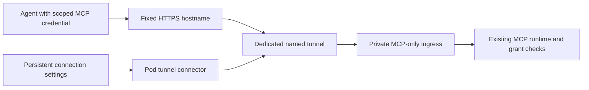

# Stable MCP addresses for supporters

Status: proposal, 2026-10-06. No hosted service, payment integration, DNS change or tunnel has been deployed. The existing [MCP connection guide](../configuration/mcp.md) describes released behavior.

## Intended experience

A supporter receives one fixed MCP address after a one-time contribution and manual activation by the LoRA Pilot operator. Replacing a RunPod pod while retaining its network volume should require no address change in the agent. The pod must be running and healthy; the service does not provide GPU compute or keep a stopped pod online.

Assumptions for this proposal: one active workspace per address, manual payment verification and provisioning, existing bearer-token clients, and an optional service alongside direct MCP access. Domain ownership, Cloudflare account configuration, payment accounts and pricing have not been verified or selected.

Success means a real client can connect, the original pod can be stopped, and a replacement using the same volume can serve the same address and still-valid credential with exactly the same grants. Credentials retain their existing expiration and revocation rules. An unchanged address does not mean a permanent access token.

## Address and routing choice

Recommended first version: `https://mcp-customname.lorapilot.com/mcp`, with a separate named Cloudflare Tunnel for each subscriber. This provides an independent hostname and avoids a shared application router. Cloudflare documents persistent tunnel DNS routing to local services and outbound connectors in its [routing guide](https://developers.cloudflare.com/tunnel/concepts/routing/).

The requested `https://mcp.lorapilot.com/customname` format is feasible, but needs a shared gateway that maps each name to its tunnel and rewrites the MCP path. DNS cannot route by URL path. Cloudflare tunnel path matching does not strip prefixes, as documented in [ingress configuration](https://developers.cloudflare.com/tunnel/features/locally-managed-tunnels/configuration-file/). This option adds tenant routing, streaming, path normalization and artifact-link work. Final URL shape remains a product decision.

Avoid choosing `customname.mcp.lorapilot.com` without planning certificate coverage: ordinary Universal SSL on a full `lorapilot.com` zone covers first-level subdomains, not that deeper name. See [Universal SSL limitations](https://developers.cloudflare.com/ssl/edge-certificates/universal-ssl/limitations/).

A static redirect or a CNAME pointing at the current RunPod hostname does not provide automatic migration. The connector must reconnect using identity saved on the volume, independently of RunPod's changing public hostname.

## Manual enrollment

1. User requests an available name and supplies a private contact method. Reserve the name before requesting payment; allow only lowercase ASCII letters, digits and internal hyphens, with a documented length limit and reserved-name list.
2. Operator verifies the contribution in Buy Me a Coffee or GitHub Sponsors. A screenshot or a user-supplied payment reference alone is not proof of ownership or payment. No payment webhooks or custom checkout are needed initially.
3. Operator records the name, verified supporter identity, provider reference, provisioning status and tunnel ID in private operational storage outside this repository. Provisioning is idempotent so a retry cannot assign a second owner's tunnel.
4. Operator creates a dedicated tunnel and hostname, then privately supplies a connection package containing only that tunnel's scoped credential and assigned address. Never distribute the account-wide Cloudflare certificate/API token. The package is a reusable secret, not a one-time activation code.
5. Signed-in user imports the package in Settings with the existing password and CSRF checks. Parse a bounded, versioned data format; never accept shell commands, arbitrary service URLs, filesystem paths or executable tunnel configuration.
6. LoRA Pilot saves private connection settings on `/workspace`, starts the connector only after validation and workspace ownership checks, and verifies the route. The user then creates or copies an MCP connection using the existing grant UI.

Use a locally constrained tunnel configuration and an MCP-only ingress. A remote configuration change must not be able to turn the connector into a proxy for Jupyter, ComfyUI, owner settings or arbitrary network services. The local ingress remains a second boundary even if an edge rule is wrong.

The operator does not need the user's MCP token, ControlPilot password or RunPod API key for enrollment. Actual MCP traffic still passes through the hosting provider; see the privacy limits below.

## Changes needed in LoRA Pilot

| Area | Required behavior |
| --- | --- |
| MCP origin handling | Separate the owner UI origin from the public MCP origin. Currently `Runtime.origin`/`host` also constrain owner administration in `admin.py`; changing only `MCP_PUBLIC_URL` would break administration through the RunPod address. Preserve strict checks for each boundary. |
| Origin precedence | An explicitly activated hosted address must survive automatic RunPod detection. Keep direct deployment behavior unchanged when hosted mode is absent; reject conflicting configuration visibly. |
| Private ingress | Expose only approved MCP routes to the connector. Preserve bearer headers and Streamable HTTP behavior. Establish HTTPS/host trust only at the dedicated local boundary, never from arbitrary forwarded headers on the public listener. Reuse the existing runtime/store rather than opening another ledger owner. |
| Persistent settings | Store scoped tunnel credentials under a dedicated private directory in `/workspace/config`, using existing file containment and atomic-write patterns, directory mode `0700` and file mode `0600`. Do not put secrets in command arguments, logs or browser storage. Disk-full/corrupt-state failures must not silently reset identity. |
| Connector lifecycle | Optional installation through Services, pinned download with integrity verification, disabled until enrolled. Stop on deactivation, failed workspace ownership or invalid configuration; restart with bounded backoff. Do not download software on every boot. |
| Settings | Show assigned address, Connected/Connecting/Offline/Needs attention, last safe error, and Disconnect. Copy setup instructions use the hosted address; the existing four prompts and grant controls remain. Never auto-create broader permissions. |
| Recovery | Preserve the address across normal pod replacement. Rotation of a tunnel credential is separate from MCP token rotation. Disconnection removes routing capability without deleting datasets, models, runs or the MCP ledger. |

For the shared-path alternative, add a separate gateway implementation: a fixed private name-to-tunnel map, exact path parsing, explicit HTTP method allowlist, streaming without buffering, and no caller-controlled upstream URLs. It must strip user-supplied internal routing headers and prevent redirects from forwarding credentials to another host. Origin validation alone cannot isolate tenants sharing one origin.

## Security and operational boundaries

- Enforce tenant separation with one tunnel credential and exact hostname route per user. Unknown names and paths fail closed. Never share a connector credential between customers or automatically recycle released names: stale clients may still send tokens to them.
- Keep authorization on the user's pod. Existing expiration, revocation, object grants, execution gates, owner approval and idempotency apply to every tunneled call. A paid address grants no additional tools or data access and does not add OAuth support.
- Serialize active ownership. A second pod using the same volume must not start a connector until the old owner is stopped and ownership is acquired safely. Cloudflare treats same-tunnel connectors as replicas; accidental overlap can send traffic to either pod. Validate cross-pod locking on the actual network storage; if it is insufficient, require an operator-mediated takeover with fencing before launch. A copied volume needs explicit reenrollment or a fenced takeover.
- Keep TLS verification enabled, reject unexpected Host/Origin values, disable response caching and avoid recording authorization headers, request/response bodies, dataset names or tool arguments. Keep only bounded operational metadata with a documented retention period.
- Explain that TLS terminates at the routing provider: the provider, and an operator able to change routing, occupy a trusted position and can potentially access MCP credentials and responses. Do not market this as end-to-end encrypted or zero-knowledge. Preserve direct MCP access as an alternative.
- Start with bounded MCP requests/results. Bulk model, video and archive delivery needs a separately verified bandwidth policy and transport; do not advertise working artifact exports through the hosted route before validating them. Cloudflare's [public routing documentation](https://developers.cloudflare.com/tunnel/concepts/routing/) flags additional service terms for video and large files. Do not weaken artifact authentication to work around routing limits.
- Pod sleep, deleted pods and network failures must surface as unavailable with retry guidance, never as a redirect to another workspace. No automatic retry of state-changing operations after ambiguous outcomes. No automatic pod creation or compute charges.
- Protect operator provisioning access with MFA and scoped credentials; keep encrypted recoverable records of assignments. Recovery or transfer requires verified owner identity. Payment reversals or service suspension may disable routing, never delete customer files.

## Meaningful acceptance tests

| Scenario | Required evidence |
| --- | --- |
| Pod replacement | Real SDK/client call succeeds before and after recreation on the same volume with unchanged URL, valid token and grants. No operator DNS update; record reconnect time. |
| Expiry and revocation | Expired/revoked bearer credentials fail through the fixed address immediately as they do directly; token renewal does not change the address. |
| Two customers | Tenant A's credentials fail at B's endpoint; mismatched Host, malformed names, foreign Origin and forged routing headers cannot reach B. No cached response crosses customers. |
| Two pods / copied volume | Concurrent starts cannot serve divergent state through one address. Prove fencing on real RunPod storage, including crash, stale ownership and network partition. Block release if this cannot be demonstrated. |
| Route exposure | `/`, `/api/settings/*`, `/comfy/*`, `/mediapilot/*`, Jupyter and arbitrary paths are unreachable through the MCP hostname. Test encoded traversal, duplicate slashes and unexpected methods. |
| Owner setup | Password, owner session and CSRF remain required on the ControlPilot origin after hosted activation; a tunnel credential or MCP bearer cannot administer settings. |
| Package import | Oversized/malformed input, account credentials, unknown fields, invalid names, mismatched address and malicious service/path values are rejected without altering existing settings. |
| Storage failure | Read-only/full volume, symlinks, interrupted writes and corrupt settings prevent partial activation, secret disclosure, identity reset and loss of existing grants. |
| Streaming and retries | Real Streamable HTTP handshake, disconnect, cancellation, timeout and reconnect behave correctly through the provider. Approved mutations keep existing deduplication and unknown-outcome semantics. |
| Credential rotation | Old tunnel credentials cannot reconnect after replacement and old connectors are disconnected. MCP token revocation remains independent. Owner recovery preserves the alias and data. |
| Offline and recovery | Stopped pod and blocked outbound network give honest offline status. Restoring connectivity recovers without copying a new client URL or silently falling back to another tenant. |
| Secret handling | Inspect application/connector/edge logs, browser storage, process arguments and diagnostics; no credentials or MCP payloads appear. Verify private file modes and cache headers. |
| Manual fulfillment | Duplicate payment checks, repeated provisioning, abandoned reservations and recovery cannot overwrite an existing assignment. Public name lookup reveals no supporter identity or workspace state. |

For the shared-path option also test cross-tenant path confusion, percent/double decoding, root redirects, long-lived responses, upstream failures and generated links. Every generated artifact URL must remain authorized and resolve to the correct tenant before artifact support is offered.

## Supporter offer and rollout

Suggested wording: **A fixed address for your LoRA Pilot MCP connection, with manual setup after a one-time supporter contribution. Your address follows your workspace when you replace the pod. GPU hosting is separate.**

[GitHub Sponsors supports one-time tiers and custom rewards](https://docs.github.com/en/sponsors/receiving-sponsorships-through-github-sponsors/managing-your-sponsorship-tiers); [Buy Me a Coffee supports one-time contributions](https://help.buymeacoffee.com/en/articles/10182730-what-is-buy-me-a-coffee-and-how-does-it-work). Choose the amount, payment links, fulfillment target and service terms before publishing. Promise one reserved address and manual setup; define ongoing availability and fair use explicitly instead of promising unlimited lifetime hosting. Account eligibility and the suitability of the final offer still need checking.

1. Confirm URL format and hosting account; prototype one disposable tunnel and a real client without customer data.
2. Implement the owner/public-origin separation, constrained ingress, optional connector and private package import. Run the boundary tests before exposing a public route.
3. Exercise pod migration, duplicate ownership, failure recovery and revocation on a disposable RunPod network volume. Measure reconnect behavior and operational cost.
4. Pilot manual fulfillment with a small number of users, publish clear privacy/service terms, then update user documentation and the changelog when the feature ships.

Keep this proposal separate from the deployed MCP validation record until the implementation and provider/client tests have evidence. A fixed endpoint is useful only if it preserves the existing security boundary during migration and failure.
