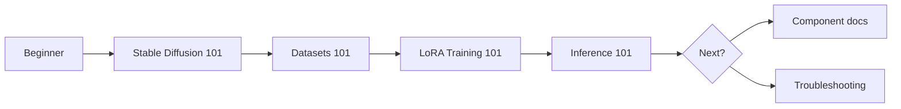

# Getting Started

Setup and onboarding index for LoRA Pilot.

## Recommended Order

1. [System Requirements](system-requirements.md)
2. [Installation](installation.md)
3. [First Run](first-run.md)
4. [Troubleshooting](troubleshooting.md) (when needed)

## Quick Install (Compose)

```bash
git clone https://github.com/vavo/lora-pilot.git
cd lora-pilot
cp .env.example .env
docker compose -f docker-compose.yml up -d
```

## Optional Run Modes

- Development: `docker compose -f docker-compose.dev.yml up -d`
- CPU-only: `docker compose -f docker-compose.cpu.yml up -d`

## Learning Tracks

- [Stable Diffusion 101](stable-diffusion-101/README.md)
- [Datasets 101](datasets-101/README.md)
- [LoRA Training 101](loRA-training-101/README.md)
- [Inference 101](inference-101/README.md)

## Beginner Learning Flow



## Continue To

- [User Guide](../user-guide/README.md)
- [Configuration](../configuration/README.md)
- [Components](../components/README.md)

## Support

- [Troubleshooting](troubleshooting.md)
- [GitHub Discussions](https://github.com/vavo/lora-pilot/discussions)
- [GitHub Issues](https://github.com/vavo/lora-pilot/issues)

---

_Last updated: 2026-02-12_

---

## 📝 Feedback

Was this helpful? [Suggest improvements on GitHub Discussions](https://github.com/notri1/lora-pilot/discussions/categories/documentation-feedback)


