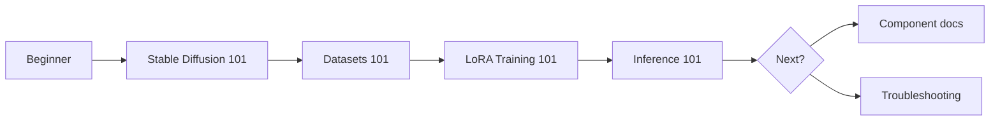

# Getting Started

_Last updated: 2026-07-06_

Setup gets LoRA Pilot running. The 101 chapters teach you what you are looking at after the browser opens and the sliders start making threats.

## Recommended Order

1. [System Requirements](system-requirements.md)
2. [Installation](installation.md)
3. [First Run](first-run.md)
4. [Troubleshooting](troubleshooting.md) (when needed)

## Quick Install (Compose)

```bash
git clone https://github.com/vavo/lora-pilot.git
cd lora-pilot
cp .env.example .env
docker compose -f docker-compose.yml up -d
```

## Optional Run Modes

- Development: `docker compose -f docker-compose.dev.yml up -d`
- CPU-only: `docker compose -f docker-compose.cpu.yml up -d`

## Learning Tracks

- [Stable Diffusion 101](stable-diffusion-101/README.md)
- [Datasets 101](datasets-101/README.md)
- [LoRA Training 101](loRA-training-101/README.md)
- [Inference 101](inference-101/README.md), including [Workflow Types](inference-101/workflow-types.md)

## First 90 Minutes

If you are new, do not start by importing a huge community workflow. Start with one small loop and make it boring on purpose.

Read [Stable Diffusion 101](stable-diffusion-101/README.md) until the noise-to-image idea makes sense. Then read [What is Inference?](inference-101/what-is-inference.md) and generate one image with a fixed seed. Change only the prompt once, then only CFG or guidance once. That teaches more than memorizing sampler names.

After that, read [What Makes a Good Dataset](datasets-101/what-makes-a-good-dataset.md). You do not need a perfect dataset yet; you need to understand why ten sharp, varied, honest images can beat a folder of two hundred near-duplicates. Finish with [What is LoRA Training?](loRA-training-101/what-is-loRA-training.md), then try one small project from [Practical Training Projects](loRA-training-101/practical-training-projects.md).

The first milestone is simple: make one image, reproduce it, change it on purpose, collect a tiny dataset, and understand what a LoRA would add.

## Beginner Learning Flow


```mermaid
flowchart LR
  A["Beginner"] --> B["Stable Diffusion 101"]
  B --> C["Datasets 101"]
  C --> D["LoRA Training 101"]
  D --> E["Inference 101"]
  E --> F{"Next?"}
  F --> G["Component docs"]
  F --> H["Troubleshooting"]
```

## Continue To

- [User Guide](../user-guide/README.md)
- [Configuration](../configuration/README.md)
- [Components](../components/README.md)

## Support

- [Troubleshooting](troubleshooting.md)
- [GitHub Discussions](https://github.com/vavo/lora-pilot/discussions)
- [GitHub Issues](https://github.com/vavo/lora-pilot/issues)

---

## 📝 Feedback

Was this helpful? [Suggest improvements on GitHub Discussions](https://github.com/vavo/lora-pilot/discussions/categories/documentation-feedback)
