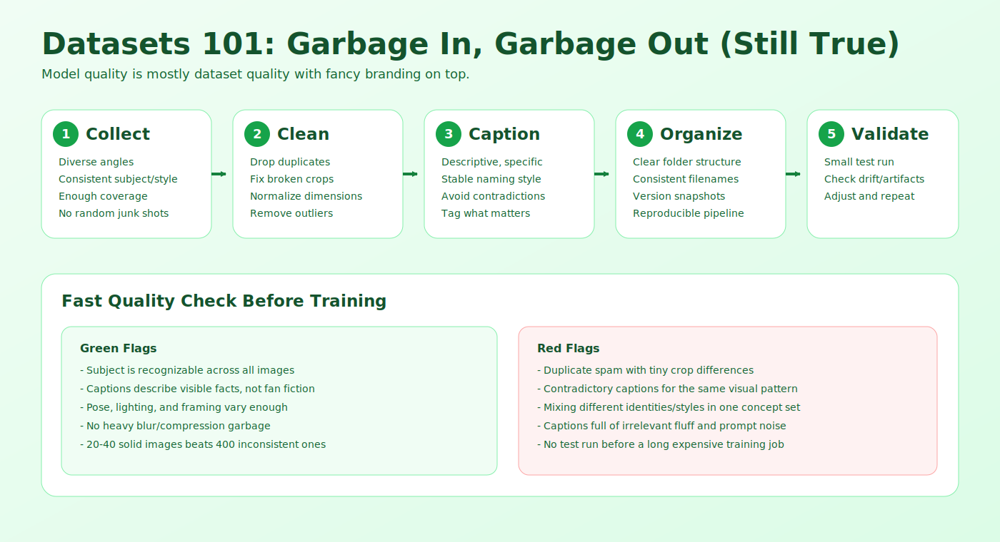
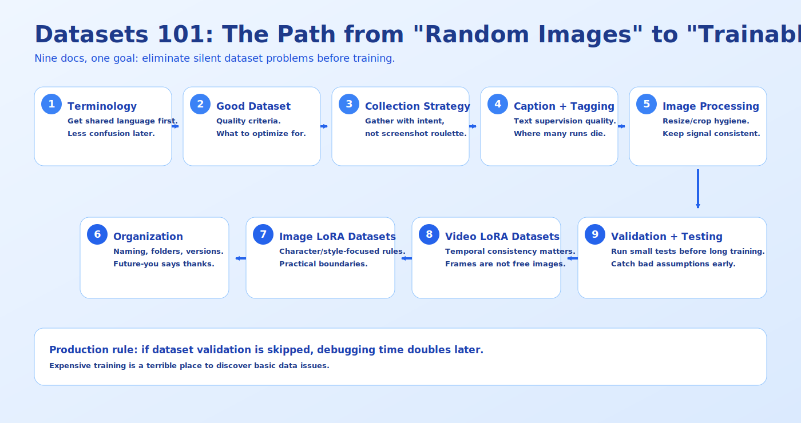

# Datasets 101

_Last updated: 2026-07-06_

You cannot fix a bad dataset with good training settings. The images you feed into training decide most of what the LoRA can learn, what it memorizes by accident, and where it fails later.

That is why this chapter matters more than the settings page, even if settings look more technical and therefore more important. Twenty clear, varied, well-captioned images can beat two hundred near-duplicates. A tiny dataset with honest captions can teach a cleaner concept than a huge folder full of mixed lighting, random crops, hidden watermarks, and "whatever Google had lying around." Very rude of reality, but useful.

Datasets 101 teaches you how to collect, caption, clean, organize, and test the examples before you spend GPU time training on them.

##  Chapter Overview

This chapter is structured to help you master dataset creation and management:

###  Learning Path
1. **[Dataset Terminology](dataset-terminology.md)** - Basic terms and concepts
2. **[What Makes a Good Dataset](what-makes-a-good-dataset.md)** - Quality standards and principles
3. **[Image Collection Strategies](image-collection-strategies.md)** - How to gather effective images
4. **[Captioning and Tagging](captioning-and-tagging.md)** - Writing effective descriptions
5. **[Image Processing and Preparation](image-processing-preparation.md)** - Technical preparation
6. **[Dataset Organization](dataset-organization.md)** - Structuring and management
7. **[Image LoRA Datasets](image-lora-datasets.md)** - Specific guidance for image LoRA
8. **[Video LoRA Datasets](video-lora-datasets.md)** - Specific guidance for video LoRA
9. **[Dataset Validation and Testing](dataset-validation-and-testing.md)** - Quality assurance

###  Learning Goals

After completing this chapter, you'll be able to:
- **Understand** dataset terminology and concepts
- **Recognize** what makes a dataset high-quality
- **Collect** effective images for training
- **Write** compelling captions and tags
- **Process** images for optimal training
- **Organize** datasets efficiently
- **Create** specialized datasets for different training types
- **Validate** dataset quality before training
- **Manage** large datasets effectively

###  Quick Start

If you're eager to start creating datasets, here's the fastest path:

1. **[Dataset Terminology](dataset-terminology.md)** - 5 minute read
2. **[What Makes a Good Dataset](what-makes-a-good-dataset.md)** - 10 minute read
3. **[Image Collection Strategies](image-collection-strategies.md)** - Start collecting images
4. **[Captioning and Tagging](captioning-and-tagging.md)** - Start writing descriptions

###  Prerequisites

No prior dataset knowledge needed! We assume:
- Basic understanding of AI model training (helpful but not required)
- Interest in creating high-quality training data
- Willingness to be detail-oriented
- Patience for careful preparation

###  Why This Chapter Matters

Dataset quality determines most of your final LoRA quality. The trainer can adjust weights, but it cannot guess which details matter if the examples contradict each other or the captions hide the wrong things. By the end, you should be able to look at a folder of images and predict whether it will train cleanly.

### 🤝 How to Use This Chapter

- **Read in Order**: Each section builds on previous knowledge
- **Follow Examples**: Use the practical exercises and examples
- **Apply Concepts**: Use the principles in your own projects
- **Reference**: Come back to specific sections when needed

Let's begin your journey into creating amazing datasets!

---

##  Chapter Structure

### 🌅 Fundamentals Section (Documents 1-3)
**Focus**: Understanding the basics
- **Dataset Terminology**: Core concepts and vocabulary
- **What Makes a Good Dataset**: Quality standards and principles
- **Image Collection Strategies**: How to gather effective images

###  Preparation Section (Documents 4-6)
**Focus**: Creating your dataset
- **Captioning and Tagging**: Writing effective descriptions
- **Image Processing and Preparation**: Technical preparation
- **Dataset Organization**: Structuring and management

###  Specialized Section (Documents 7-8)
**Focus**: Specific training types
- **Image LoRA Datasets**: Specific guidance for image LoRA
- **Video LoRA Datasets**: Specific guidance for video LoRA

###  Quality Assurance Section (Document 9)
**Focus**: Ensuring dataset quality
- **Dataset Validation and Testing**: Quality assurance methods

---

##  Success Metrics

###  After This Chapter, You'll Be Able To:

#### Technical Skills
- ✅ Understand dataset terminology and concepts
- ✅ Recognize quality standards for training data
- ✅ Collect effective images for different training types
- ✅ Write compelling captions and tags
- ✅ Process images for optimal training
- ✅ Organize datasets efficiently and professionally

#### Creative Skills
- ✅ Create datasets for character consistency
- ✅ Build datasets for style training
- ✅ Develop datasets for concept training
- ✅ Curate datasets for specialized training needs
- ✅ Combine multiple concepts in single datasets

#### Professional Skills
- ✅ Manage large datasets efficiently
- ✅ Validate dataset quality systematically
- ✅ Document dataset creation processes
- ✅ Create reproducible dataset workflows
- ✅ Build portfolio-ready training datasets

---

##  What Makes This Chapter Different

###  Beginner-Focused
- **Simple Language**: Complex concepts explained with everyday analogies
- **Visual Examples**: Clear before-and-after examples
- **Step-by-Step**: Each process broken into manageable steps
- **Practice Exercises**: Hands-on learning with each section

###  Comprehensive Coverage
- **All Dataset Types**: Image, video, specialized datasets
- **All Training Types**: Character, style, concept datasets
- **Quality Standards**: Comprehensive quality guidelines
- **Processing Techniques**: All necessary preparation methods

###  Practical Focus
- **Real-World Application**: Techniques you can use immediately
- **Tool Integration**: How to use with LoRA Pilot tools
- **Quality Assurance**: Systematic validation methods
- **Scalable Methods**: Approaches that work for any dataset size

###  Progressive Learning
- **Builds Knowledge**: Each section uses previous concepts
- **Confidence Building**: Start simple, gradually increase complexity
- **Practical Focus**: Emphasis on creating actual datasets
- **Portfolio Ready**: End with professional-quality datasets

---

##  Let's Begin Your Journey!

Ready to start creating amazing datasets?

**Start here**: [Dataset Terminology](dataset-terminology.md)

Remember: Every expert was once a beginner. Take your time, be detail-oriented, and most importantly - create datasets that train amazing models!

---

## 📝 Feedback

Was this helpful? [Suggest improvements on GitHub Discussions](https://github.com/vavo/lora-pilot/discussions/categories/documentation-feedback)
