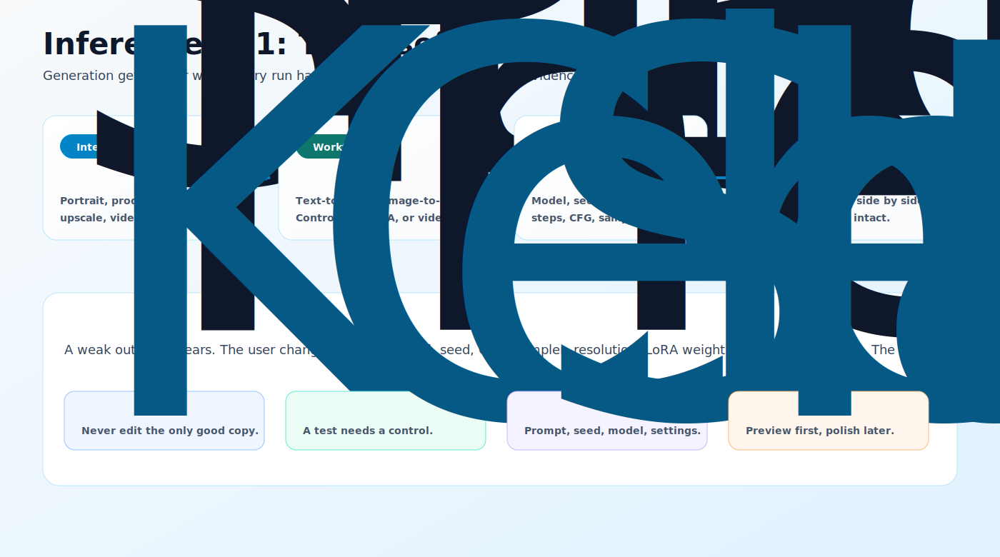

# Inference 101

_Last updated: 2026-07-05_

Inference is where the model stops being theory and starts making images. This chapter is for the moment when you have LoRA Pilot running, a model loaded, and a screen full of settings that all look important. Some of them are important. Some mostly generate heat.

The goal is not to memorize every sampler or chase a perfect internet preset. The goal is to build a repeatable way to generate, compare, fix, and save results without losing track of what changed.

## How to Read This Chapter

Start with the mental model, then move toward workflow choice and settings. The chapter is written as a learning path because inference is easier when each decision has a place: first choose the job, then choose the workflow shape, then tune the knobs.

| Read | Page | What It Gives You |
|---|---|---|
| 1 | [What is Inference?](what-is-inference.md) | The basic loop: model, prompt, settings, output, evidence. |
| 2 | [Inference Stacks](inference-stacks.md) | When to use ComfyUI, when to use InvokeAI, and why both exist. |
| 3 | [Model Selection for Inference](model-selection-for-inference.md) | How to avoid mixing incompatible checkpoints, VAEs, and LoRAs. |
| 4 | [Core Generation Settings](core-generation-settings.md) | Seed, steps, CFG, sampler, resolution, denoise, and batch size. |
| 5 | [Workflow Types](workflow-types.md) | Text-to-image, image-to-image, inpainting, ControlNet, LoRA, upscale, text-to-video, and image-to-video. |
| 6 | [Inference Workflows](inference-workflows.md) | A practical daily loop for testing, comparing, and saving work. |
| 7 | [Performance Optimization](performance-optimization.md) | How to move faster without turning quality into soup. |
| 8 | [Troubleshooting Inference](troubleshooting-inference.md) | What to check when outputs look wrong or ComfyUI complains. |
| 9 | [Practical Inference Projects](practical-inference-projects.md) | Short projects that build intuition without a week-long detour. |

## The One Idea That Saves the Most Time

Change one thing at a time. This sounds painfully obvious, which is why people ignore it right before spending two hours wondering whether the model, prompt, VAE, LoRA weight, seed, sampler, CFG, resolution, denoise, or cosmic weather caused the improvement.

When you are learning a workflow, keep a known-good baseline untouched. Duplicate it, change one variable, generate, compare, and save the evidence. In ComfyUI that evidence can be a workflow JSON or a generated PNG with embedded workflow metadata. In InvokeAI it can be a board, preset, metadata panel, or saved prompt/settings combination. The tool matters less than the habit.

## What You Should Be Able to Do Afterward

By the end of this chapter, you should be able to look at a generation task and know whether it is a text-to-image problem, an image-to-image edit, an inpainting repair, a ControlNet composition problem, a LoRA identity/style problem, or a video workflow. You should also be able to tune seed, steps, CFG, sampler, resolution, denoise, and batch size without treating every knob like a slot machine lever.

This chapter assumes you have either read [Stable Diffusion 101](../stable-diffusion-101/README.md) or already understand the rough idea of checkpoints, prompts, LoRAs, and VAEs. [Datasets 101](../datasets-101/README.md) and [LoRA Training 101](../loRA-training-101/README.md) are useful if your inference work depends on your own trained models.

## Quick Start

If you only have twenty minutes, read [What is Inference?](what-is-inference.md), then [Workflow Types](workflow-types.md), then [Core Generation Settings](core-generation-settings.md). After that, run the first exercise in [Practical Inference Projects](practical-inference-projects.md) with a fixed seed and batch size 1.

That small loop teaches more than importing a giant community workflow and immediately installing six mystery nodes. Community workflows are useful. Learning on top of a mystery graph is how beginners accidentally become unpaid dependency managers.

---

## Feedback

Was this helpful? [Suggest improvements on GitHub Discussions](https://github.com/vavo/lora-pilot/discussions/categories/documentation-feedback)
