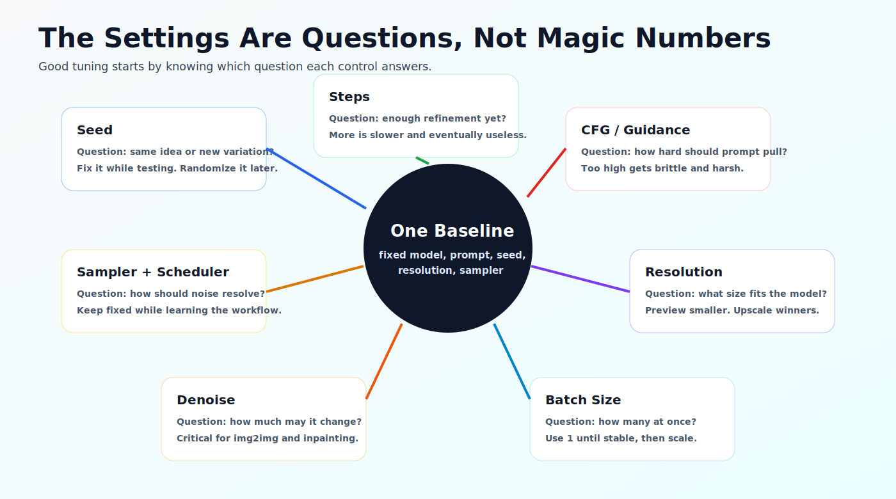

# Core Generation Settings

_Last updated: 2026-07-05_

Generation settings are easier to learn when you stop treating them like a list of magic numbers. Each control answers a specific question. If you know the question, you know when to move the control and when to leave it alone.

## Seed: Same Idea or New Variation?

The seed controls the starting noise pattern. With the same model, prompt, and settings, the same seed should give you a similar result. That makes seed the anchor for learning.

Fix the seed while testing prompt wording, LoRA weight, CFG, sampler, steps, denoise, or resolution. Randomize the seed when you want new compositions. Save the winning seed with the image metadata, because "I had a good one earlier" is not a recovery plan.

## Steps: Enough Refinement Yet?

Steps control how many denoising passes the sampler runs. More steps can improve detail until the useful range is reached. After that, more steps usually buy slower previews, higher heat, and disappointment with a progress bar.

For many classic SDXL workflows, `20` to `35` steps is a reasonable starting range. For quick previews, `15` to `20` can be enough to judge composition before a final pass. Modern distilled, turbo, LCM, Flux-style, and video workflows may use very different ranges. The model card and workflow notes beat generic advice.

## CFG and Guidance: How Hard Should the Prompt Pull?

CFG, or guidance scale, controls how strongly the model is pushed toward the prompt. Low values give the model more freedom. High values can improve prompt adherence, but they can also make faces, hands, textures, lighting, and composition brittle.

For many classic image workflows, starting around `4` to `7` is safer than cranking the value upward. If the output looks harsh, overcooked, or distorted, lower guidance before rewriting the entire prompt. If the output ignores important prompt details, raise guidance slowly.

Some model families do not use classic CFG in the same way. Flux workflows, for example, often use different guidance behavior than SDXL. Again, the model notes matter.

## Sampler and Scheduler: How Should Noise Resolve?

The sampler and scheduler decide how the image moves from noise toward structure and detail. They can change texture, sharpness, contrast, stability, and the kind of artifacts you see.

Pick one or two reliable combinations and learn them before sampler-hopping. Keep sampler and scheduler fixed while testing prompts, seeds, LoRA weights, or CFG. Changing sampler, scheduler, seed, and prompt together creates motion, not knowledge.

## Resolution: What Size Fits the Model?

Resolution is not just output size. It affects composition, anatomy, memory use, and whether the model is operating near the size it learned best. SD 1.5 workflows often begin near 512-class sizes. SDXL workflows often begin near 1024-class sizes. Newer families publish their own preferred dimensions and aspect-ratio guidance.

Start at a moderate, model-appropriate size. Get a clean composition first, then upscale or refine the winners. Forcing huge base resolution early is a popular way to find your VRAM limit while learning almost nothing.

## Denoise: How Much May the Model Change?

Denoise matters most when the workflow starts from an existing image or latent. In text-to-image, denoise is often `1.0` because the model is free to build from noise. In image-to-image, inpainting, upscaling, and refinement, denoise decides how strongly the output can drift from the source.

Lower denoise preserves more of the input. Higher denoise gives the model more freedom. If an image-to-image run destroys the original composition, lower denoise. If it barely changes anything, raise it.

## Batch Size: How Many at Once?

Batch size controls how many images are generated in one pass. Keep it at `1` while learning or debugging. Increase it only when the workflow is stable and VRAM has headroom.

When CUDA runs out of memory, batch size is one of the first levers to pull. Lower batch size, then lower resolution, then simplify branches or switch to lighter model variants.

## A Practical Baseline

Start with one model family, one checkpoint, batch size `1`, fixed seed, model-appropriate resolution, a conservative guidance value, and a familiar sampler. Generate a baseline image. Then change one setting and compare.

This is slower than random tweaking for about five minutes. After that, it is faster by a humiliating margin.

## Next

Continue to [Workflow Types](workflow-types.md).

---

## Feedback

Was this helpful? [Suggest improvements on GitHub Discussions](https://github.com/vavo/lora-pilot/discussions/categories/documentation-feedback)
