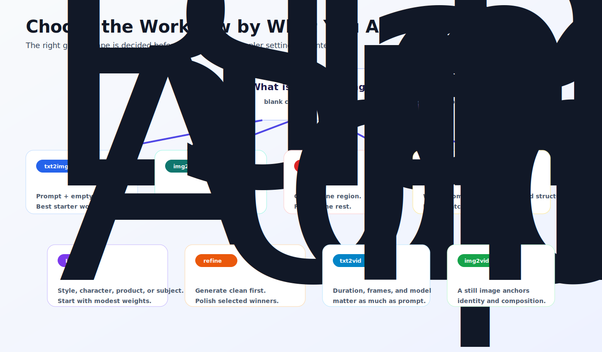

# Workflow Types

_Last updated: 2026-07-05_

Workflow type is the first real decision in inference. Before you argue with CFG or rewrite a prompt for the ninth time, ask what kind of input you already have and what kind of change you want.

## Text-to-Image: Start From Nothing

Text-to-image is the cleanest starting point because the model begins from noise and a prompt. In ComfyUI, the basic shape is checkpoint loader, prompt encoders, empty latent image, sampler, VAE decode, and save image. In InvokeAI, the same idea is hidden behind a friendlier interface.

Use text-to-image when you want a new composition and do not need to preserve an existing image. It is also the best place to learn seed, steps, CFG, sampler, scheduler, resolution, and LoRA weights because the workflow has fewer moving parts.

The beginner trap is expecting prompt language to solve structural problems forever. If you need a specific pose, depth layout, edge structure, product silhouette, or room composition, text-to-image may fight you. That is when ControlNet or image-to-image becomes the adult answer.

## Image-to-Image: Start From a Source Image

Image-to-image begins with an existing image. The image is encoded into latent space, then the sampler modifies it according to the prompt and denoise value.

Denoise is the key control. Low denoise preserves the original image closely. Higher denoise allows stronger changes. If the output barely changes, raise denoise. If it destroys the input, lower denoise. This is less glamorous than prompt engineering and much more useful.

Use image-to-image for redesigns, style transfer, cleaner variants, product concept changes, and turning rough compositions into polished images.

## Inpainting: Change One Region

Inpainting is image-to-image with a mask. The mask tells the workflow which area may change. Everything outside the mask should remain as stable as the model and settings allow.

Use inpainting for replacing a background detail, fixing a face, changing clothing, repairing hands, removing artifacts, or adding an object without regenerating the full image. The two common mistakes are bad masks and denoise that is too high. If the edit bleeds into the rest of the image, inspect both before blaming the prompt.

## ControlNet: Preserve Structure

ControlNet gives the model a structural guide such as pose, depth, edges, line art, canny maps, or segmentation. It is useful when the prompt describes what you want but cannot reliably hold the composition.

Use ControlNet when a subject must stand in a specific pose, a product must keep its silhouette, a room layout must survive, or an illustration needs to follow a sketch. The control image and preprocessor matter. A weak or mismatched control signal gives weak control.

## LoRA Workflows: Add Identity or Style

A LoRA workflow loads a compatible LoRA into the model stack so the output carries a trained concept. That concept might be a person, product, clothing item, visual style, character, location, or brand-specific look.

Start with one LoRA and a moderate weight. If the identity is weak, raise the weight slightly. If the output gets distorted, lower it. If multiple LoRAs are required, add them one at a time and save each working version.

LoRAs are not a universal fix. They work best when the base model family matches the LoRA and the prompt gives the concept enough context.

## Upscale and Refinement Workflows: Polish Winners

Upscale and refinement workflows are for images that already work. They increase resolution, recover detail, improve faces, sharpen texture, or add a final pass without rebuilding the whole composition.

Do not start every experiment at massive resolution. Generate a clean candidate first. Then upscale or refine only the winners. This keeps iteration fast and makes memory failures less dramatic.

## Text-to-Video: Prompt to Motion

Text-to-video is not just text-to-image with extra frames. Video models care about duration, frame count, motion strength, resolution, model family, decoder, and temporal stability. A beautiful first frame can still become unusable motion if the model or settings drift.

Use text-to-video when the entire shot can be described from scratch. Keep early tests short and low-cost. Lock the prompt and seed when comparing duration, motion, or guidance changes. For model families such as Wan, LTX, HunyuanVideo, or other video stacks, follow the workflow notes first.

## Image-to-Video: Move an Existing Image

Image-to-video starts with a still image and asks the model to animate it. The input image anchors identity, composition, product shape, character design, or art direction more strongly than a prompt alone.

Use image-to-video when the starting frame matters. Product motion, character animation, camera drift, animated poster shots, and style-preserving clips are natural fits. The first frame should already be strong; image-to-video is not a good place to repair a weak still image and invent motion at the same time.

## About FLF and Local Shorthand

This repo does not currently define `FLF`, and a docs page should not pretend otherwise. If the team uses `FLF` to mean a specific workflow pattern, define the acronym beside the workflow before it becomes tribal knowledge with better branding.

Good workflow documentation should name the starting input, the model family, the required model files, the important settings, and the expected output. Once `FLF` has that definition, it belongs in this page as a first-class workflow type.

## Choosing Fast

If you have no source image, start with text-to-image. If you have a source image, use image-to-image. If only part of the image should change, use inpainting. If structure must hold, add ControlNet. If identity or style must carry through, add a LoRA. If the still image is already good and needs quality, upscale or refine. If the output must move, choose text-to-video or image-to-video based on whether you already have the first frame.

That decision tree sounds obvious. Most useful workflow rules do.

## Next

Continue to [Inference Workflows](inference-workflows.md).

---

## Feedback

Was this helpful? [Suggest improvements on GitHub Discussions](https://github.com/vavo/lora-pilot/discussions/categories/documentation-feedback)
