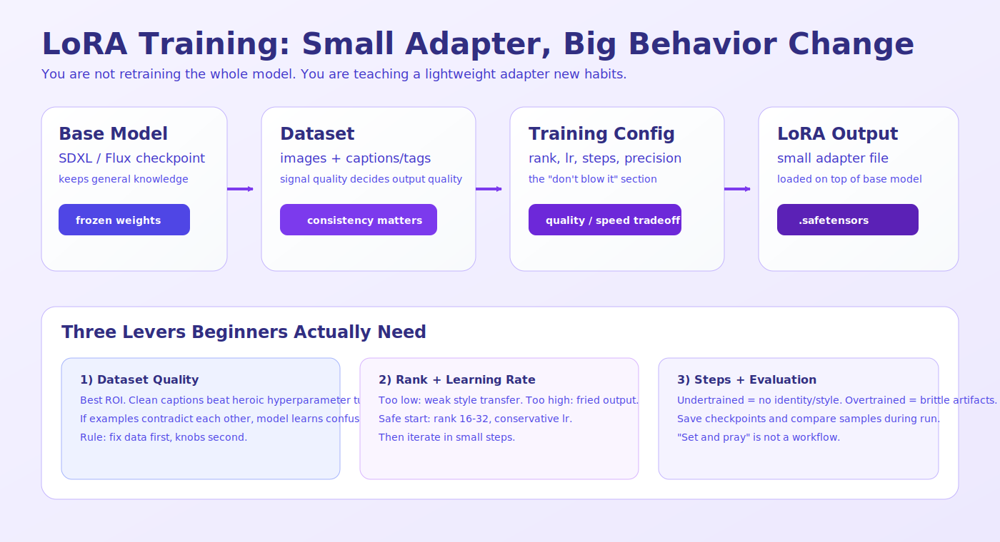
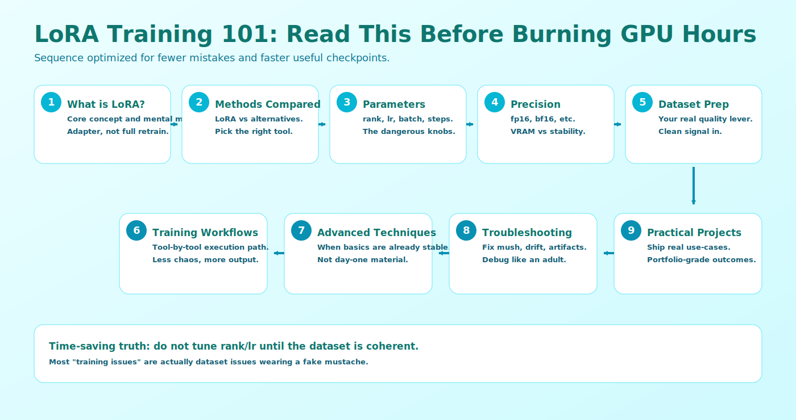

# LoRA Training 101

Welcome to LoRA Training 101! This comprehensive chapter covers everything you need to know about training custom LoRA models, from absolute basics to advanced techniques. Whether you want to create consistent characters, unique styles, or specialized concepts, this guide will take you there.

## Beginner Terms (Plain English)

- **Training**: teaching the model using your example images
- **LoRA**: the small file that stores what was learned
- **Steps**: how many training passes to run
- **Learning rate**: how big each training update is
- **Batch size**: how many images are processed together per update
- **VRAM**: your GPU memory
- **Precision (FP16/BF16)**: number format that affects speed and memory

##  Chapter Overview

This chapter is structured to help you master LoRA training progressively:

###  Learning Path
1. **[What is LoRA Training?](what-is-loRA-training.md)** - Basic concepts and how it works
2. **[Training Methods Compared](training-methods-compared.md)** - Different training approaches, explained simply
3. **[Training Parameters Explained](training-parameters-explained.md)** - All settings and what they mean
4. **[Precision Formats Explained](precision-formats.md)** - Number formats (speed vs memory)
5. **[Dataset Preparation](dataset-preparation.md)** - Creating effective training data
6. **[Training Workflows](training-workflows.md)** - Step-by-step training processes
7. **[Advanced Training Techniques](advanced-training-techniques.md)** - Professional-level training methods
8. **[Troubleshooting Training](troubleshooting-training.md)** - Common issues and solutions
9. **[Practical Training Projects](practical-training-projects.md)** - Real-world training projects

###  Learning Goals

After completing this chapter, you'll be able to:
- **Understand** how LoRA training works and when to use it
- **Choose** the right training method for your needs
- **Prepare** effective datasets that train well
- **Configure** training parameters for optimal results
- **Execute** training workflows with confidence
- **Troubleshoot** common training problems
- **Create** consistent characters, styles, and concepts
- **Optimize** training for quality and efficiency

###  Quick Start

If you're eager to start training, here's the fastest path:

1. **[What is LoRA Training?](what-is-loRA-training.md)** - 5 minute read
2. **[Training Methods Compared](training-methods-compared.md)** - 10 minute read
3. **[Practical Training Projects](practical-training-projects.md)** - Start with your first project!

###  Prerequisites

No prior training knowledge needed! We assume:
- Basic understanding of Stable Diffusion (complete Stable Diffusion 101 first)
- Interest in creating custom models
- Willingness to experiment and learn
- Patience for training processes

###  Why This Chapter Matters

LoRA training can seem complex with all the technical options and parameters. This chapter breaks everything down into simple, understandable concepts with practical examples. By the end, you'll have the confidence to train high-quality custom models.

### 🤝 How to Use This Chapter

- **Read in Order**: Each section builds on previous knowledge
- **Follow Examples**: Use the practical exercises and projects
- **Experiment**: Don't be afraid to try different settings
- **Reference**: Come back to specific sections when needed

Let's begin your journey into LoRA training!

---

##  Chapter Structure

### 🌅 Fundamentals Section (Documents 1-5)
**Focus**: Understanding the basics
- **What is LoRA Training?**: Core concepts explained simply
- **Training Methods Compared**: Different approaches and when to use each
- **Training Parameters Explained**: All settings and what they do
- **Precision Formats Explained**: FP32, FP16, BF16 explained
- **Dataset Preparation**: Creating effective training data

###  Application Section (Documents 6-7)
**Focus**: Practical application
- **Training Workflows**: Step-by-step training processes
- **Advanced Training Techniques**: Professional-level methods

###  Advanced Section (Documents 8-9)
**Focus**: Mastery and troubleshooting
- **Troubleshooting Training**: Common issues and solutions
- **Practical Training Projects**: Real-world training projects

###  Learning Timeline

#### Week 1: Foundations
- **Day 1-2**: What is LoRA Training? + Training Methods Compared
- **Day 3-4**: Training Parameters + Precision Formats
- **Day 5-7**: Dataset Preparation + Practice with basic training

#### Week 2: Application
- **Day 8-10**: Training Workflows + Advanced Techniques
- **Day 11-12**: Troubleshooting Training + Practice projects
- **Day 13-14**: Complete first training project

#### Week 3: Mastery
- **Day 15-21**: Advanced training projects
- **Day 22-28**: Portfolio development and refinement
- **Day 29-30**: Experimentation and optimization

---

##  What Makes This Chapter Different

###  Beginner-Focused
- **Simple Language**: Complex concepts explained with everyday analogies
- **Visual Learning**: Step-by-step processes with clear examples
- **Practice Exercises**: Hands-on learning with each section
- **Confidence Building**: Start simple, gradually increase complexity

###  Comprehensive Coverage
- **All Training Methods**: DreamBooth, LoRA, LyCORIS, full fine-tuning
- **Complete Parameters**: Every training setting explained
- **All Precision Formats**: FP32, FP16, BF16, FP8 explained
- **Real-World Projects**: Practical projects you can actually build

###  Progressive Learning
- **Builds Knowledge**: Each section uses previous concepts
- **Practical Focus**: Emphasis on creating actual models
- **Quality Progression**: From basic to professional quality
- **Portfolio Ready**: End with professional-quality work

---

##  Success Metrics

###  After This Chapter, You'll Be Able To:

#### Technical Skills
- ✅ Understand how LoRA training works
- ✅ Choose appropriate training methods
- ✅ Master training parameters and settings
- ✅ Prepare effective training datasets
- ✅ Execute training workflows with confidence
- ✅ Troubleshoot common training problems

#### Creative Skills
- ✅ Train consistent characters across multiple images
- ✅ Create unique artistic styles
- ✅ Develop specialized concepts
- ✅ Combine multiple LoRAs for complex results
- ✅ Optimize training for quality and efficiency

#### Professional Skills
- ✅ Work efficiently with training tools
- ✅ Optimize workflows for quality and speed
- ✅ Create portfolio-ready custom models
- ✅ Understand the AI training ecosystem
- ✅ Plan and execute complex training projects

---

##  Let's Begin Your Journey!

Ready to start training amazing custom models?

**Start here**: [What is LoRA Training?](what-is-loRA-training.md)

Remember: Every expert was once a beginner. Take your time, experiment freely, and most importantly - have fun creating!

---

## 📝 Feedback

Was this helpful? [Suggest improvements on GitHub Discussions](https://github.com/vavo/lora-pilot/discussions/categories/documentation-feedback)

