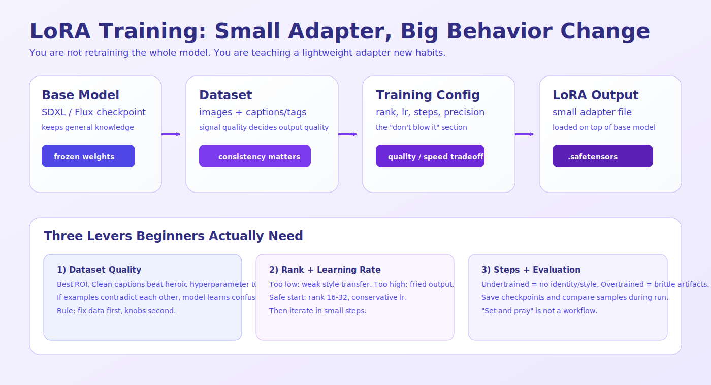
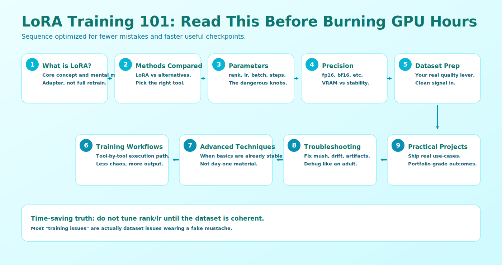

# LoRA Training 101

_Last updated: 2026-07-06_

LoRA training is how you teach a base model a new reusable idea without retraining the whole thing. That idea might be a character, product, outfit, drawing style, logo treatment, or visual habit you want to use again and again.

The beginner trap is thinking LoRA quality comes mostly from secret settings. Settings matter, but the dataset does most of the work. A clean set of varied images, honest captions, and a small test loop will beat a giant settings spreadsheet with bad data almost every time.

## Beginner Terms (Plain English)

- **Training**: teaching the model using your example images
- **LoRA**: the small file that stores what was learned
- **Steps**: how many training passes to run
- **Learning rate**: how big each training update is
- **Batch size**: how many images are processed together per update
- **VRAM**: memory on the GPU; if normal RAM is your desk, VRAM is the workbench beside the image-making machine
- **Precision (FP16/BF16)**: number format that affects speed and memory; useful later, not where beginners should start

##  Chapter Overview

This chapter is structured to help you master LoRA training progressively:

###  Learning Path
1. **[What is LoRA Training?](what-is-loRA-training.md)** - Basic concepts and how it works
2. **[Training Methods Compared](training-methods-compared.md)** - Different training approaches, explained simply
3. **[Dataset Preparation](dataset-preparation.md)** - Creating effective training data
4. **[Training Parameters Explained](training-parameters-explained.md)** - The few settings that matter first
5. **[Training Workflows](training-workflows.md)** - Step-by-step training processes
6. **[Troubleshooting Training](troubleshooting-training.md)** - Common issues and solutions
7. **[Practical Training Projects](practical-training-projects.md)** - Real-world training projects
8. **[Advanced Training Techniques](advanced-training-techniques.md)** - Professional-level training methods
9. **[Precision Formats Explained](precision-formats.md)** - Optional technical appendix for memory, speed, and hardware choices

###  Learning Goals

After completing this chapter, you'll be able to:
- **Understand** how LoRA training works and when to use it
- **Choose** the right training method for your needs
- **Prepare** effective datasets that train well
- **Configure** training parameters for optimal results
- **Execute** training workflows with confidence
- **Troubleshoot** common training problems
- **Create** consistent characters, styles, and concepts
- **Optimize** training for quality and efficiency

###  Quick Start

If you're eager to start training, here's the fastest path:

1. **[What is LoRA Training?](what-is-loRA-training.md)** - 5 minute read
2. **[Training Methods Compared](training-methods-compared.md)** - 10 minute read
3. **[Dataset Preparation](dataset-preparation.md)** - Build the tiny dataset first
4. **[Practical Training Projects](practical-training-projects.md)** - Start with your first project

###  Prerequisites

No prior training knowledge needed! We assume:
- Basic understanding of Stable Diffusion (complete Stable Diffusion 101 first)
- Interest in creating custom models
- Willingness to experiment and learn
- Patience for training processes

###  Why This Chapter Matters

LoRA training gives you repeatability. A prompt can ask for "a red jacket" once. A LoRA can make your exact jacket show up across many prompts, poses, lighting setups, and scenes. The chapter teaches the loop: collect images, caption what should vary, train a small adapter, test checkpoints, and keep the version that behaves best.

### 🤝 How to Use This Chapter

- **Read in Order**: Each section builds on previous knowledge
- **Follow Examples**: Use the practical exercises and projects
- **Experiment**: Don't be afraid to try different settings
- **Reference**: Come back to specific sections when needed

Let's begin your journey into LoRA training!

---

##  Chapter Structure

### 🌅 Fundamentals Section (Documents 1-5)
**Focus**: Understanding the basics
- **What is LoRA Training?**: Core concepts explained simply
- **Training Methods Compared**: Different approaches and when to use each
- **Dataset Preparation**: Creating effective training data
- **Training Parameters Explained**: Starter settings before the advanced knobs

###  Application Section (Documents 6-7)
**Focus**: Practical application
- **Training Workflows**: Step-by-step training processes
- **Troubleshooting Training**: Common issues and solutions

###  Advanced Section (Documents 8-9)
**Focus**: Mastery and troubleshooting
- **Practical Training Projects**: Real-world training projects
- **Advanced Training Techniques**: Professional-level methods
- **Precision Formats Explained**: Optional technical appendix

###  Learning Timeline

#### Week 1: Foundations
- **Day 1-2**: What is LoRA Training? + Training Methods Compared
- **Day 3-4**: Dataset Preparation
- **Day 5-7**: Starter Training Parameters + one tiny test run

#### Week 2: Application
- **Day 8-10**: Training Workflows
- **Day 11-12**: Troubleshooting Training + checkpoint comparison
- **Day 13-14**: Complete first training project

#### Week 3: Mastery
- **Day 15-21**: Advanced training projects
- **Day 22-28**: Advanced techniques and precision formats only if they solve a real problem
- **Day 29-30**: Portfolio development and refinement

---

##  What Makes This Chapter Different

###  Beginner-Focused
- **Simple Language**: Complex concepts explained with everyday analogies
- **Visual Learning**: Step-by-step processes with clear examples
- **Practice Exercises**: Hands-on learning with each section
- **Confidence Building**: Start simple, gradually increase complexity

###  Comprehensive Coverage
- **Training Methods**: The common approaches and when they make sense
- **Starter Parameters**: The few settings you should touch before the advanced panel
- **Technical Appendices**: Precision formats and advanced options when hardware or quality issues force the topic
- **Real-World Projects**: Practical projects you can actually build

###  Progressive Learning
- **Builds Knowledge**: Each section uses previous concepts
- **Practical Focus**: Emphasis on creating actual models
- **Quality Progression**: From basic to professional quality
- **Portfolio Ready**: End with professional-quality work

---

##  Success Metrics

###  After This Chapter, You'll Be Able To:

#### Technical Skills
- ✅ Understand how LoRA training works
- ✅ Choose appropriate training methods
- ✅ Configure starter training parameters without guessing wildly
- ✅ Prepare effective training datasets
- ✅ Execute training workflows with confidence
- ✅ Troubleshoot common training problems

#### Creative Skills
- ✅ Train consistent characters across multiple images
- ✅ Create unique artistic styles
- ✅ Develop specialized concepts
- ✅ Combine multiple LoRAs for complex results
- ✅ Optimize training for quality and efficiency

#### Professional Skills
- ✅ Work efficiently with training tools
- ✅ Optimize workflows for quality and speed
- ✅ Create portfolio-ready custom models
- ✅ Understand the AI training ecosystem
- ✅ Plan and execute complex training projects

---

##  Let's Begin Your Journey!

Ready to start training amazing custom models?

**Start here**: [What is LoRA Training?](what-is-loRA-training.md)

Remember: the first goal is not a perfect LoRA. The first goal is a run you can explain, repeat, and improve.

---

## 📝 Feedback

Was this helpful? [Suggest improvements on GitHub Discussions](https://github.com/vavo/lora-pilot/discussions/categories/documentation-feedback)
