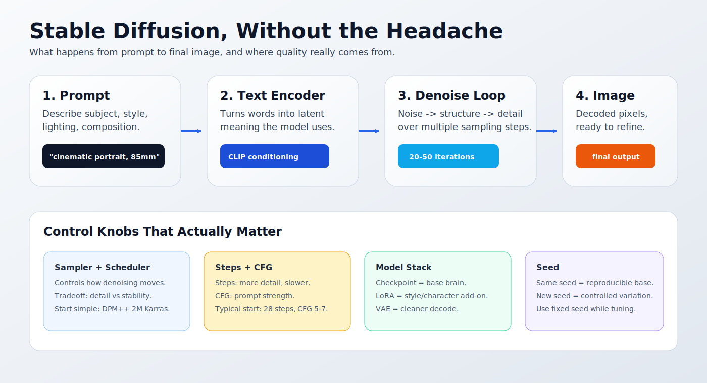
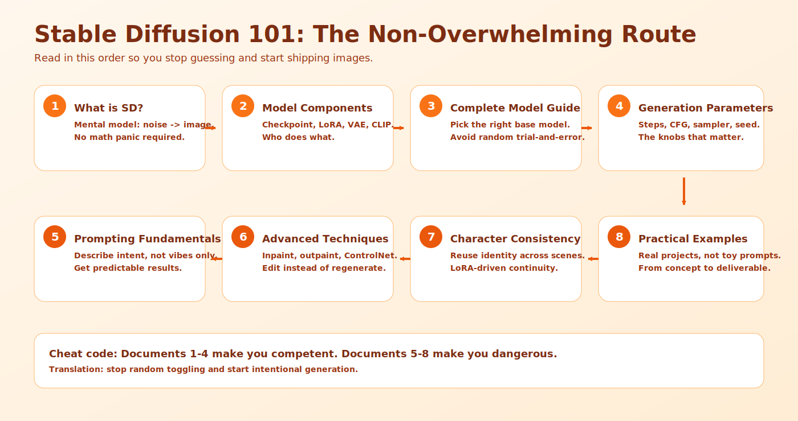

# Stable Diffusion 101

Welcome to Stable Diffusion 101! This comprehensive chapter is designed for absolute beginners with zero or low knowledge of AI image generation. We'll take you from basic concepts to advanced techniques, covering all models available in LoRA Pilot.

## Beginner Terms (Plain English)

- **Model / Checkpoint**: the main "brain" that draws images
- **LoRA**: a small add-on that teaches one style/character/concept
- **VAE**: the part that affects final image clarity/colors
- **Sampler**: the method the model uses to build an image
- **CFG**: how strongly the model follows your prompt
- **Seed**: randomness number (same seed = similar result)

##  Chapter Overview

This chapter is structured to help you learn progressively:

###  Learning Path
1. **[What is Stable Diffusion?](what-is-stable-diffusion.md)** - Basic concepts and how it works
2. **[Model Components Explained](model-components.md)** - Understanding the model "brain" and add-ons
3. **[Complete Model Guide](complete-model-guide.md)** - All models supported by LoRA Pilot
4. **[Generation Parameters](generation-parameters.md)** - Core controls: sampler, guidance, seed, and steps
5. **[Prompting Fundamentals](prompting-fundamentals.md)** - How to write effective prompts
6. **[Advanced Techniques](advanced-techniques.md)** - Inpainting, outpainting, and more
7. **[Character Consistency](character-consistency.md)** - Using LoRA for consistent characters
8. **[Practical Examples](practical-examples.md)** - Real-world projects and workflows

###  Learning Goals

After completing this chapter, you'll be able to:
- **Understand** how Stable Diffusion creates images from text
- **Choose** the right model for your needs
- **Write** effective prompts for different styles
- **Use** LoRA for character and style consistency
- **Apply** advanced techniques like inpainting and outpainting
- **Create** consistent characters across multiple images
- **Optimize** your workflow for best results

###  Quick Start

If you're eager to start, here's the fastest path:

1. **[What is Stable Diffusion?](what-is-stable-diffusion.md)** - 5 minute read
2. **[Model Components Explained](model-components.md)** - 10 minute read
3. **[Practical Examples](practical-examples.md)** - Start creating immediately!

###  Prerequisites

No prior knowledge needed! We assume:
- Basic computer skills
- Interest in AI image generation
- Willingness to experiment and learn

###  Why This Chapter Matters

Stable Diffusion can seem overwhelming with all the technical terms and options. This chapter breaks everything down into simple, understandable concepts with practical examples. By the end, you'll have the confidence to create amazing images and understand exactly what you're doing.

### 🤝 How to Use This Chapter

- **Read in Order**: Each section builds on previous knowledge
- **Try Examples**: Follow along with practical exercises
- **Experiment**: Don't be afraid to try different settings
- **Reference**: Come back to specific sections when needed

Let's begin your journey into AI image generation!

##  Chapter Structure

### 🌅 Beginner Section (Documents 1-3)
**Focus**: Understanding the basics
- **What is Stable Diffusion?**: Core concepts explained simply
- **Model Components**: Understanding all the pieces
- **Complete Model Guide**: All available models explained

###  Intermediate Section (Documents 4-5)
**Focus**: Practical application
- **Generation Parameters**: Mastering the controls
- **Prompting Fundamentals**: Writing effective prompts

###  Advanced Section (Documents 6-8)
**Focus**: Professional techniques
- **Advanced Techniques**: Inpainting, outpainting, ControlNet
- **Character Consistency**: Creating consistent characters with LoRA
- **Practical Examples**: Real-world projects

###  Learning Timeline

#### Week 1: Foundations
- **Day 1-2**: What is Stable Diffusion? + Model Components
- **Day 3-4**: Complete Model Guide
- **Day 5-7**: Practice with basic generation

#### Week 2: Application
- **Day 8-9**: Generation Parameters
- **Day 10-11**: Prompting Fundamentals
- **Day 12-14**: Practice prompting techniques

#### Week 3: Advanced Skills
- **Day 15-16**: Advanced Techniques
- **Day 17-18**: Character Consistency
- **Day 19-21**: Complete practical projects

#### Week 4: Mastery
- **Day 22-28**: Portfolio development and refinement

##  What Makes This Chapter Different

###  Beginner-Focused
- **Simple Language**: No technical jargon without explanation
- **Visual Analogies**: Complex concepts compared to everyday things
- **Step-by-Step**: Each concept broken into manageable steps
- **Practice Exercises**: Hands-on learning with each section

###  Comprehensive Coverage
- **All Models**: Every model in LoRA Pilot explained
- **Complete Techniques**: From basic to professional workflows
- **Real Examples**: Practical projects you can actually build
- **Troubleshooting**: Common problems and solutions

###  Progressive Learning
- **Builds Knowledge**: Each section uses previous concepts
- **Confidence Building**: Start simple, gradually increase complexity
- **Practical Focus**: Emphasis on creating actual images
- **Portfolio Ready**: End with professional-quality work

##  Success Metrics

###  After This Chapter, You'll Be Able To:

#### Technical Skills
- ✅ Understand how Stable Diffusion works
- ✅ Choose appropriate models for any project
- ✅ Master generation parameters and settings
- ✅ Write effective prompts for any style
- ✅ Use advanced techniques like inpainting
- ✅ Create consistent characters with LoRA

#### Creative Skills
- ✅ Generate images in any style you want
- ✅ Fix and improve existing images
- ✅ Create consistent character series
- ✅ Build complex multi-element scenes
- ✅ Develop your own artistic style

#### Professional Skills
- ✅ Work efficiently with AI tools
- ✅ Troubleshoot common problems
- ✅ Optimize workflows for quality and speed
- ✅ Create portfolio-ready images
- ✅ Understand the AI art ecosystem

##  Let's Begin Your Journey!

Ready to start creating amazing AI images? 

**Start here**: [What is Stable Diffusion?](what-is-stable-diffusion.md)

Remember: Every expert was once a beginner. Take your time, experiment freely, and most importantly - have fun creating!

---

## 📝 Feedback

Was this helpful? [Suggest improvements on GitHub Discussions](https://github.com/vavo/lora-pilot/discussions/categories/documentation-feedback)

