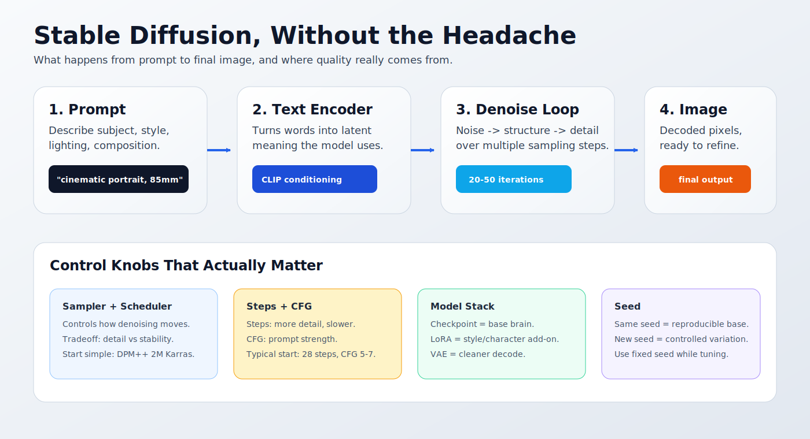

# What is Stable Diffusion?

_Last updated: 2026-07-06_

Picture a sculptor working in reverse. Instead of starting with marble and carving away everything that is not the statue, Stable Diffusion starts with visual noise, something like TV static, and refines it pass by pass until an image matching your prompt appears.

The noise is the raw material. The prompt gives direction. The model supplies visual memory from training. The sampler removes noise in small steps until the image has enough structure and detail to decode into pixels.

## The Canvas You Never See

Stable Diffusion does most of its work in a compressed image space called a **latent**. Think of it as a rough working sketch that carries the important structure without storing every final pixel. The **VAE** decodes that latent into the image you can save, inspect, or send to MediaPilot.

This compressed canvas is the practical trick behind Stable Diffusion. Working on full-size pixels would cost far more memory and time. Working in latent space lets a single GPU handle the job.

Your prompt goes through a text encoder first. The encoder turns words into conditioning the image model can use. It does not "understand" like a person, but it has learned useful relationships between words and images: cats have feline shapes, windowsills sit near windows, morning light tends to be soft, and "top hat on a cat" probably means the hat belongs on the cat rather than on the windowsill. Probably. The model still has opinions.

## The Denoising Loop

Each generation step compares two things: the current noisy latent and your prompt conditioning. The model predicts which part of the noise does not belong, removes a little of it, then hands the cleaner latent to the next step.

Many beginner explanations imply the image appears in a smooth sequence: step 10 looks like a blurry cat, step 25 looks like a better cat, step 40 adds whiskers. That is too tidy. Early steps often look like structured fog. The rough composition tends to settle before the fine detail, and recognizable forms can appear late enough to feel sudden.

> **Why does this work?** Early in sampling, the latent is too noisy for the model to place fine details with confidence. It can estimate broad structure first: subject position, rough shapes, major color regions. As noise drops, smaller details become predictable. Structure comes first, detail comes later.

> **Try this variation:** In ControlPilot or ComfyUI, generate the same prompt with three different seeds. Keep the model, resolution, sampler, steps, and guidance fixed. You should get different compositions that still obey the same prompt. The seed changes the starting noise; the prompt decides what counts as a valid landing zone.

## Why the Name Is a Little Misleading

**Diffusion** describes the step-by-step noise process. Researchers train diffusion models by adding noise to real images and teaching the model to reverse each step.

**Stable** is part of the product name released by Stability AI. It does not mean the model always behaves reliably. The technical lineage comes from latent diffusion; the paper [High-Resolution Image Synthesis with Latent Diffusion Models](https://arxiv.org/abs/2112.10752) is the foundation, and Stability AI's public release gave the model family the name [Stable Diffusion](https://stability.ai/news-updates/stable-diffusion-public-release).

If you want repeatable output, use the same model, prompt, seed, sampler, resolution, VAE, LoRA stack, and settings. The word "stable" will not do that job for you. Branding remains undefeated.

## Where LoRA Fits

The base model already knows a broad range of subjects, styles, lighting, materials, and compositions. A **LoRA** adds a small trained adjustment for one narrower idea: your character, product, outfit, visual style, logo treatment, or subject the base model does not handle well.

LoRAs do not replace the base model. They steer it. That is why model compatibility matters: an SDXL LoRA, a Flux LoRA, and a video LoRA may expect different model families and workflow shapes. [LoRA Training 101](../loRA-training-101/README.md) explains how to create one; [Inference 101](../inference-101/README.md) explains how to use it without turning every setting into soup.

## What This Means in LoRA Pilot

Every image you generate in LoRA Pilot, whether through ControlPilot, InvokeAI, or a raw ComfyUI workflow, follows the same broad loop: encode the prompt, denoise a latent, decode the image, save the result. ControlPilot gives you the product surface, ComfyUI exposes the graph, InvokeAI gives you a focused generation UI, and MediaPilot helps you inspect and curate outputs.

Once you understand that loop, the settings stop looking like a wall of random knobs. Seed controls the starting noise. Steps control how long denoising runs. Guidance controls how hard the prompt pulls. The model family decides what kind of visual knowledge you start from.

## What's Next?

Continue with [Model Components](model-components.md) to learn what checkpoints, VAEs, LoRAs, and text encoders do. Then read [Prompting Fundamentals](prompting-fundamentals.md) before you start collecting other people's 400-word prompt soups from the internet.

Your first experiment: pick one prompt and generate it with SD1.5, SDXL, and Flux if you have them installed. Keep the prompt fixed. The differences in detail, prompt obedience, speed, and composition will teach you more about model personality than another paragraph here can.

---

## 📝 Feedback

Was this helpful? [Suggest improvements on GitHub Discussions](https://github.com/vavo/lora-pilot/discussions/categories/documentation-feedback)
