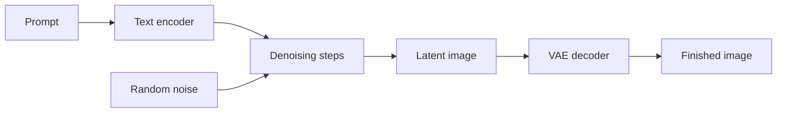

# What is Stable Diffusion?

_Last updated: 2026-07-06_

Stable Diffusion turns a written prompt into an image. That sentence sounds like magic because the useful version of the idea is magic-shaped: you describe a cat on a windowsill, press Generate, and a new image appears.

The real mechanism is more interesting. Stable Diffusion starts with noise, the kind of visual chaos that looks like TV static. Then it removes a little noise at a time while your prompt pulls the image toward "cat", "windowsill", "soft morning light", or whatever else you asked for. It is a sculptor in reverse: it starts with a block of chaos and chips away everything that does not belong.

You do not need to memorize those parts on day one. You only need the shape of the process: prompt plus noise, repeated denoising, decoded into pixels.

## The Three Things Happening

First, the model reads your prompt as conditioning. It does not understand language like a person does, but it has learned patterns between words and images. "Cat" points toward feline shapes. "Sitting" points toward posture. "Windowsill" points toward a setting.

Second, the sampler walks through a series of denoising steps. Early steps decide the rough composition. Middle steps find the subject and large forms. Later steps refine texture, lighting, small details, and all the little ways a model can still make hands weird. Progress, yes. Perfection, no.

Third, the VAE decoder turns the model's internal latent image into pixels you can save. That is why model components matter later: the checkpoint, text encoder, sampler, and VAE each affect the final result.

## Why the Name Is a Little Misleading

"Diffusion" is the important technical word. Diffusion models learn how to reverse a noising process: they start from noise and recover an image step by step. Stable Diffusion is also a latent diffusion model, which means most of that work happens in a compressed image space instead of full-size pixels. That is one reason it became practical to run on consumer GPUs.

"Stable" does not mean the model always gives stable or reliable output. The name is tied to Stability AI's release of Stable Diffusion and the latent diffusion research behind it. If you want repeatable output, use the same seed, model, prompt, and settings. The word "stable" will not do that job for you. Nice try, branding department.

For the curious, the technical foundation is the paper [High-Resolution Image Synthesis with Latent Diffusion Models](https://arxiv.org/abs/2112.10752), and Stability AI's launch context is in their [Stable Diffusion public release](https://stability.ai/news-updates/stable-diffusion-public-release).

## What You Can Make With It

Stable Diffusion can create photorealistic portraits, painted landscapes, product mockups, concept art, game assets, fashion sketches, storyboards, and strange little accidents you will pretend were intentional. It can also edit images, fill missing regions, upscale results, follow rough composition guides, and use LoRAs to repeat a character, product, or style.

The catch is that the model is not a mind reader. A short prompt like "beautiful landscape" gives it room to improvise. A more directed prompt like "wide photo of a misty pine forest at sunrise, lake reflection, soft orange light, natural colors" gives it a cleaner target. Settings then decide how hard the model follows that target, how long it refines, and whether you can reproduce the result.

## What Beginners Usually Get Wrong

The first mistake is changing everything at once. If an image looks bad, keep the same seed and change one thing: the prompt, CFG or guidance, steps, sampler, resolution, or model. If you change five things and the next image improves, you learned almost nothing. Maybe it was the prompt. Maybe it was Tuesday.

The second mistake is treating every model as interchangeable. SD1.5, SDXL, Flux, video models, and specialized checkpoints have different strengths, resolutions, workflows, and settings. A prompt or LoRA that works well in one family may do nothing useful in another.

The third mistake is expecting prompt text to overpower bad inputs. A model can ignore vague words, fight impossible compositions, or hallucinate details. Better inputs often beat louder prompts.

## A Simple First Exercise

Pick one image idea and write it as a normal sentence. Add the subject, setting, style, and lighting. Generate with a fixed seed. Then change only one phrase and generate again.

Example: start with "photo of a tabby cat sitting on a wooden windowsill, morning light, cozy apartment". Keep the seed. Change "morning light" to "blue evening light". The subject should stay similar while the mood changes. That is the first useful lesson: control comes from small, visible changes.

## What's Next?

Continue with [Model Components](model-components.md) to learn what checkpoints, VAEs, LoRAs, and text encoders do. Then read [Prompting Fundamentals](prompting-fundamentals.md) before you start collecting other people's 400-word prompt soups from the internet.

---

## 📝 Feedback

Was this helpful? [Suggest improvements on GitHub Discussions](https://github.com/vavo/lora-pilot/discussions/categories/documentation-feedback)
