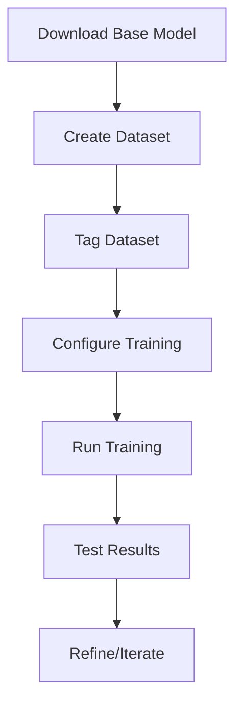
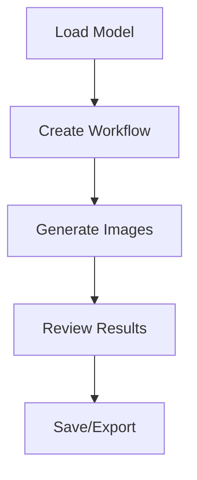

# User Guide

Welcome to the LoRA Pilot user guide! This section covers how to use all the features and workflows available in LoRA Pilot. Whether you're training custom models, generating images, or managing your AI workspace, this guide will help you get the most out of LoRA Pilot.

## 📚 What You'll Learn

- **ControlPilot** - Master the main web interface
- **Training Workflows** - Create and train custom LoRA models
- **Model Management** - Download, organize, and manage models
- **Dataset Preparation** - Create and tag training datasets
- **Inference** - Generate images with ComfyUI and InvokeAI

## 🎯 Recommended Learning Path

### New Users
1. **[ControlPilot Interface](control-pilot.md)** - Learn the main dashboard
2. **[Model Management](model-management.md)** - Download and organize models
3. **[Dataset Preparation](dataset-preparation.md)** - Create your first dataset
4. **[Training Workflows](training-workflows.md)** - Train your first LoRA

### Intermediate Users
1. **[Advanced Training](training-workflows.md#advanced-training-techniques)** - Fine-tune training parameters
2. **[Inference Techniques](inference.md)** - Master ComfyUI workflows
3. **[Batch Operations](model-management.md#batch-operations)** - Manage multiple projects

### Advanced Users
1. **[Custom Configurations](../configuration/custom-setup.md)** - Customize your setup
2. **[API Usage](../development/api-reference.md)** - Automate workflows
3. **[Performance Optimization](../deployment/performance-tuning.md)** - Optimize for speed

## 🖥️ Interface Overview

LoRA Pilot provides multiple interfaces for different tasks:

### ControlPilot (Main Hub)
- **URL**: http://localhost:7878
- **Purpose**: Central management dashboard
- **Features**: Service control, model management, dataset tools

### Component Interfaces
- **ComfyUI**: http://localhost:5555 - Node-based inference
- **Kohya SS**: http://localhost:6666 - LoRA training UI
- **InvokeAI**: http://localhost:9090 - Dedicated inference
- **JupyterLab**: http://localhost:8888 - Notebook environment
- **Code Server**: http://localhost:8443 - VS Code in browser

## 🔄 Workflow Overview

### Typical Training Workflow



### Typical Inference Workflow



## 🎨 Key Features

### 🏠 Centralized Management
- **Single Interface**: ControlPilot manages all services
- **Persistent Workspace**: All data stored in `/workspace`
- **Service Integration**: Seamless switching between tools

### 🎯 Multi-Tool Training
- **Three Trainers**: Kohya SS, AI Toolkit, Diffusion Pipe
- **Model Support**: 30+ training families (SD1.5, SDXL, FLUX.1, etc.)
- **Flexible Configurations**: From quick tests to production training

### 🖼️ Inference Options
- **ComfyUI**: Node-based workflow automation
- **InvokeAI**: User-friendly inference interface
- **Shared Models**: Models available across all tools

### 📊 Dataset Tools
- **TagPilot**: Fast dataset tagging and captioning
- **MediaPilot**: Image organization and review
- **Batch Processing**: Handle large datasets efficiently

## 🚀 Quick Start Examples

### Train Your First LoRA

1. **Download Base Model**
   - Go to Models tab → Download → Select "sdxl-base"

2. **Create Dataset**
   - Go to TagPilot → Upload 10-20 images
   - Add captions for each image
   - Export as dataset

3. **Configure Training**
   - Go to TrainPilot → Select dataset
   - Choose "quick_test" profile
   - Set 100 steps for testing

4. **Start Training**
   - Click "Start Training"
   - Monitor progress in real-time
   - Test results when complete

### Generate Images with ComfyUI

1. **Load Model**
   - Open ComfyUI from Services
   - Load checkpoint in CheckpointLoader node

2. **Create Workflow**
   - Add Prompt, NegativePrompt nodes
   - Connect to KSampler
   - Connect to VAEDecode and SaveImage

3. **Generate**
   - Set prompt and parameters
   - Queue prompt
   - Review generated images

## 📱 Tips and Best Practices

### 🎯 Training Tips
- **Start Small**: Test with 10-20 images and 100 steps
- **Quality Over Quantity**: Better images beat more images
- **Consistent Style**: Keep dataset style consistent
- **Good Captions**: Detailed captions improve results

### 🖼️ Inference Tips
- **Experiment**: Try different prompts and parameters
- **Save Workflows**: Reuse successful workflows
- **Batch Generation**: Generate multiple variations
- **Model Combinations**: Try different base models

### 📁 Organization Tips
- **Clear Naming**: Use descriptive names for models and datasets
- **Regular Cleanup**: Remove unused models and checkpoints
- **Backup Important Work**: Save trained models externally
- **Version Control**: Keep track of training iterations

## 🔧 Common Tasks

### Download Models
```bash
# Via ControlPilot
Models tab → Download → Select models

# Via CLI
docker exec lora-pilot models pull sdxl-base
```

### Monitor Training
```bash
# Via ControlPilot
Services tab → View logs for training service

# Via CLI
docker-compose logs -f kohya
```

### Manage Storage
```bash
# Check usage
docker exec lora-pilot du -sh /workspace/*

# Clean cache
docker exec lora-pilot python -c "import torch; torch.cuda.empty_cache()"
```

## 🆘 Getting Help

### In-Application Help
- **ControlPilot**: Help button in top navigation
- **Component Docs**: Each tool has built-in documentation
- **Tooltips**: Hover over interface elements for help

### External Resources
- **[Troubleshooting Guide](../getting-started/troubleshooting.md)** - Common issues
- **[Configuration Reference](../configuration/README.md)** - Detailed settings
- **[Community Forums](https://github.com/vavo/lora-pilot/discussions)** - Community support

## 📈 Performance Tips

### 🚀 Speed Up Training
- **Use GPU**: Ensure CUDA is available
- **Optimize Batch Size**: Find the sweet spot for your GPU
- **Cache Latents**: Enable latent caching for faster iterations
- **Gradient Checkpointing**: Trade speed for memory efficiency

### 💾 Optimize Storage
- **SSD Workspace**: Use fast storage for `/workspace`
- **Regular Cleanup**: Remove intermediate files
- **External Storage**: Move completed models to external storage
- **Compression**: Compress datasets when not in use

---

*Last updated: 2025-02-11*
