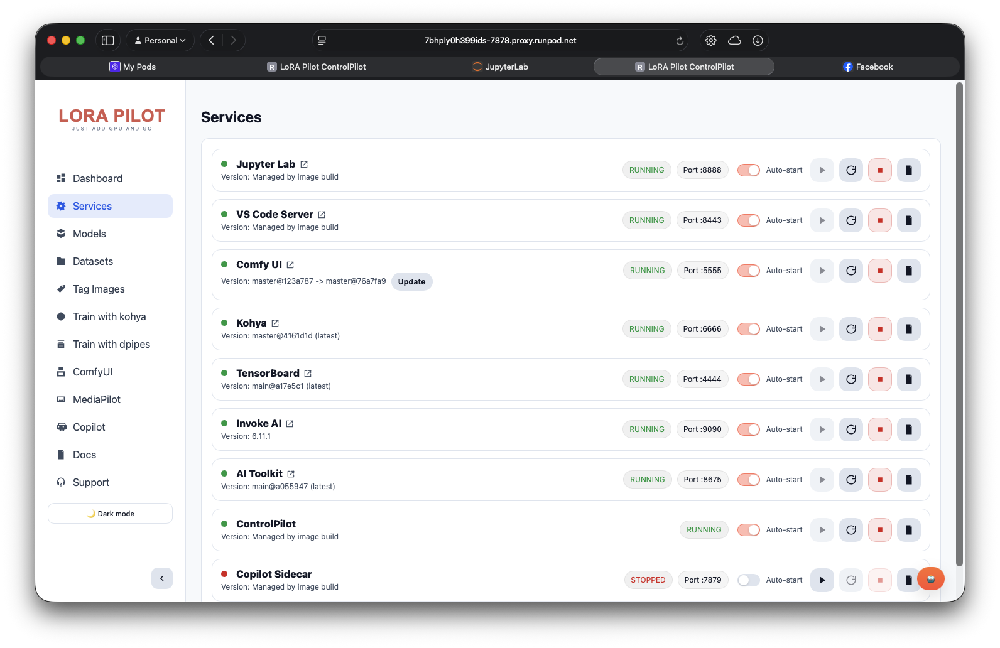
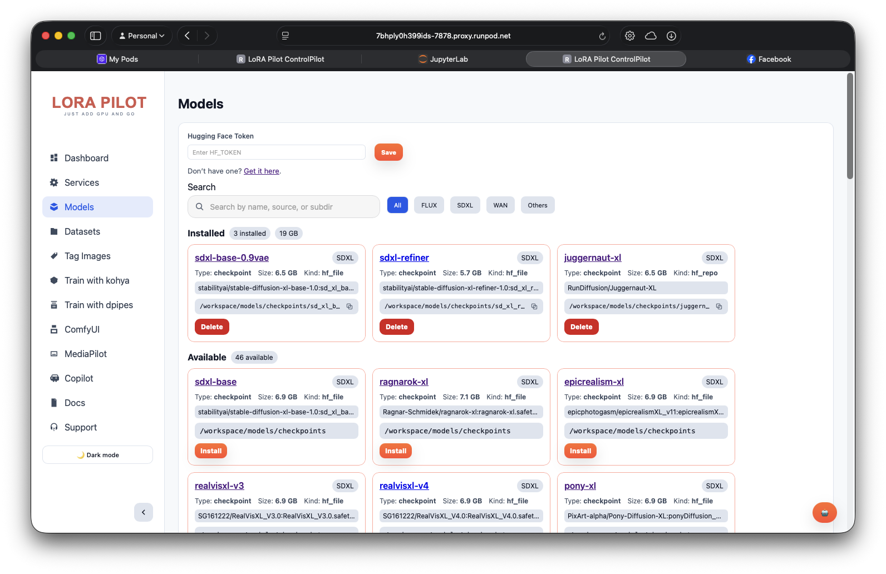
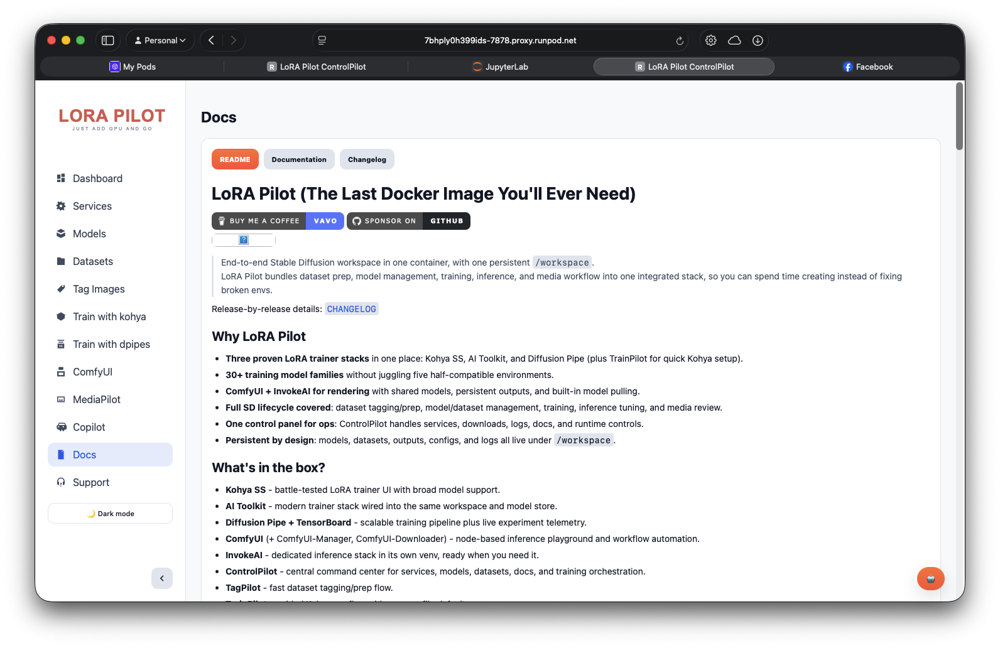
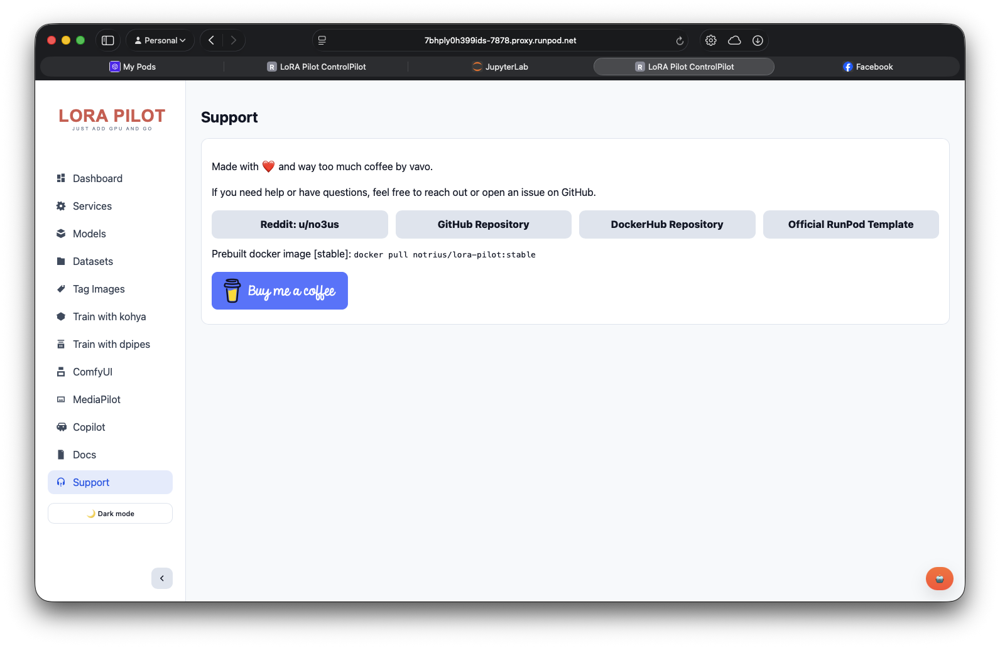

# ControlPilot

_Last updated: 2026-09-19_

ControlPilot brings the path from a folder of images to a usable LoRA into one workspace. Start with your dataset, prepare captions, choose a training profile, and bring the result into ComfyUI. Models, service controls, and detailed logs remain close when you need them.

## Find your next step

Open ControlPilot through your pod's exposed port `7878`, or visit `http://localhost:7878` when running locally. In a RunPod terminal, `supervisorctl status controlpilot` reports the service state. A Docker Compose host can run the equivalent command inside its container. RunPod terminals already run inside the pod, so they do not need a nested Docker command.

The Dashboard puts four starting points ahead of the hardware details: prepare a dataset, train a LoRA, generate with ComfyUI, or explore your outputs. Its compact status strip shows the detected GPU, free workspace storage, and service availability. Expand **Hardware details** when you need resource readings, or **Scheduled shutdown** when you want to configure the existing timer.

The sidebar follows the same journey. **Prepare** contains Datasets, Caption images, and Models. **Train** contains Guided training and Advanced training. **Create** opens ComfyUI and the Gallery, while **Manage** holds Services and Settings. Docs and Support sit below these groups. The Light and Dark controls remain at the bottom of the menu, including on mobile.

## Give your images a clear next step

Datasets accepts ZIP archives containing images and optional matching captions. A saved collection shows real image previews, its image count, and how many images have a matching nonempty caption file. Coverage is a useful starting signal; it does not assess whether those captions describe the images well.

When captions are missing, **Review captions** opens the selected collection in Caption images. A fully captioned collection offers **Train a LoRA**, carrying the dataset into Guided training. **Manage** keeps rename and delete actions separate from that next step. You can also create an empty dataset and add images through the existing captioning workspace.

Guided training presents the dataset, LoRA name, and Quick test, Balanced, or Extended profile together with a run summary. Configuration and logs remain available in expandable sections. A successful run leads to saved filenames and an explicit move into the shared LoRA library. Read the [TrainPilot guide](../components/trainpilot.md) for profile behavior and result persistence.

## Connect model access without losing your place

The Models catalog's **Access settings** action opens Settings directly on **Connections**. Hugging Face credentials remain hidden after saving, and the saved indicator distinguishes a configured token from an empty field. Both **Back to Models** and **Return to Models** return to the selected catalog family. Some gated models also require license acceptance on Hugging Face; saving a token does not grant that approval.

### Services Management




#### Service Overview
Each service card displays:
- **Service Name**: Component identifier
- **Status**: Running, Stopped, or Error
- **Port**: Network port number
- **Resource Usage**: Memory and GPU consumption
- **Actions**: Start, Stop, Restart, Logs, Open

#### Service Controls
```bash
# Available actions for each service:
- Start: Launch the service
- Stop: Graceful shutdown
- Restart: Stop and start service
- Logs: View service logs
- Open: Launch service interface
- Update: Update to latest version
```

#### Service Details
Click on any service to see:
- **Configuration**: Current settings and environment
- **Resource Usage**: Real-time memory and GPU usage
- **Log History**: Recent log entries
- **Health Checks**: Service health status

### Model Management



Browse model families in **Catalog**, filter by task or family, and select a row
for details. For bundled LTX-2.5 and MiniMax H3 workflows, choose a variant and
use **Review installation** to check required files, optional components, sizes,
source access and free storage. **Download missing files** reuses installed
components and queues the rest.

**Installed** provides paths and removal controls. **Downloads** shows progress,
errors and retries. File presence does not prove GPU readiness. See
[Model Management](model-management.md) for CLI commands and existing-download
migration behavior.

### Dataset Tools


#### TagPilot Integration
- **Launch TagPilot**: Open dataset tagging interface
- **Recent Datasets**: View recently created datasets
- **Dataset Stats**: Image count, caption coverage
- **Quick Actions**: Create new dataset, import existing

#### MediaPilot Integration
- **Launch MediaPilot**: Open media management interface
- **Image Gallery**: Browse generated images
- **Batch Operations**: Organize and process images
- **Export Options**: Download or share collections

### Docs and Support Tabs




### Training Orchestration

#### TrainPilot Integration
- **Quick Training**: Fast setup with common profiles
- **Dataset Selection**: Choose from available datasets
- **Model Selection**: Pick base model for training
- **Configuration**: Training parameters and settings

#### Job Management
- **Active Jobs**: Currently running training jobs
- **Job Queue**: Pending training jobs
- **Job History**: Completed and failed jobs
- **Progress Tracking**: Real-time training progress

#### Training Profiles
```yaml
# Available training profiles:
- quick_test: 100 steps, basic testing
- medium_training: 500 steps, balanced quality
- full_training: 1000+ steps, high quality
- experimental: Latest features, experimental
```

### File Browser

#### Workspace Navigation
- **Directory Tree**: Browse workspace structure
- **File Operations**: Copy, move, delete, rename
- **Preview**: Quick file preview for images and text
- **Upload**: Upload files to workspace

#### Common Directories
```
/workspace/
├── datasets/           # Training datasets
├── outputs/           # Training outputs
├── models/            # Downloaded models
├── cache/             # Cache files
├── config/            # Configuration files
└── logs/              # Log files
```

### System Monitoring

#### Resource Usage
- **GPU Utilization**: Real-time GPU usage graphs
- **Memory Usage**: System and GPU memory consumption
- **Disk Usage**: Storage space and usage trends
- **Network Activity**: Data transfer rates

#### Service Health
- **Uptime**: Service running time
- **Response Times**: API response performance
- **Error Rates**: Service error frequency
- **Resource Limits**: Memory and CPU limits

#### Log Management
- **Live Logs**: Real-time log streaming
- **Log History**: Historical log entries
- **Log Filtering**: Filter by service or error level
- **Log Export**: Download logs for analysis

##  Advanced Features

### API Access

#### REST API
ControlPilot provides a REST API for automation:

```bash
# Service management
GET /api/services              # List all services
POST /api/services/{name}/start   # Start service
POST /api/services/{name}/stop    # Stop service

# Model management
GET /api/models               # List models
POST /api/models/pull         # Download model
DELETE /api/models/{name}     # Remove model

# TrainPilot management
POST /api/trainpilot/start    # Start guided Kohya training
POST /api/trainpilot/stop     # Stop guided Kohya training
GET  /api/trainpilot/logs     # Read guided training logs

# Diffusion Pipe management
POST /dpipe/train/validate    # Validate a Diffusion Pipe request
POST /dpipe/train/start       # Start Diffusion Pipe training
POST /dpipe/train/stop        # Stop Diffusion Pipe training
GET  /dpipe/train/logs        # Read Diffusion Pipe logs
```

#### API Authentication
```bash
# Enable ControlPilot password authentication in Settings, or persist it in
# /workspace/config/controlpilot-settings.json.
# The browser login creates the controlpilot_session cookie used by the API.

# For scripted API calls, send that cookie after logging in through the UI.
curl --cookie 'controlpilot_session=<session-cookie>' http://localhost:7878/api/services
```

When password protection is enabled, the same session is required for
Diffusion Pipe, the ComfyUI proxy, and the ComfyUI preview WebSocket. Login
and auth-status endpoints remain public so the browser can establish a
session.

### Custom Configuration

#### Environment Variables
```bash
# ControlPilot configuration
CONTROLPILOT_PORT=7878
CONTROLPILOT_HOST=0.0.0.0
# Supervisor web UI password (separate from ControlPilot login)
SUPERVISOR_ADMIN_PASSWORD=secure_password
CONTROLPILOT_LOG_LEVEL=INFO
```

#### Custom Themes
```bash
# Custom CSS and themes
# Place custom.css in /workspace/config/controlpilot/
# Restart ControlPilot to apply
```

### Integration with Other Tools

#### JupyterLab Integration
- **Launch**: Open JupyterLab from ControlPilot
- **Workspace Access**: Direct access to workspace files
- **Kernel Management**: Switch between Python environments

#### Code Server Integration
- **VS Code in Browser**: Full VS Code experience
- **Workspace Mount**: Direct workspace access
- **Extension Support**: Install VS Code extensions

#### Copilot Sidecar Integration
- **AI Assistant**: GitHub Copilot integration
- **Code Generation**: AI-powered code assistance
- **Workspace Awareness**: Context-aware suggestions

##  Performance Optimization

### Interface Optimization

#### Caching
- **Model Cache**: Cache model information for faster loading
- **Log Cache**: Cache log entries for better performance
- **Image Cache**: Cache thumbnails and previews

#### Lazy Loading
- **Service Status**: Load service information on demand
- **Model Lists**: Paginate model lists for large collections
- **Log History**: Load log entries incrementally

### Resource Management

#### Memory Optimization
- **Log Rotation**: Automatic log file rotation
- **Cache Management**: Intelligent cache cleanup
- **Resource Limits**: Set memory limits for components

#### Performance Monitoring
- **Response Time Tracking**: Monitor API response times
- **Resource Usage Alerts**: Alert on high resource usage
- **Performance Metrics**: Track system performance over time

##  Troubleshooting

### Common Issues

#### Service Won't Start
```bash
# Check service logs
tail -n 100 /workspace/logs/controlpilot.out.log

# Check port availability
netstat -tulpn | grep :7878

# Restart service
supervisorctl restart controlpilot
```

#### Models Not Showing
```bash
# Check model directory
docker exec lora-pilot ls -la /workspace/models/

# Check model manifest
cat /opt/pilot/config/models.manifest.default

# Refresh model list
curl http://localhost:7878/api/models/refresh
```

#### Training Jobs Not Starting
```bash
# Check training service
docker exec lora-pilot supervisorctl status kohya
docker exec lora-pilot supervisorctl status ai-toolkit

# Check dataset availability
docker exec lora-pilot ls -la /workspace/datasets/images/

# Check model availability
docker exec lora-pilot ls -la /workspace/models/stable-diffusion/
```

### Debug Commands

#### Health Check
```bash
# API health check
curl http://localhost:7878/api/health

# Service status check
curl http://localhost:7878/api/services

# System information
curl http://localhost:7878/api/system/info
```

#### Log Analysis
```bash
# View ControlPilot logs
docker exec lora-pilot tail -f /workspace/logs/controlpilot.out.log

# Check for errors
docker exec lora-pilot grep -i error /workspace/logs/controlpilot.out.log

# Monitor resource usage
docker exec lora-pilot top -bn1 | head -20
```

##  Best Practices

### Service Management
1. **Start Services Gradually**: Start core services first
2. **Monitor Resources**: Keep an eye on GPU and memory usage
3. **Regular Restarts**: Restart services periodically for stability
4. **Log Management**: Regularly check and clean up logs

### Model Management
1. **Plan Storage**: Ensure sufficient disk space for models
2. **Organize Models**: Use consistent naming conventions
3. **Regular Cleanup**: Remove unused models to free space
4. **Backup Important Models**: Save trained models externally

### Training Workflows
1. **Test Small**: Start with small test datasets
2. **Monitor Progress**: Keep an eye on training progress
3. **Save Checkpoints**: Save training progress regularly
4. **Validate Results**: Test trained models before deployment

### System Maintenance
1. **Regular Updates**: Keep components updated
2. **Backup Configuration**: Save important configuration files
3. **Monitor Health**: Regularly check system health
4. **Performance Tuning**: Optimize settings based on usage patterns

---

## 📝 Feedback

Was this helpful? [Suggest improvements on GitHub Discussions](https://github.com/vavo/lora-pilot/discussions/categories/documentation-feedback)
