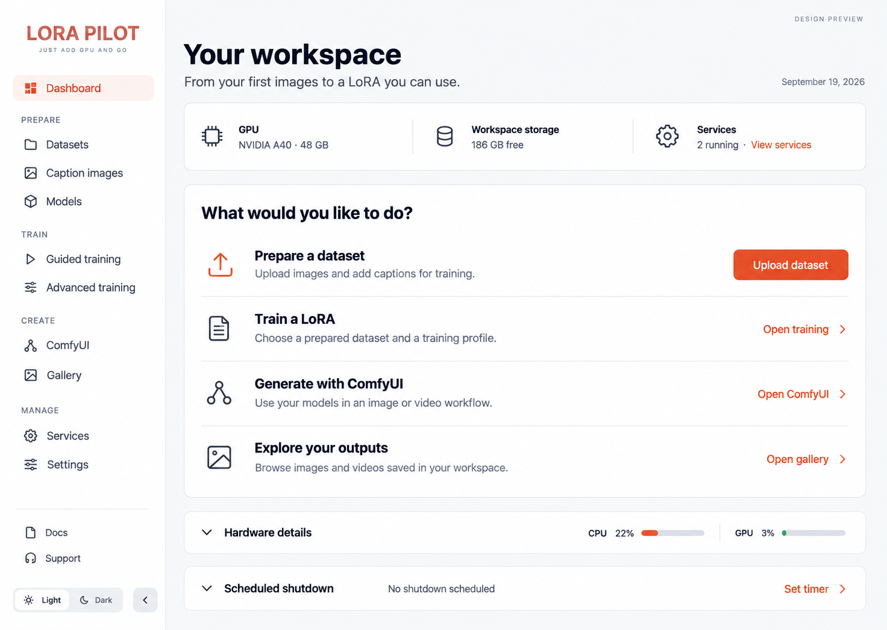
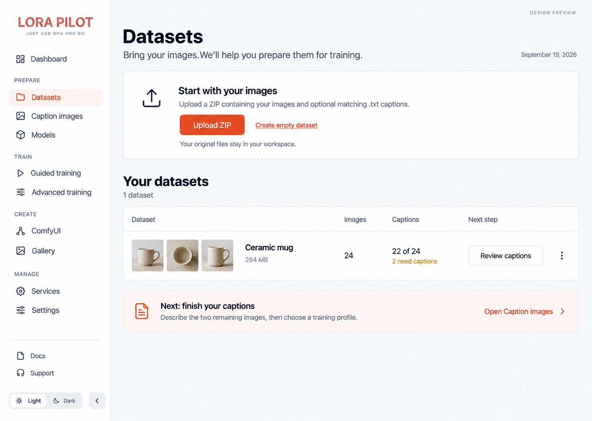
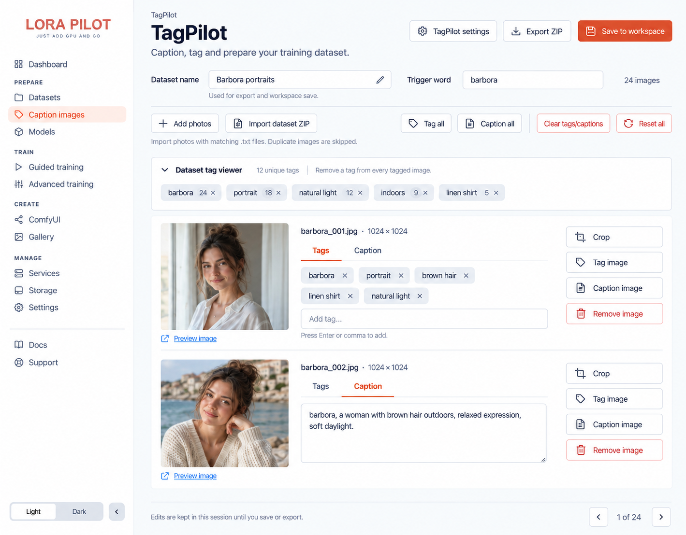

# ControlPilot

_Last updated: 2026-10-05_

ControlPilot brings the path from a folder of images to a usable LoRA into one workspace. Start with your dataset, prepare captions, choose a training profile, and bring the result into ComfyUI. Models, service controls, and detailed logs remain close when you need them.

## Find your next step

Open ControlPilot through your pod's exposed port `7878`, or visit `http://localhost:7878` when running locally. In a RunPod terminal, `supervisorctl status controlpilot` reports the service state. A Docker Compose host can run the equivalent command inside its container. RunPod terminals already run inside the pod, so they do not need a nested Docker command.

The Dashboard puts four starting points ahead of the hardware details: prepare a dataset, train a LoRA, generate with ComfyUI, or explore your outputs. Its compact status strip shows the detected GPU, free workspace storage, and service availability. Expand **Hardware details** when you need resource readings, or **Scheduled shutdown** when you want to configure the existing timer.

The sidebar follows the same journey. **Prepare** contains Datasets, Caption images, and Models. **Train** contains Guided training and Advanced training. **Create** opens ComfyUI and the Gallery, while **Manage** holds Services, Storage, and Settings. Docs and Support sit below these groups. The Light and Dark controls remain at the bottom of the menu, including on mobile. The collapsed desktop menu uses sun and moon icons for these choices.

You can minimize the build and activity bar with its close control. An activity icon appears beside Copilot at the bottom right; select it to reopen the bar. This browser remembers your choice across pages and reloads. The icon marks active work and pending completion notices while the bar is minimized.

*Dashboard design preview from [lorapilot.com](https://lorapilot.com/); your installed image may show a different interface.*

## Know what is running

When the build and activity bar is expanded, its build label opens **Build & diagnostics**. It shows the image's source commit and build date, detected GPU and memory, and locally installed service versions and states. Choose **Copy diagnostics** when asking for support. The summary deliberately leaves out credentials, URLs, workspace paths, dataset names and logs, so you can explain which build you are testing without copying your environment. Older images and source checkouts without embedded metadata show **unknown**.

The activity control stays with you as you move between pages. Open it to inspect guided training, legacy TrainPilot, managed Diffusion Pipe runs and model downloads. A percentage appears when the job reports progress. Completion and failure notices offer **View task**, which returns to the training run or the Downloads view. The page checks every five seconds while ControlPilot is open; it does not send desktop or email notifications. Work launched independently in another tool is outside this indicator's scope.

If a status source becomes unavailable, its last known jobs remain visible with an explicit warning. A paused training queue is identified separately from running work. Guided run history stays in the workspace, while legacy training and download activity follow their existing service lifetimes.

## Give your images a clear next step

Datasets accepts ZIP archives containing images and optional matching captions. A saved collection shows real image previews, its image count, and how many images have a matching nonempty caption file. Coverage is a useful starting signal; it does not assess whether those captions describe the images well.

When captions are missing, **Review captions** opens the selected collection in Caption images. A fully captioned collection offers **Train a LoRA**, carrying the dataset into Guided training. **Manage** keeps rename and delete actions separate from that next step. You can also create an empty dataset and add images through the existing captioning workspace.

Use **Check quality** to inspect unreadable images, exact duplicates, small images and missing or empty captions before training. The report leaves your files unchanged and links to the affected images. A complete caption count still needs your review: file checks cannot judge whether the descriptions are useful.

For a first experiment, expand **Your first LoRA** in Datasets or Guided training. You can install the eight orange robot images from the LoRA Pilot videos, review their captions, and prepare an SDXL Quick test with the trigger word `pilotceramic`. The guide tracks your saved progress through training and comparison. These are sample training images; you generate the trained result on your own GPU.

Guided training brings SDXL, FLUX.1 dev, SD 1.5, and SD 3.5 Medium/Large into the same setup flow. Choose a dataset, name the LoRA, and select a profile. A persistent queue and history keep the experiment available after a restart, while the result screen lets you move or copy checkpoints into the library and compare their progress against the base model. Read the [TrainPilot guide](../components/trainpilot.md) for the complete workflow.

*Datasets design preview from [lorapilot.com](https://lorapilot.com/): review caption coverage before training.*

## Connect model access without losing your place

The Models catalog's **Access settings** action opens Settings directly on **Connections**. Hugging Face credentials remain hidden after saving, and the saved indicator distinguishes a configured token from an empty field. Both **Back to Models** and **Return to Models** return to the selected catalog family. Some gated models also require license acceptance on Hugging Face; saving a token does not grant that approval.

## Manage services and model files

Open **Services** to see the running and stopped tools in one directory. Use **All**, **Running** or **Stopped** to narrow the list, then select a service. Its detail panel brings together its state, configured port, Start or Stop controls, Restart, and recent log output. Choose **View full log** when you need more context. On mobile, **Back to services** returns you to the list.

For a running tool with a browser interface, choose **Open** in its detail panel or use the shortcut beside its row. Both links use the configured service port, including RunPod proxy addresses. Protected ComfyUI opens through the ControlPilot gateway. Copilot Sidecar runs behind ControlPilot and has no direct application link.

**VS Code Server** starts as **Not installed** on fresh images. Select it and choose **Install VS Code**. Follow the progress in the Version section, then choose **Start service** and **Open**. Installation needs internet access and 2.5 GiB free workspace space. The editor and its data persist on the workspace volume; installation does not enable auto-start. See [installation and recovery](../components/code-server.md).

**Start with workspace** controls whether Supervisor starts that service on boot. The Version section identifies the installed version and offers an update only when the integration supports it. Image-managed applications receive their bundled updates through a new image. Restarting or stopping ControlPilot disconnects the interface you are using. The [Supervisor guide](../configuration/supervisor.md#keeping-service-definitions-consistent) explains how the shared service registry keeps these names, links and logs aligned.

In **Models**, browse the Catalog, filter by task or family, and select a row for details. Bundled LTX-2.5 and MiniMax H3 workflows offer **Review installation**, where you can inspect required files, optional components, source access, and available storage before downloading. **Download missing files** reuses installed components and queues the remaining files.

Use **Installed** to inspect paths and remove model files, or **Downloads** to follow progress and retry failures. An installed file still needs a compatible workflow and a successful GPU run before you can judge the result. The [model management guide](model-management.md) covers downloads and existing-file migration.

## Follow a training run through to its files

Choose a supported model family, then select **Quick test**, **Balanced**, or **Extended**. Each family has its own recipe and model requirements. Preflight checks the required files and managed training conflicts, while the dataset review gives you a chance to inspect problems before queueing.

Expand **GPU & training settings** to review and edit the suggested memory settings. ControlPilot can reuse settings from a successful local run with matching hardware, family, profile and build. Without that evidence, it labels the suggestion as an unmeasured starting point. The recorded memory peak covers the whole GPU, including other workloads.

You can prepare another run while one is training. The queue dispatches one guided run at a time and waits for conflicting managed training. ComfyUI can run alongside guided training; GPU occupancy warnings do not require you to stop it first. **Pause queue** holds the next start without interrupting current training. Concurrent work shares GPU memory, so review the settings and workload if a run runs out of memory.

**Training queue & history** keeps run status, configuration snapshots, logs, and output locations on your persistent volume. **View run** opens its details, **Use settings** fills a new setup from the saved configuration, and **Repeat run** queues another experiment against the current dataset. A server restart marks formerly running jobs interrupted and pauses pending work for inspection. It does not automatically resume checkpoints or recreate the result of a process it no longer owns.

Search the full history by LoRA or dataset name, filter by model family or status, and move through results with **Previous** and **Next**. Each page shows up to 50 matching runs. Filtering the list leaves the selected run open so you can inspect it while finding another experiment.

The selected run shows elapsed time from launch, including preparation. Startup and cache preparation have their own stage labels. A remaining-time estimate appears only after enough recent trainer progress is available; it disappears when the progress becomes stale. Treat it as an estimate, since checkpoint saves and changing workload conditions can affect the finish time.

A successful run shows saved files and their location. **Download** saves an individual checkpoint to your computer while keeping the workspace copy. **Move to LoRA library** relocates checkpoints under `/workspace/models/loras/ControlPilot/<run-id>`, keeping downloads and comparisons available. **Copy to LoRA library** also preserves the originals. **Try my LoRA** displays a no-LoRA baseline followed by all saved checkpoints in training order, using the same prompt and seed. A single-checkpoint option is available for a smaller comparison. You can also open the prepared graph in ComfyUI without generating immediately.

To carry a finished experiment elsewhere, expand **Export experiment**. Choose one checkpoint, enter the trigger words and sample prompt, and select any comparison images to include. Review the file list before downloading the ZIP. The package includes selected training settings and model requirements; it leaves out datasets, logs, credentials and local paths.

A failed or stopped run keeps its status and logs rather than showing a success screen. Any saved checkpoints remain in its output directory and can be downloaded after the run stops. Recognized failures offer an explanation and a relevant next action, such as checking Hugging Face access or opening Storage. Expand **Technical details** to inspect the underlying message. For model families or controls outside these guided recipes, open the relevant trainer described in the [training workflows guide](training-workflows.md).

## Keep preparation, generation, and review connected

**Caption images** opens TagPilot for image and caption editing. Use its workspace save action before returning to training, then check the caption coverage in Datasets. A complete caption count tells you that matching nonempty files exist; it cannot tell you whether their descriptions are useful.

*Caption editor view from [lorapilot.com](https://lorapilot.com/). Save your edits to the workspace before returning to training.*

**ComfyUI** opens the generation workspace. **Gallery** opens MediaPilot to review saved media. Both use the shared workspace, which lets you prepare a dataset, train an adaptation, and inspect generated results without copying files between containers. For file work outside these views, use the JupyterLab or code-server link in Services.

## Make room for the next experiment

Open **Storage** under Manage to see the space used by models, original datasets, private training snapshots, outputs, and application caches. On shared storage, ControlPilot distinguishes measured workspace usage from the allocation reported by RunPod or supplied in configuration. It labels unavailable capacity as unknown instead of presenting the host filesystem as your volume. Category totals describe file sizes and exclude symbolic links and duplicate hard links, so they are not a complete breakdown of every byte on the disk. A separately mounted model directory can contribute to the category total without consuming workspace space.

Cleanup starts with your selection. Choose a checkpoint, a finished run's private dataset snapshot, or its training caches, then choose **Review selected cleanup**. The preview shows the selected groups, file count, and estimated reclaimable space. Removing a checkpoint makes it unavailable for download or comparison from that run. **Keep files** closes the preview without removing anything. Removal requires an explicit acknowledgment and cannot be undone here.

ControlPilot rechecks files and workload status before removal. Active or queued training, model downloads, GPU work, and unavailable workload checks block cleanup. A preview expires after five minutes, and changed files require a fresh review. Original datasets, shared models, linked files, and run metadata remain protected. General application caches and outputs from other tools are visible in the overview but are not cleanup candidates; use Models or Gallery for their existing management actions. Empty directories may remain, and filesystem snapshots or other mounts can make actual reclaimed space differ from the estimate.

## Set workspace defaults and access

Settings groups preferences into **General**, **Access & security**, **Connections**, **Shutdown**, and **MCP**. Save General preferences with its save action. The sidebar Light and Dark controls apply the theme when you choose it. Connection settings use their own save controls; leaving a credential field blank keeps the saved value unless you choose Clear.

Access & security contains ControlPilot password protection and optional ComfyUI protection. Review the [security guidance](../configuration/comfy-access.md) before changing access on a public pod. Shutdown preferences set the timer's defaults; configure an actual schedule from the Dashboard's **Scheduled shutdown** section.

## Give an assistant selected access

Open **Settings → MCP** when you want a compatible assistant client to inspect workspace information. Configure the public origin and a ControlPilot password first, then enable MCP and create a connection with the permissions and datasets or runs you choose. Save the one-time token in the client's protected credential settings. MCP starts disabled and uses its own credentials, separate from the Copilot sidecar.

An assistant can inspect granted summaries and propose supported operations. Training, comparison and export also require deployment verification gates; their plans need owner approval unless you enabled a policy that covers the selected operation and its limits. Read the [MCP setup guide](../configuration/mcp.md) before enabling execution. The current implementation supports private bearer-token clients, with public-proxy and target-GPU verification still outstanding.

## Find help while you work

Open **Docs** to read the bundled guides or changelog inside ControlPilot. **Support** provides the project's support links. If a service fails, inspect its log in Services. If training fails, start with **Logs & diagnostics** and the generated run configuration. Keep the first meaningful error when asking for help, and remove credentials from anything you share.

For automation, use the [API reference](../development/api-reference.md). It documents the dataset, model, service, and training routes, including the result metadata used by these screens. Ordinary REST scripts follow the ControlPilot session policy when password protection is enabled. MCP clients use the separate scoped bearer credentials described above.
