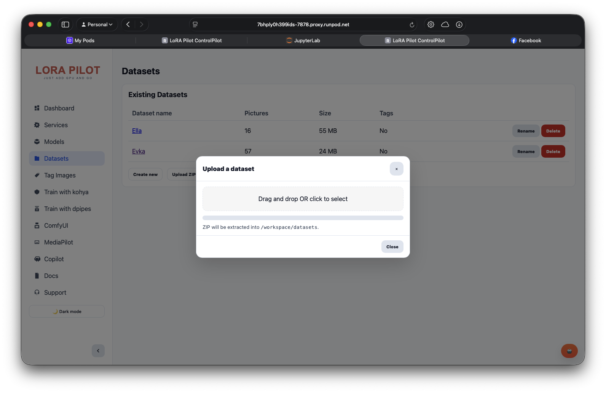

# Dataset Preparation

_Last updated: 2026-09-10_

A folder of photographs can become the starting point for a character you can place in new scenes or a visual style you can use across a project. Before training, you decide what the examples have in common and what should remain free to change. That decision shapes the dataset you build.

LoRA Pilot keeps preparation close to training. You can import images through ControlPilot, review their captions in TagPilot, and save the result into the shared workspace. You spend less time moving files between tools and more time deciding what you want the model to learn.

## Give the collection a clear purpose

Imagine you want to train a LoRA around a handmade ceramic teapot. Across your examples, the teapot should remain recognizable while you vary the angle, lighting, and surroundings. If you show it against the same kitchen wall in each photograph, you give the trainer little evidence for separating the subject from that setting.

Review the collection at full size before you upload it. Remove accidental duplicates and images that contradict the subject you want to teach. Keep useful variation, including views you want the model to handle later. LoRA Pilot does not assign a quality score to the dataset; you make these judgments by inspecting the images. The [Datasets 101 course](../getting-started/datasets-101/README.md) develops this process in more depth.

## Bring the images into ControlPilot

Open **Datasets** in ControlPilot. Create a named dataset to begin a new collection, or choose **Upload ZIP** to import files you have prepared elsewhere. For a straightforward import, place the images and any matching caption files at the top level of the archive, then give the ZIP a descriptive name such as `ceramic_teapot.zip`.

ControlPilot keeps datasets under `/workspace/datasets` and displays folders with the `1_` prefix. Creating `ceramic_teapot` through the interface produces `1_ceramic_teapot`. Importing `ceramic_teapot.zip` produces that same dataset name and stores the archive under `/workspace/datasets/ZIPs`.

Use a distinct name for a new revision if you want to retain the previous collection. Uploading another ZIP with the same name replaces the matching dataset after the archive passes import validation. The stored ZIP is a convenient snapshot, but it shares the workspace with the working files. Keep a copy elsewhere for backup.

The dataset browser recognizes PNG, JPEG, WebP, BMP, and GIF extensions. Recognition in this browser does not establish support in a trainer, so check the requirements of your chosen training workflow. For an image dataset, confirm that the files open as the still images you expect.

## Describe the image you can see

Open the dataset in TagPilot to review its images and text. You can edit tags or captions by hand, or use a configured AI provider to draft them. Read generated text before saving it. An appealing description can still invent a material, miss a detail, or name the wrong subject.

For the teapot project, a caption might read “ceramic teapot on a wooden table, side view, soft window light.” Describe visible differences that matter to the training task. If your training approach uses a trigger term for the subject, apply that convention throughout the collection. Follow the caption format expected by your trainer and base model rather than assuming that one style of tagging fits them all.

LoRA Pilot saves captions as plain `.txt` files beside their images. An image named `teapot_side.png` pairs with `teapot_side.txt`. This arrangement lets you inspect or edit the same material from JupyterLab or VS Code without converting it into an application-specific format.

## Save a version you can trust

Use TagPilot's workspace save action and wait for its completion message. That action writes the loaded collection back to the selected dataset, sending images and their text in sequence. It resets the destination at the start, so load the complete collection you intend to keep before saving over an existing dataset. An interrupted save may leave an incomplete working copy.

After saving, reopen the dataset and check an image near the end of the collection as well as the first one. Confirm that the captions match and that the number of images makes sense. The completed save also creates a ZIP snapshot in `/workspace/datasets/ZIPs`.

For terminal work, run `ls /workspace/datasets/1_ceramic_teapot` inside the pod or container to inspect the saved files. If you automate imports, the corresponding entry points are `POST /api/datasets/create` and `POST /api/datasets/upload`. TagPilot uses `POST /api/tagpilot/save-item` for its sequential save flow. The [API reference](../development/api-reference.md) provides the wider interface context.

## Carry the same collection into training

Select the saved dataset in your training interface and confirm that it resolves to the intended workspace folder. Keep the dataset revision and training configuration together in your project notes. After a test run, you can trace an unwanted background or a weak side view back to the examples you supplied and make a targeted revision.

If a ZIP import fails, check that the archive contains ordinary files with relative paths. ControlPilot rejects paths that escape the dataset directory and rejects symbolic links. Rebuild the archive from the source images instead of trying to preserve those entries.

Continue with [TagPilot](../components/tagpilot.md) for editing controls or [training workflows](training-workflows.md) to use the saved collection. For guidance on choosing source material, read [image collection strategies](../getting-started/datasets-101/image-collection-strategies.md).
