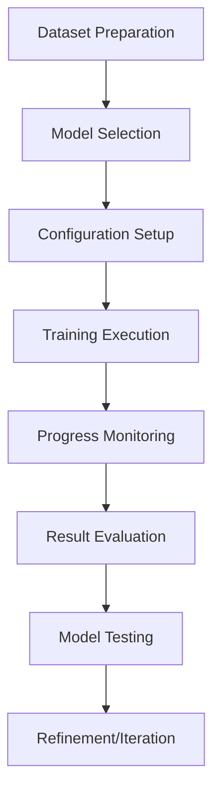

# Training Workflows

This guide covers comprehensive training workflows in LoRA Pilot, from basic LoRA training to advanced techniques using multiple training stacks. Learn how to create high-quality custom models with proven methodologies.

## 🎯 Training Overview

LoRA Pilot provides three training stacks:
- **Kohya SS**: Traditional, battle-tested LoRA trainer
- **AI Toolkit**: Modern stack for FLUX.1 and latest models
- **Diffusion Pipe**: Scalable pipeline for large-scale training

## 📋 Training Workflow Process

### Complete Training Pipeline



### Key Decision Points

1. **Model Choice**: SD1.5, SDXL, SD3, or FLUX.1?
2. **Training Stack**: Kohya SS, AI Toolkit, or Diffusion Pipe?
3. **Dataset Quality**: How many images? What resolution?
4. **Training Parameters**: Learning rate, steps, batch size?

## 🚀 Quick Start Training

### Your First LoRA Training

#### Step 1: Prepare Dataset
```bash
# Use TagPilot for dataset creation
1. Access TagPilot from ControlPilot
2. Upload 10-20 high-quality images
3. Add descriptive captions for each image
4. Export dataset to /workspace/datasets/images/1_my_dataset
```

#### Step 2: Choose Training Stack
```bash
# For beginners: Start with Kohya SS
# For FLUX.1: Use AI Toolkit
# For large-scale: Use Diffusion Pipe
```

#### Step 3: Configure Training
```bash
# Quick test configuration
- Model: SDXL Base
- Steps: 100
- Learning Rate: 1e-4
- Batch Size: 1
- Network Dim: 16
```

#### Step 4: Start Training
```bash
# Via TrainPilot
1. Go to Training tab in ControlPilot
2. Select your dataset
3. Choose "quick_test" profile
4. Click "Start Training"
```

#### Step 5: Monitor and Test
```bash
# Monitor progress
- Check training logs
- View generated samples
- Monitor GPU usage

# Test results
- Load trained LoRA in ComfyUI
- Generate test images
- Evaluate quality
```

## 🎨 Model-Specific Workflows

### Stable Diffusion 1.5 Training

#### Best For
- Beginners and learning
- Fast training and inference
- Extensive community support
- Lower hardware requirements

#### Configuration
```yaml
# Kohya SS Configuration for SD1.5
model:
  pretrained_model_name_or_path: "/workspace/models/stable-diffusion-v1-5"
  v2: false
  v_parameterization: false

training:
  resolution: 512
  batch_size: 1
  gradient_accumulation_steps: 1
  learning_rate: 1e-4
  max_train_steps: 1000
  save_every_n_steps: 100

network:
  network_type: "lora"
  network_dim: 32
  network_alpha: 32

dataset:
  enable_bucket: true
  min_bucket_reso: 256
  max_bucket_reso: 512
```

#### Workflow Steps
1. **Dataset**: 15-30 images, 512x512 resolution
2. **Training**: 1000 steps, 1e-4 learning rate
3. **Testing**: Generate samples every 100 steps
4. **Refinement**: Adjust based on sample quality

### Stable Diffusion XL Training

#### Best For
- High-quality results
- Professional applications
- Detailed, realistic images
- Commercial use

#### Configuration
```yaml
# Kohya SS Configuration for SDXL
model:
  pretrained_model_name_or_path: "/workspace/models/stable-diffusion-xl-base-1.0"
  v2: true
  sdxl: true

training:
  resolution: 1024
  batch_size: 1
  gradient_accumulation_steps: 1
  learning_rate: 1e-4
  max_train_steps: 1500
  save_every_n_steps: 150

network:
  network_type: "lora"
  network_dim: 64
  network_alpha: 64

dataset:
  enable_bucket: true
  min_bucket_reso: 512
  max_bucket_reso: 1024
```

#### Workflow Steps
1. **Dataset**: 20-40 images, 1024x1024 resolution
2. **Training**: 1500 steps, 1e-4 learning rate
3. **Validation**: Test with various prompts
4. **Refinement**: Continue training if needed

### FLUX.1 Training (AI Toolkit)

#### Best For
- State-of-the-art quality
- Artistic and creative styles
- Complex prompt following
- Latest generation capabilities

#### Configuration
```yaml
# AI Toolkit Configuration for FLUX.1
job: "extension"
config:
  name: "flux_lora_training"
  process:
    - type: "diffusion_trainer"
      training_folder: "/workspace/outputs/ai-toolkit"
      device: "cuda"
      trigger_word: "your_trigger_word"
      network:
        type: "lora"
        linear: 32
        linear_alpha: 32
      datasets:
        - folder_path: "/workspace/datasets/images/1_your_dataset"
          resolution: [1024]
          num_repeats: 1
      train:
        batch_size: 1
        steps: 3000
        lr: 0.0001
        gradient_checkpointing: true
        optimizer: "adamw8bit"
        dtype: "bf16"
      model:
        name_or_path: "black-forest-labs/FLUX.1-schnell"
        low_vram: false
```

#### Workflow Steps
1. **Authentication**: Set up Hugging Face token
2. **Dataset**: 20-30 high-quality images, 1024x1024
3. **Training**: 3000 steps, BF16 precision
4. **Testing**: Use FLUX.1 in ComfyUI for testing

## 📊 Advanced Training Techniques

### Multi-Concept Training

#### Concept Blending
```yaml
# Train multiple concepts in one LoRA
datasets:
  - folder_path: "/workspace/datasets/images/1_concept_a"
    network_weight: 1.0
  - folder_path: "/workspace/datasets/images/2_concept_b"
    network_weight: 0.8
  - folder_path: "/workspace/datasets/images/3_concept_c"
    network_weight: 0.6
```

#### Trigger Words
```yaml
# Use unique trigger words for each concept
trigger_word: "photo of sks person, photo of abc style"
```

### Style Transfer Training

#### Art Style LoRA
```yaml
# Configuration for artistic styles
training:
  learning_rate: 5e-5  # Lower learning rate for styles
  max_train_steps: 2000  # More steps for style learning
  
network:
  network_dim: 128  # Higher dimension for styles
  network_alpha: 64

dataset:
  # Use diverse artistic examples
  resolution: [512, 768, 1024]  # Multiple resolutions
```

#### Character Design
```yaml
# Configuration for character LoRA
training:
  learning_rate: 1e-4
  max_train_steps: 1500
  
network:
  network_dim: 32
  network_alpha: 32

dataset:
  # Consistent character poses and angles
  resolution: 1024
  enable_bucket: false  # Disable bucketing for consistency
```

### Resolution-Specific Training

#### High-Resolution Training
```yaml
# For high-resolution models
training:
  resolution: 1536  # Higher resolution
  batch_size: 1     # Reduce batch size
  gradient_checkpointing: true  # Enable checkpointing
  
dataset:
  min_bucket_reso: 1024
  max_bucket_reso: 1536
```

#### Multi-Resolution Training
```yaml
# Train on multiple resolutions
dataset:
  resolution: [512, 768, 1024, 1280]  # Multiple resolutions
  enable_bucket: true
  bucket_reso_steps: 64
```

## 🔧 Optimization Strategies

### Memory Optimization

#### Gradient Checkpointing
```yaml
# Enable gradient checkpointing
train:
  gradient_checkpointing: true
  
# Reduces memory usage by ~40%
# Slightly increases training time
```

#### Mixed Precision
```yaml
# Use mixed precision training
train:
  mixed_precision: "fp16"  # For SD1.5/SDXL
  dtype: "bf16"            # For FLUX.1
```

#### CPU Offloading
```yaml
# For low VRAM scenarios
model:
  low_vram: true

# Moves some computations to CPU
# Significantly slower but reduces VRAM
```

### Speed Optimization

#### Batch Processing
```yaml
# Increase effective batch size
train:
  batch_size: 1
  gradient_accumulation_steps: 4  # Effective batch size = 4
```

#### Latent Caching
```yaml
# Cache latents for faster training
datasets:
  - cache_latents_to_disk: true
  
# Faster training after initial cache
# Uses disk space for cache
```

### Quality Optimization

#### Learning Rate Scheduling
```yaml
# Use learning rate scheduling
train:
  lr_scheduler: "cosine"
  warmup_steps: 100
  lr_end: 1e-6
```

#### Regularization
```yaml
# Add regularization dataset
datasets:
  - folder_path: "/workspace/datasets/images/1_main_concept"
    is_reg: false
  - folder_path: "/workspace/datasets/images/2_regularization"
    is_reg: true
    network_weight: 0.1
```

## 📈 Progress Monitoring

### Real-Time Monitoring

#### Training Metrics
```bash
# Monitor training progress
docker exec lora-pilot tail -f /workspace/outputs/my_lora/_logs/train.log

# Key metrics to watch:
- Loss values
- Learning rate
- GPU utilization
- Memory usage
```

#### Sample Generation
```yaml
# Configure sample generation
sample:
  sample_every: 100  # Generate samples every 100 steps
  prompts:
    - "photo of your_trigger_word subject"
    - "artistic style of your_trigger_word"
  seed: 42
```

### Quality Assessment

#### Sample Evaluation
1. **Visual Quality**: Check for artifacts, blurriness
2. **Concept Adherence**: Does it match your concept?
3. **Trigger Word Effectiveness**: Is trigger word working?
4. **Overfitting**: Is it memorizing training images?

#### Quantitative Metrics
```bash
# Calculate training loss trends
python -c "
import json
with open('/workspace/outputs/my_lora/_logs/metrics.json') as f:
    metrics = json.load(f)
print('Latest loss:', metrics['loss'][-1])
"
```

## 🎯 Troubleshooting Training

### Common Issues

#### Poor Quality Results
```yaml
# Solutions:
1. Increase training steps
2. Improve dataset quality
3. Adjust learning rate
4. Increase network dimension
5. Add more diverse images
```

#### Overfitting
```yaml
# Solutions:
1. Add regularization dataset
2. Reduce network dimension
3. Decrease learning rate
4. Add more diverse training images
5. Use early stopping
```

#### Training Instability
```yaml
# Solutions:
1. Lower learning rate
2. Enable gradient clipping
3. Use mixed precision
4. Check dataset quality
5. Ensure proper image format
```

#### Memory Issues
```yaml
# Solutions:
1. Enable gradient checkpointing
2. Use mixed precision
3. Reduce batch size
4. Enable CPU offloading
5. Clear GPU cache
```

### Debug Commands

#### Check Training Status
```bash
# Check if training is running
docker exec lora-pilot supervisorctl status kohya
docker exec lora-pilot supervisorctl status ai-toolkit

# View training logs
docker exec lora-pilot tail -100 /workspace/outputs/my_lora/_logs/train.log
```

#### Validate Configuration
```bash
# Test configuration before training
cd /opt/pilot/repos/ai-toolkit
python run.py --validate /path/to/config.yaml
```

#### Check GPU Usage
```bash
# Monitor GPU during training
docker exec lora-pilot nvidia-smi
watch -n 1 'docker exec lora-pilot nvidia-smi'
```

## 🔄 Iterative Refinement

### Training Iterations

#### First Pass (Testing)
```yaml
# Quick test configuration
steps: 100
learning_rate: 1e-4
network_dim: 16
```

#### Second Pass (Refinement)
```yaml
# Based on test results
steps: 500-1000
learning_rate: 5e-5 to 1e-4
network_dim: 32-64
```

#### Final Pass (Production)
```yaml
# Final training configuration
steps: 1500-3000
learning_rate: 1e-4 to 5e-5
network_dim: 64-128
```

### A/B Testing

#### Compare Configurations
```bash
# Train multiple versions
trainpilot run --dataset my_dataset --profile test_a --name test_a
trainpilot run --dataset my_dataset --profile test_b --name test_b

# Compare results
# Test both in ComfyUI
# Evaluate quality and consistency
```

### Ensemble Methods

#### Model Blending
```bash
# Blend multiple LoRAs
# In ComfyUI:
1. Load base model
2. Add multiple LoRA nodes
3. Adjust weights for each
4. Test combinations
```

## 🎨 Best Practices

### Dataset Preparation
1. **Quality Over Quantity**: 20 excellent images > 100 mediocre images
2. **Consistent Style**: Maintain visual consistency across dataset
3. **Good Captions**: Detailed, descriptive captions improve results
4. **Proper Resolution**: Use appropriate resolution for target model
5. **Diversity**: Include varied poses, lighting, and compositions

### Training Configuration
1. **Start Small**: Test with 100-500 steps first
2. **Monitor Progress**: Check samples every 100 steps
3. **Save Frequently**: Save checkpoints every 100-250 steps
4. **Adjust Learning Rate**: Too high = unstable, too low = slow learning
5. **Use Appropriate Settings**: Match configuration to model type

### Quality Assurance
1. **Test Thoroughly**: Test with various prompts and settings
2. **Evaluate Consistency**: Check results across different inputs
3. **Compare to Base**: Ensure improvement over base model
4. **Document Results**: Keep track of successful configurations
5. **Iterate**: Continuously refine based on results

---

*Last updated: 2025-02-11*
